# Dragon Boy - System Architecture

Tài liệu mô tả kiến trúc tổng thể của hệ thống Dragon Boy - game online dạng microservice.

## 1. Tổng quan kiến trúc

Hệ thống được xây dựng theo kiến trúc microservice với pattern **database-per-service**. Mỗi service sở hữu DB riêng và giao tiếp với nhau qua gRPC (sync), WebSocket (realtime với client), hoặc Outbox/Saga pattern (async).

### Stack chính

- **Backend**: NestJS + TypeORM + gRPC, Go (game-service-go)
- **Database**:
  - MySQL InnoDB: auth, user, item, pay, social, detu, game-data
  - PostgreSQL: admin (vì cần `jsonb` cho saga payload)
  - MongoDB: logger
  - Redis: cache, session, OTP
- **Realtime với client**: WebSocket (game-service NestJS), UDP/TCP custom (game-service-go với tickrate 20Hz)
- **Infra**: Cloudflared, Nginx (reverse proxy DB), Docker Compose, 3 VPS
- **Patterns**: Saga, Outbox, Idempotency Key, Optimistic Lock

### Service Topology

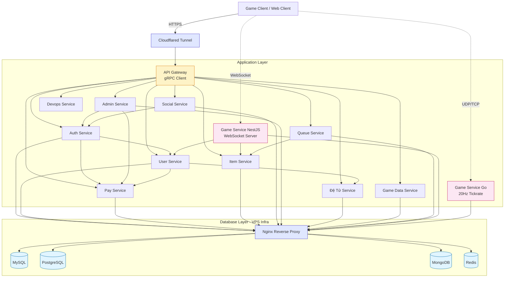

**Quy ước:**
- Mũi tên liền `-->`: sync gRPC call
- Mũi tên đứt `-.->`: realtime WebSocket/UDP với client

### Coupling Matrix

Bảng này tổng hợp tất cả coupling giữa các service trong hệ thống:

| From → To | Auth | User | Pay | Item | Social | Admin | Detu | GameData | Queue | Devops | GameNest | GameGo |
|-----------|------|------|-----|------|--------|-------|------|----------|-------|--------|----------|--------|
| **API Gateway** | ✅ | ✅ | ✅ | ✅ | ✅ | ✅ | ✅ | ✅ | ✅ | ✅ | ❌ | ❌ |
| **Auth** | - | ✅ | ✅ | ❌ | ❌ | ❌ | ❌ | ❌ | ❌ | ❌ | ❌ | ❌ |
| **User** | ❌ | - | ✅ | ❌ | ❌ | ❌ | ✅ | ❌ | ❌ | ❌ | ❌ | ❌ |
| **Pay** | ❌ | ❌ | - | ❌ | ❌ | ❌ | ❌ | ❌ | ❌ | ❌ | ❌ | ❌ |
| **Item** | ❌ | ❌ | ❌ | - | ❌ | ❌ | ❌ | ❌ | ❌ | ❌ | ❌ | ❌ |
| **Social** | ✅ | ❌ | ❌ | ❌ | - | ❌ | ❌ | ❌ | ❌ | ❌ | ❌ | ❌ |
| **Admin** | ✅ | ❌ | ✅ | ❌ | ❌ | - | ❌ | ❌ | ❌ | ❌ | ❌ | ❌ |
| **Detu** | ❌ | ❌ | ❌ | ❌ | ❌ | ❌ | - | ❌ | ❌ | ❌ | ❌ | ❌ |
| **GameData** | ❌ | ❌ | ❌ | ❌ | ❌ | ❌ | ❌ | - | ❌ | ❌ | ❌ | ❌ |
| **Queue** | ❌ | ❌ | ❌ | ✅ | ❌ | ❌ | ❌ | ❌ | - | ❌ | ❌ | ❌ |
| **GameNest** | ❌ | ✅ | ❌ | ✅ | ❌ | ❌ | ❌ | ❌ | ❌ | ❌ | - | ❌ |
| **GameGo** | ❌ | ❌ | ❌ | ❌ | ❌ | ❌ | ❌ | ❌ | ❌ | ❌ | ❌ | - |

**Nhận xét:**
- `Pay`, `Item`, `Detu`, `GameData`, `GameGo` là **leaf services** (không gọi ai)
- `API Gateway` là entry point chính cho web client
- `GameNest` và `GameGo` được client game gọi trực tiếp, không qua Gateway
- `Auth` và `Admin` là 2 service có nhiều outgoing call nhất do chứa business logic phức tạp

## 2. ERD tổng thể toàn hệ thống

ERD bên dưới hiển thị **toàn bộ entity** của hệ thống, kèm theo cả physical FK (trong cùng DB) lẫn logical FK (xuyên service).

> ⚠️ **Lưu ý quan trọng**: Quan hệ giữa các service là **logical FK** - chỉ tồn tại ở tầng application, không có constraint vật lý ở DB. Tool reverse-engineering sẽ không detect được các quan hệ này.

```mermaid
erDiagram
    %% ========== AUTH SERVICE (MySQL) ==========
    AUTH ||--o{ REGISTER_OUTBOX : "saga register"

    AUTH {
        int id PK
        string username UK
        string email
        string realname
        boolean biBan
        string role "USER/ADMIN/EDITOR/PARTNER"
        int tokenVersion
        string password
        string avatarUrl
        int type "0=normal 1=google"
        timestamp createdAt
        timestamp updatedAt
    }
    REGISTER_OUTBOX {
        uuid id PK
        json payload
        string status "PENDING/PROCESSING/DONE/FAILED"
        int retries
        int maxRetries
        datetime nextRetryAt
        text lastError
    }
    AUTH_IDEMPOTENCY {
        string key PK
        json response
        datetime expires_at
    }

    %% ========== USER SERVICE (MySQL) ==========
    USERS ||--|| USER_GAME_STATS : "1-1"
    USERS ||--|| USERS_POSITION : "1-1"
    USERS ||--o{ USERS_WEB_ITEM : "1-n"

    USERS {
        int id PK
        bigint auth_id UK "logical FK AUTH.id"
        string gameName
        string avatarUrl "duplicated from AUTH"
        timestamp createdAt
        timestamp updatedAt
    }
    USER_GAME_STATS {
        int id PK
        int userId FK
        bigint vang "indexed leaderboard"
        bigint ngoc
        bigint sucManh "indexed leaderboard"
        bigint vangNapTuWeb
        bigint ngocNapTuWeb
        boolean daVaoTaiKhoanLanDau
        boolean coDeTu
    }
    USERS_POSITION {
        int id PK
        int userId FK
        float x
        float y
        string mapHienTai
    }
    USERS_WEB_ITEM {
        int id PK
        int userId FK
        bigint item_id "logical FK ITEMS"
        bigint price
        timestamp createdAt
    }
    BUY_ITEM_OUTBOX {
        int id PK
        json payload
        string status
        int retries
        datetime nextRetryAt
    }
    CREATE_PAY_OUTBOX {
        uuid id PK
        json payload
        string status
        int retries
        datetime nextRetryAt
    }

    %% ========== DETU SERVICE (MySQL) ==========
    DETU {
        int id PK
        bigint sucManh "default 2000"
        int userId "logical FK USERS.id"
    }

    %% ========== ITEM SERVICE (MySQL) ==========
    ITEMS {
        int id PK
        string maItem
        string ten
        string loai
        text moTa
        int soLuong
        string hanhTinh
        string setKichHoat
        int soSaoPhaLe
        int soSaoPhaLeCuongHoa
        int soCap
        float hanSuDung
        string sucManhYeuCau
        string linkTexture
        string viTri
        text chiso "JSON string"
        int userId "indexed logical FK USERS"
        string uuid
    }

    %% ========== PAY SERVICE (MySQL) ==========
    PAY ||..o{ CASH_FLOW_MANAGEMENT : "lịch sử"

    PAY {
        int id PK
        string tien "default 0"
        int userId UK "logical FK USERS"
        string status "open/closed"
        timestamp updatedAt
    }
    CASH_FLOW_MANAGEMENT {
        int id PK
        int userId "indexed logical FK"
        string type "NAP/RUT"
        int amount
        timestamp create_at
    }
    PAY_IDEMPOTENCY {
        string key PK
        json response
        datetime expires_at
    }

    %% ========== SOCIAL SERVICE (MySQL) ==========
    CHAT_GROUPS ||--o{ CHAT_GROUP_MEMBERS : "có thành viên"
    COMMENTS ||..o{ COMMENT_LIKES : "logical"
    COMMENTS ||..o{ COMMENTS : "parent-child"

    CHAT {
        int id PK
        string roomId "composite idx with createdAt"
        int userId "logical FK"
        longtext content
        timestamp createdAt
    }
    CHAT_GROUPS {
        int id PK
        string name
        string avatarUrl
        string description
        int ownerId "logical FK USERS"
        int maxMember "default 500"
        timestamp createdAt
    }
    CHAT_GROUP_MEMBERS {
        int id PK
        int groupId FK
        int userId "indexed logical FK"
        int role
        timestamp joinedAt
    }
    COMMENTS {
        int id PK
        int postId "indexed logical FK POSTS"
        int parentId "self-ref"
        int userId "logical FK"
        int likeCount "denormalized"
        boolean isDelete "soft delete"
        string content
        timestamp createdAt
    }
    COMMENT_LIKES {
        int id PK
        int commentId "logical FK"
        int userId "logical FK"
        timestamp createdAt
    }
    NOTIFICATION {
        int id PK
        int userId "indexed logical FK"
        string title
        longtext content
        timestamp createdAt
    }
    SOCIAL_NETWORK {
        int id PK
        int userId "logical FK"
        int friendId "logical FK"
        int status "0=pending 1=accepted 2=blocked"
        timestamp createdAt
    }

    %% ========== ADMIN SERVICE (PostgreSQL) ==========
    ACCOUNTS_SELL ||..o{ OUTBOX_EVENTS : "BUY_ACCOUNT saga"
    OUTBOX_EVENTS ||..|| SAGA_STATE : "tracks progress"

    WITHDRAW_MONEY {
        int id PK
        int userId "indexed logical FK AUTH"
        int amount
        string bank_name
        string bank_number
        string bank_owner
        string status "PENDING/SUCCESS/ERROR"
        int finance_id "admin duyệt"
        timestamp request_at
        timestamp success_at
    }
    POSTS {
        int id PK
        string title
        string url_anh
        text content
        int editor_id "indexed logical FK AUTH"
        string editor_realname "duplicated"
        string status "ACTIVE/LOCKED"
        timestamp create_at
        timestamp update_at
    }
    ACCOUNTS_SELL {
        int id PK
        string username
        string password
        string url
        string description
        int price
        string status "SOLD/ACTIVE"
        int partner_id "logical FK AUTH"
        int buyer_id "logical FK AUTH"
        int version "optimistic lock"
        timestamp createdAt
    }
    OUTBOX_EVENTS {
        uuid id PK
        string sagaType "BUY_ACCOUNT"
        jsonb payload
        string status
        int retries
        int maxRetries
        timestamp nextRetryAt
        text lastError
    }
    SAGA_STATE {
        uuid saga_id PK
        enum phase "FORWARD/COMPENSATING/DONE/FAILED"
        int attempt
        jsonb completed_steps
        text original_password
        text original_email
    }

    %% ========== GAME-DATA SERVICE (MySQL - master data) ==========
    MAP_BASE ||--o{ NPC_SPAWN : "có spawn"
    NPC_BASE ||--o{ NPC_SPAWN : "được spawn"
    NPC_BASE ||--o{ NPC_SHOP_ITEM : "shop của NPC"
    ITEM_BASE ||--o{ NPC_SHOP_ITEM : "item bán"

    MAP_BASE {
        int id PK
        string ten UK
    }
    NPC_BASE {
        int id PK
        string ten UK
        enum loai "NGUOI/CAYDAU/RUONGDO/DUIGA"
    }
    ITEM_BASE {
        int id PK
        string ten UK
        string ma UK
    }
    NPC_SPAWN {
        int id PK
        int npc_base_id FK
        int map_id FK
        float x
        float y
        boolean is_active
    }
    NPC_SHOP_ITEM {
        int id PK
        int npc_base_id FK
        int item_base_id FK
        int gia
        enum loaiTien "VANG/NGOC"
        enum tab "AO_QUAN/PHU_KIEN/DAC_BIET"
        boolean is_active
    }

    %% ========== LOGICAL FK XUYÊN SERVICE ==========
    AUTH ||..|| USERS : "logical 1-1"
    USERS ||..|| DETU : "logical 1-1"
    USERS ||..o{ ITEMS : "logical 1-n"
    USERS ||..|| PAY : "logical 1-1"
    USERS ||..o{ CHAT : "logical chat"
    USERS ||..o{ CHAT_GROUPS : "owner"
    USERS ||..o{ CHAT_GROUP_MEMBERS : "member"
    USERS ||..o{ COMMENTS : "viết comment"
    USERS ||..o{ NOTIFICATION : "nhận noti"
    USERS ||..o{ SOCIAL_NETWORK : "friend"
    AUTH ||..o{ WITHDRAW_MONEY : "rút tiền"
    AUTH ||..o{ POSTS : "editor viết"
    AUTH ||..o{ ACCOUNTS_SELL : "partner bán"
    POSTS ||..o{ COMMENTS : "logical bài viết"
    ITEMS ||..o{ USERS_WEB_ITEM : "logical mua web"
```

### Quy ước trong ERD

| Ký hiệu | Ý nghĩa |
|---------|---------|
| `\|\|--o{` | Quan hệ 1-n có physical FK (cùng DB) |
| `\|\|--\|\|` | Quan hệ 1-1 có physical FK |
| `\|\|..o{` | Quan hệ 1-n logical (xuyên service, không có FK vật lý) |
| `\|\|..\|\|` | Quan hệ 1-1 logical (xuyên service) |

## 3. Use Case Flows

Phần này mô tả các luồng nghiệp vụ chính của hệ thống. Mỗi flow có sequence diagram thể hiện chính xác RPC calls, sync/async, và error handling.

### 3.1. Register Flow (Saga)

User đăng ký tài khoản mới. Flow này dùng saga vì cần tạo record ở 3 service: auth, user, pay.

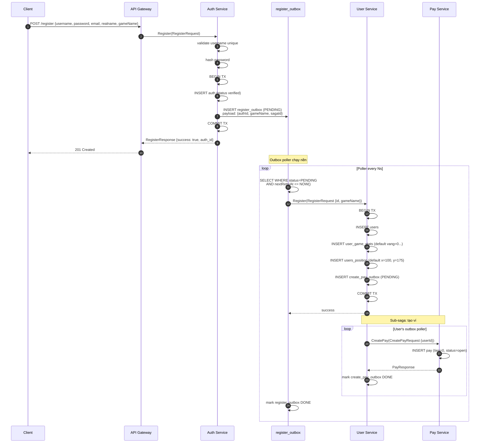

**Đặc điểm:**
- Auth response cho client ngay khi insert auth thành công, **không đợi user/pay tạo xong** (eventual consistency)
- Nếu user/pay tạo lỗi, outbox poller sẽ retry tới khi thành công
- Client có thể login ngay sau register (auth đã có), nhưng game data có thể chưa sẵn sàng vài giây đầu

### 3.2. Login Flow (với OTP)

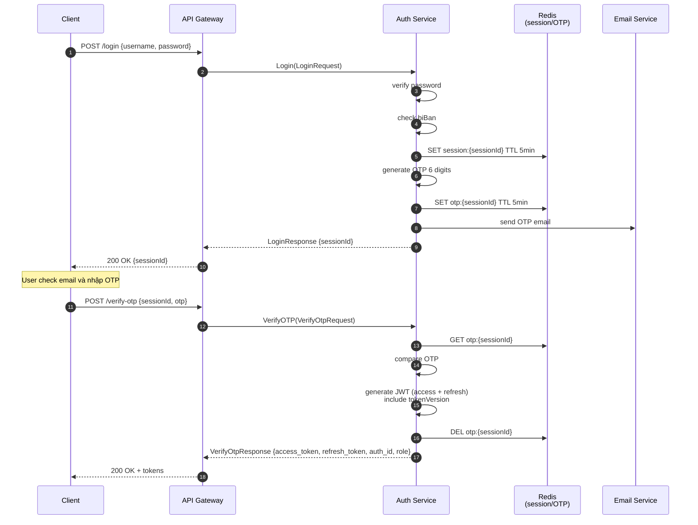

### 3.3. Login với Google OAuth

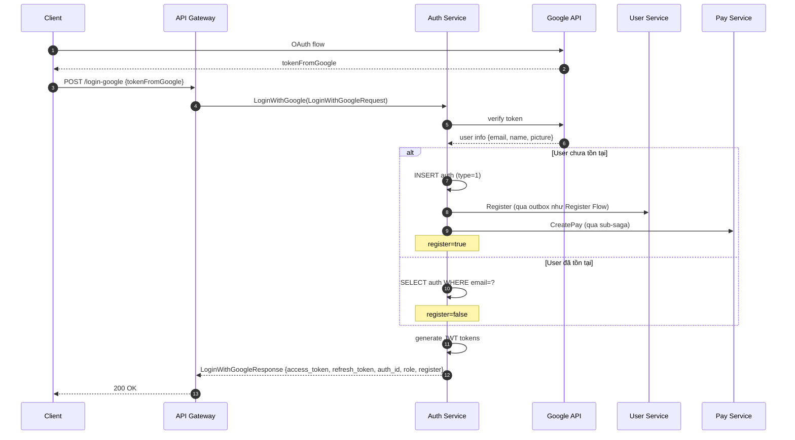

### 3.4. Buy Item from Web (Saga với Outbox)

User mua item từ web. Item phải có trong inventory **trước** khi trừ tiền (nếu trừ tiền trước, lỡ tạo item fail thì khó refund tự động).

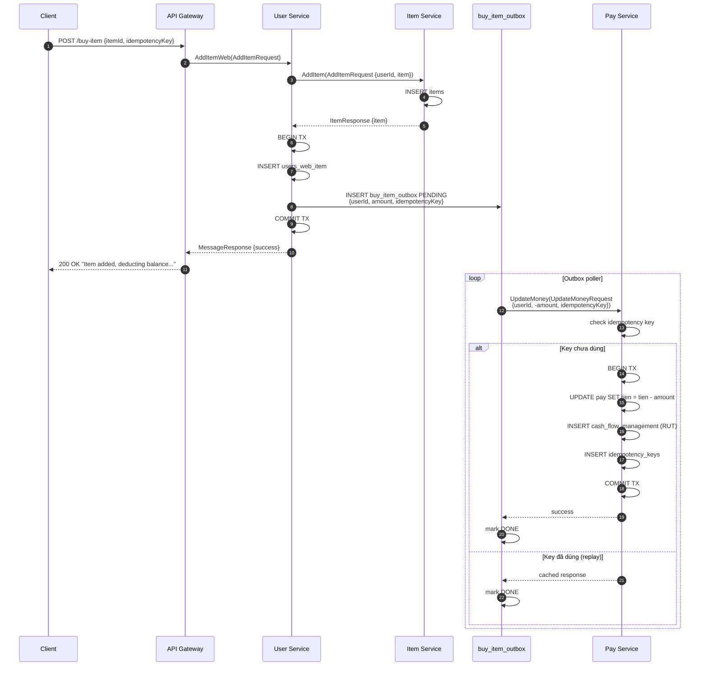

**Lưu ý design:**
- `BUY_ITEM_OUTBOX` không có status `FAILED` - **bắt buộc phải retry** đến khi trừ được tiền vì item đã tạo
- Idempotency key đảm bảo retry nhiều lần không trừ tiền nhiều lần
- Trade-off: nếu user hết tiền thì admin phải intervene manual

### 3.5. Buy Account Flow (Saga phức tạp với Compensation)

Đây là flow phức tạp nhất hệ thống. User mua account từ partner thông qua admin service.

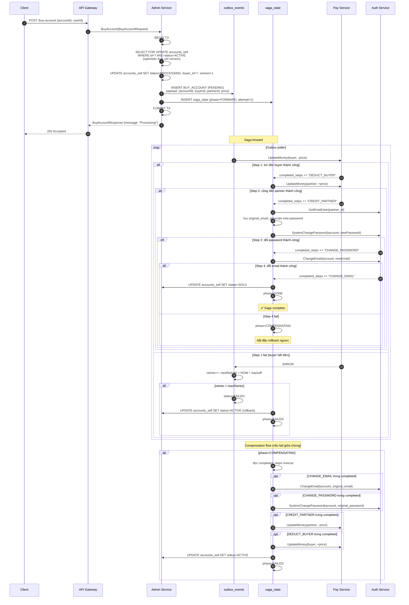

**Tại sao phức tạp vậy:**
- Nhiều bước cross-service, mỗi bước đều có thể fail
- Cần lưu `original_password`, `original_email` trong `saga_state` để rollback chính xác
- `completed_steps` (jsonb) track step nào đã chạy để compensation đúng thứ tự ngược
- Optimistic lock (`version`) tránh 2 user mua cùng 1 account

### 3.6. Withdraw Money Flow (Admin duyệt)

User yêu cầu rút tiền, admin xét duyệt thủ công.

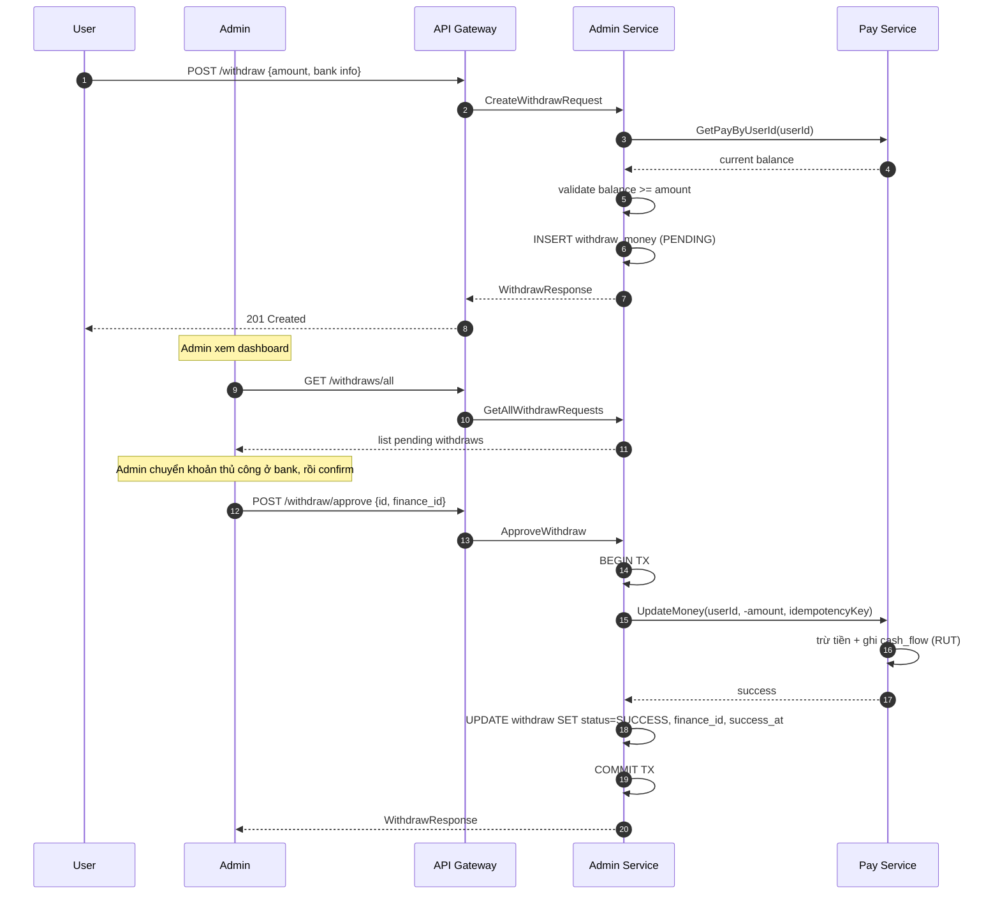

### 3.7. Game Connect Flow (Realtime)

Client game kết nối tới game server. Đây là flow đặc biệt vì client không qua API Gateway.

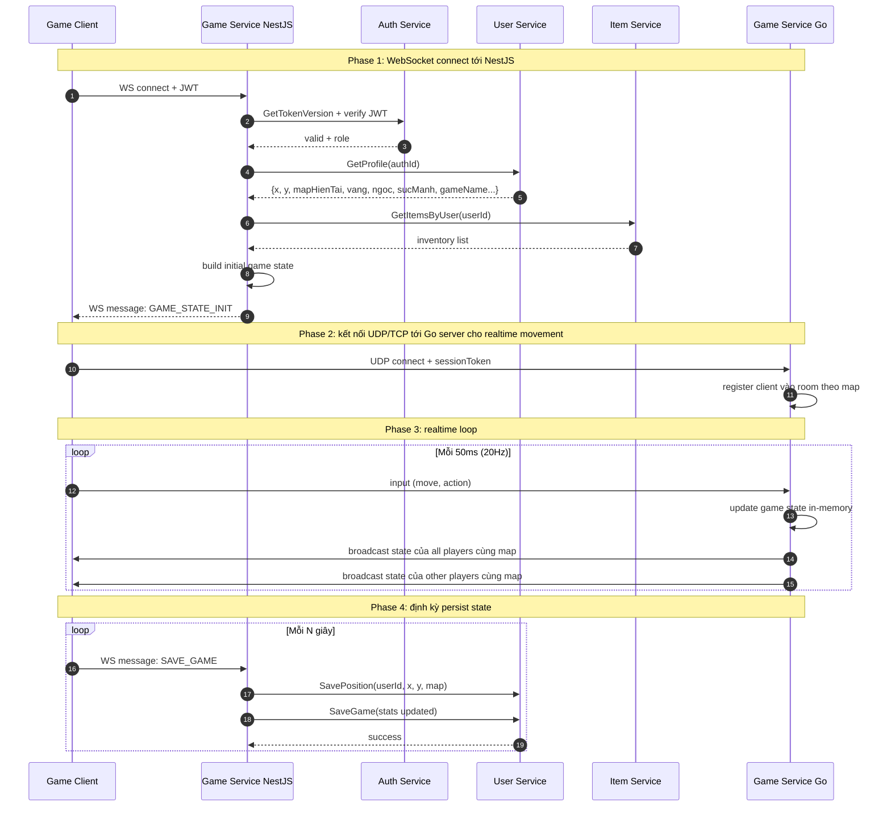

**Tại sao tách 2 game service:**
- **NestJS**: handle business logic (load profile, save game, validate action) - cần gọi gRPC nhiều
- **Go**: handle high-frequency realtime broadcast (20Hz = 20 lần/giây mỗi client) - cần performance cao, ít business logic
- Tách ra để mỗi service tối ưu cho mục đích riêng, NestJS không bị nghẽn vì broadcast

### 3.8. Friend & Chat Flow

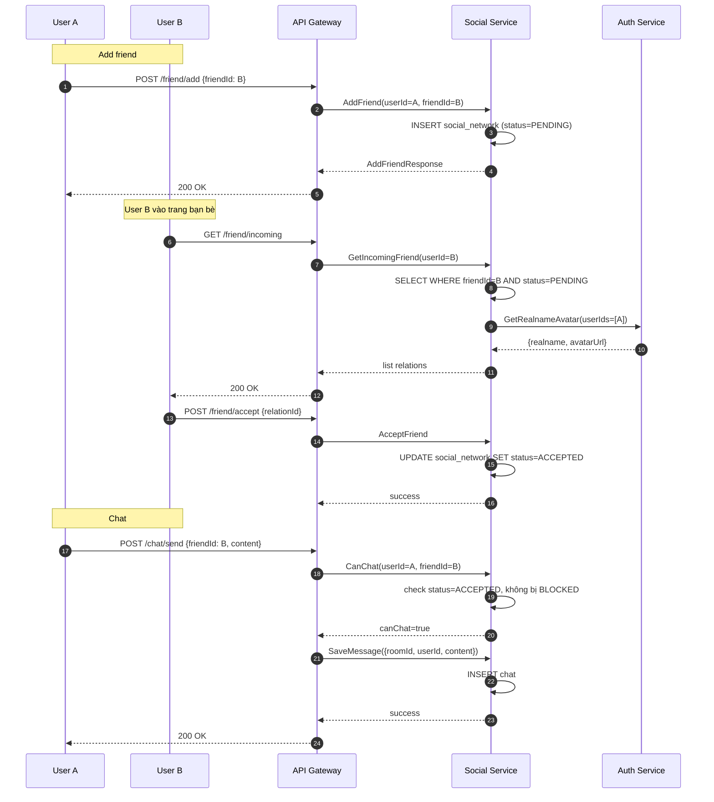

### 3.9. Leaderboard Query (Read-heavy)

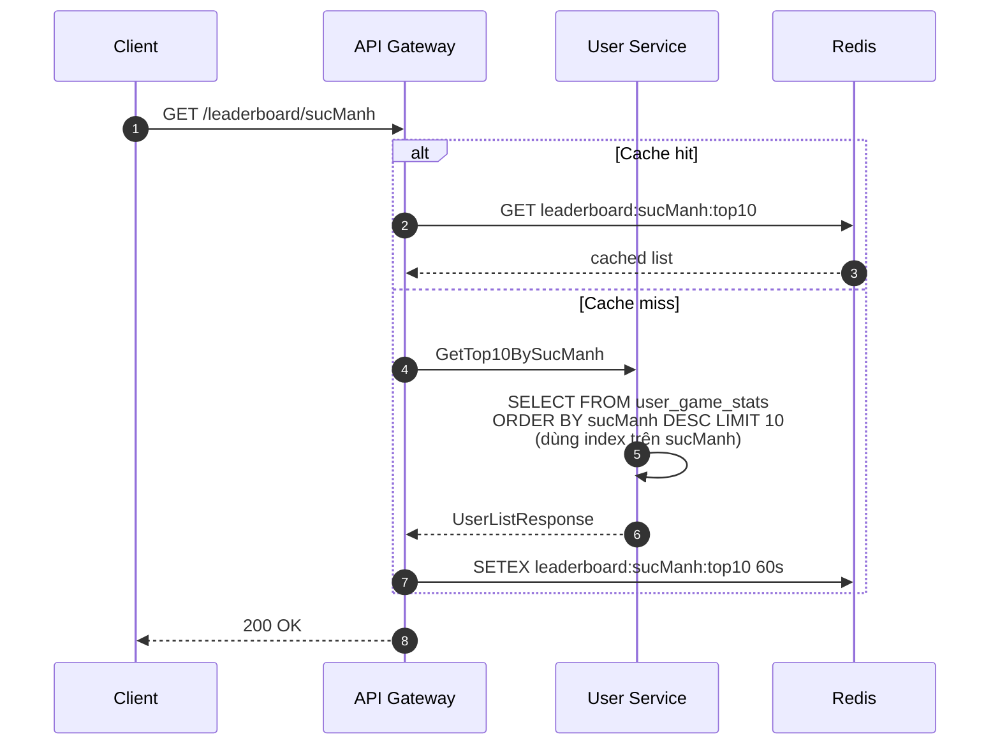

**Index strategy:** Vì query có `ORDER BY sucManh DESC LIMIT 10`, B+Tree index trên `sucManh` cho phép DB chỉ cần đọc 10 leaf node cuối thay vì sort toàn bảng. Trade-off: write chậm hơn O(log n) nhưng read leaderboard nhanh hơn rất nhiều.

### 3.10. Editor Post + Comment Flow

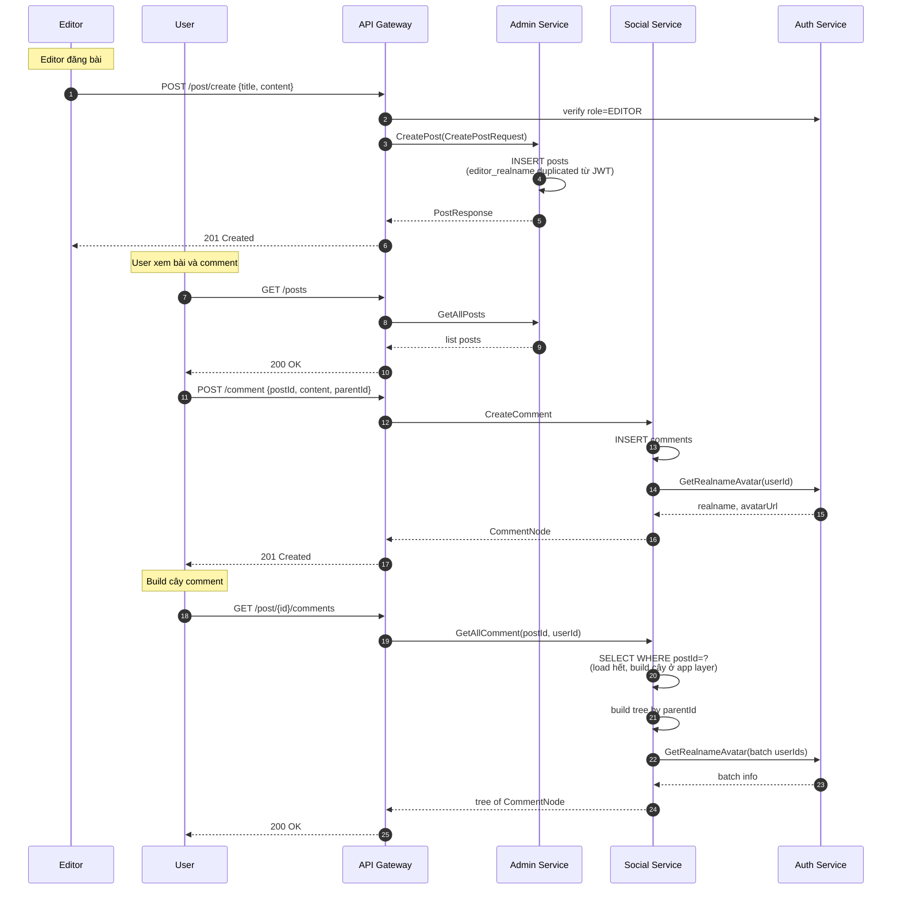

## 4. Service Breakdown

### 4.1. Auth Service (MySQL)

Quản lý xác thực, phân quyền, đăng ký/đăng nhập.

**Entities**: `AUTH`, `REGISTER_OUTBOX`, `AUTH_IDEMPOTENCY`

**Outgoing calls**: User Service, Pay Service

**Key RPCs**:
- `Register/Login/VerifyOTP/Refresh`: auth flow chuẩn
- `ChangePassword/ResetPassword/ChangeEmail`: user actions với idempotency
- `SystemChangePassword`: API system-level cho admin service trong saga BUY_ACCOUNT
- `GetRealnameAvatar(batch)`: cho social service load info nhiều user
- `ChangeAvatar`: update avatar, sau đó event sync về user service

### 4.2. User Service (MySQL)

Quản lý dữ liệu game của người chơi: stats, vị trí, vật phẩm web.

**Entities**: `USERS`, `USER_GAME_STATS`, `USERS_POSITION`, `USERS_WEB_ITEM`, `BUY_ITEM_OUTBOX`, `CREATE_PAY_OUTBOX`

**Outgoing calls**: Pay Service, Đệ Tử Service

**Key RPCs**:
- `Register`: tạo user record (gọi từ auth qua outbox)
- `GetProfile/SaveGame/SavePosition`: game state CRUD
- `GetTop10BySucManh/GetTop10ByVang`: leaderboard
- `AddItemWeb/UseItemWeb`: mua/dùng item từ web (trigger BUY_ITEM_OUTBOX)
- `UpdateBalance/UseVangNapTuWeb`: quản lý vàng/ngọc

### 4.3. Pay Service (MySQL)

**Entities**: `PAY`, `CASH_FLOW_MANAGEMENT`, `PAY_IDEMPOTENCY`

**Outgoing calls**: ❌ không gọi ai (leaf service)

**Key RPCs**:
- `CreatePay`: tạo ví khi register
- `UpdateMoney`: cộng/trừ tiền với idempotency key
- `CreatePayOrder`: tạo QR thanh toán
- `CreateFinanceRecord/GetFinanceSummary`: lịch sử dòng tiền

### 4.4. Item Service (MySQL)

**Entities**: `ITEMS`

**Outgoing calls**: ❌ không gọi ai (leaf service)

**Key RPCs**:
- `GetItemsByUser`: load inventory (critical path)
- `AddItem/AddMultipleItems`: thêm vào inventory
- `SwapItem`: chuyển item giữa 2 user
- `GetItemsByItemUuids`: batch lookup

### 4.5. Social Service (MySQL)

**Entities**: `CHAT`, `CHAT_GROUPS`, `CHAT_GROUP_MEMBERS`, `COMMENTS`, `COMMENT_LIKES`, `NOTIFICATION`, `SOCIAL_NETWORK`

**Outgoing calls**: Auth Service (lấy realname/avatar)

**Key RPCs**:
- Friend: `AddFriend/AcceptFriend/RejectFriend/Unfriend/BlockUser/CanChat`
- Chat: `SaveMessage/GetMessage`
- Group: `CreateGroup/AddUserToGroup/CheckGroupUser/GetAllGroup`
- Comment: `CreateComment/GetAllComment/UpdateComment/DeleteComment/LikeComment`
- Notification: `CreateNotification/GetNotificationByUser`

### 4.6. Admin Service (PostgreSQL)

**Entities**: `WITHDRAW_MONEY`, `POSTS`, `ACCOUNTS_SELL`, `OUTBOX_EVENTS`, `SAGA_STATE`

**Outgoing calls**: Auth Service, Pay Service

**Sub-services trong Admin:**
- **EditorService**: CRUD post (`CreatePost/GetAllPosts/UpdatePost/LockPost...`)
- **CashierService**: rút tiền (`CreateWithdrawRequest/ApproveWithdraw...`)
- **PartnerService**: mua bán account (`CreateAccountSell/BuyAccount/MarkAccountAsSold...`)

### 4.7. Đệ Tử Service (MySQL)

**Entities**: `DETU`

**Outgoing calls**: ❌ không gọi ai

**Key RPCs**: `CreateDeTu/SaveGameDeTu/GetDeTuByUserId`

### 4.8. Game Data Service (MySQL)

**Entities**: `MAP_BASE`, `NPC_BASE`, `ITEM_BASE`, `NPC_SPAWN`, `NPC_SHOP_ITEM`

**Outgoing calls**: ❌ không gọi ai

**Key RPCs**: CRUD cho map/npc/item base + shop config. Read-heavy, có thể cache aggressive.

### 4.9. Game Service NestJS (WebSocket)

Server WebSocket cho game client, handle business logic game.

**Outgoing calls**: User Service, Item Service (qua gRPC)

**Use cases**:
- `handleConnection`: gọi `User.GetProfile` lấy state, gọi `Item.GetItemsByUser` lấy inventory
- `handleSaveGame`: gọi `User.SaveGame`, `User.SavePosition`
- `handleBuyFromNPC`: gọi `Item.AddItem`, `User.UpdateBalance`

### 4.10. Game Service Go (Realtime 20Hz)

Server Go xử lý realtime movement, không cần gRPC client.

**Outgoing calls**: ❌ không gọi service khác

**Use cases**:
- Nhận input từ client (di chuyển, attack)
- Update state in-memory
- Broadcast state cho clients cùng map ở 20Hz

**Persist state**: client sẽ định kỳ gửi save về NestJS, không phải Go server tự save.

### 4.11. Queue Service

Service consumer xử lý job nền.

**Incoming**: trigger từ API Gateway, Auth Service và các service khác

**Outgoing calls**: Item Service

**Use cases**: xử lý batch job liên quan item (bulk add, cleanup expired items...)

### 4.12. Devops Service

**Trigger từ**: các service khác (CI webhooks, manual deploy)

**Outgoing calls**: ❌ không gọi service business, chỉ thực hiện deploy lên VPS

### 4.13. Logger Service (MongoDB)

Log tập trung từ tất cả service.

**Schema document**:

```
{
  _id: ObjectId,
  timestamp: Date,    // indexed
  status: String,     // INFO/WARN/ERROR/DEBUG
  service: String,    // tên service phát log
  message: String,
  metadata?: Object
}
```

Có TTL index để tự xóa log cũ (giữ ~30 ngày).

## 5. Data Flow Map

Diagram thể hiện luồng dữ liệu chính giữa các service theo nhóm chức năng:

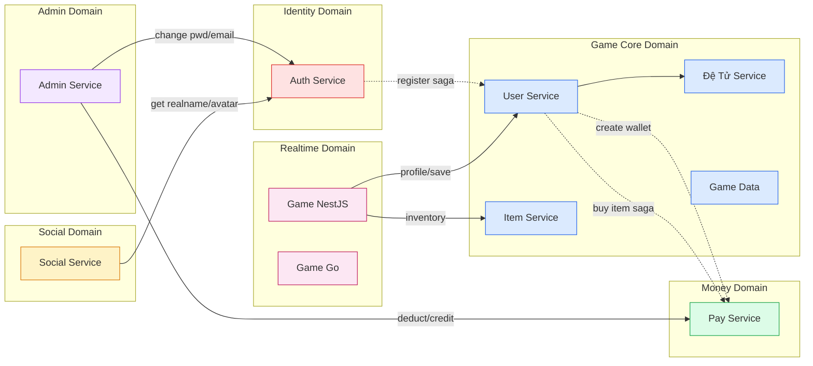

**Quy ước**: nét liền là sync gRPC, nét đứt là async qua outbox/saga.

## 6. Distributed Transaction Patterns

### 6.1. Outbox Pattern

Dùng cho **at-least-once delivery** giữa services. Mỗi service có bảng outbox riêng:

| Service | Bảng outbox | Use case |
|---------|-------------|----------|
| Auth | `register_outbox` | Sau register, tạo user ở user-service |
| User | `create_pay_outbox` | Tạo wallet ở pay-service |
| User | `buy_item_outbox` | Trừ tiền sau khi tạo item |
| Admin | `outbox_events` | Saga BUY_ACCOUNT |

**Cơ chế:**
1. Insert outbox row trong **cùng transaction** với business write
2. Poller chạy nền, scan rows `PENDING` với `nextRetryAt <= NOW()`
3. Gọi target service, mark `DONE` nếu thành công, retry với backoff nếu fail

**Index quan trọng:** `(status, nextRetryAt)` cho poller query nhanh.

### 6.2. Saga Pattern (Orchestration)

Dùng cho **multi-step distributed transaction** có thể fail giữa chừng. Hiện tại chỉ admin service có saga thực sự (BUY_ACCOUNT) với compensation.

**Các thành phần:**
- `outbox_events`: queue các saga cần xử lý
- `saga_state`: track tiến độ từng saga
  - `phase`: FORWARD → COMPENSATING → DONE/FAILED
  - `completed_steps`: jsonb array các step đã chạy
  - `original_password/email`: state cần để rollback

**Quy tắc:**
- Mỗi step phải **idempotent** (gọi 2 lần kết quả như 1)
- Compensation chạy theo thứ tự **ngược** với forward
- Dùng `SystemChangePassword` (có idempotencyKey) thay vì `ChangePassword` thường

### 6.3. Idempotency Key

Tránh side-effect khi retry. Hiện có ở:
- `auth_idempotency_keys`: cho ChangePassword, ChangeEmail
- `pay_idempotency_keys`: cho UpdateMoney
- Inline trong outbox payload

**Cơ chế:** lần đầu thực hiện và lưu response, lần sau với cùng key trả response cũ luôn không thực hiện lại.

## 7. Index Strategy

Tổng hợp các index quan trọng và lý do:

| Service | Bảng | Index | Lý do |
|---------|------|-------|-------|
| Auth | `auth` | `username` (UK) | Login query |
| User | `user_game_stats` | `vang`, `sucManh` | Leaderboard `ORDER BY ... LIMIT N` |
| Item | `items` | `userId` | Load inventory khi vào game |
| Social | `chat` | `(roomId, createdAt)` | Chat history sort |
| Social | `social_network` | `(userId, status)`, `(friendId, status)` | Friend list filter pending |
| Social | `chat_group_members` | `(groupId, userId)` UK + `userId` riêng | Cover cả 2 chiều query |
| Admin | `outbox_events` | `(status, nextRetryAt)` | Outbox poller |
| Admin | `outbox_events` | `(status, updatedAt)` | Cleanup job |
| Admin | `accounts_sell` | `partner_id`, `buyer_id` | Filter theo người bán/mua |
| Pay | `cash_flow_management` | `userId` | Lịch sử user |

### Nguyên tắc đánh index

1. **Composite index theo thứ tự selectivity → ORDER BY**
   - VD: `(status, nextRetryAt)` đặt status trước vì filter equality, nextRetryAt sau vì range scan

2. **Status có selectivity thấp vẫn đáng index nếu popularity của value cần query thấp**
   - VD: outbox `status='PENDING'` chiếm < 1% sau thời gian chạy → vẫn lọc được phần lớn rows

3. **Unique index cover được leftmost prefix queries**
   - VD: `UK(groupId, userId)` cover query chỉ filter `groupId`

4. **InnoDB tự đánh index cho FK** → không cần `@Index()` thủ công cho cột relation

*Tài liệu này nên được update mỗi khi có thay đổi lớn về schema, service boundary, hoặc thêm use case mới.*