# Dragon Boy - System Architecture Diagrams

## 1. Service Topology

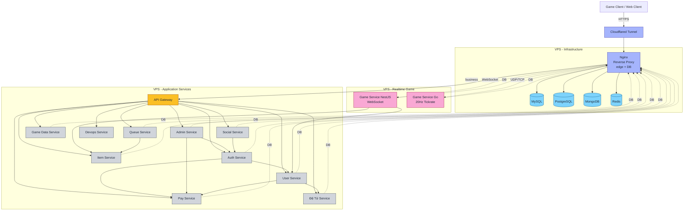
```mermaid
graph TB
    Client[Game Client / Web Client]
    CF[Cloudflared Tunnel]

    Client -->|HTTPS| CF

    subgraph VPS_Infra["VPS - Infrastructure"]
        Nginx[Nginx<br/>Reverse Proxy<br/>edge + DB]
        MySQL[(MySQL)]
        Postgres[(PostgreSQL)]
        Mongo[(MongoDB)]
        Redis[(Redis)]
    end

    subgraph VPS_App["VPS - Application Services"]
        Gateway[API Gateway]
        Auth[Auth Service]
        User[User Service]
        Pay[Pay Service]
        Item[Item Service]
        Social[Social Service]
        Admin[Admin Service]
        Detu[Đệ Tử Service]
        GameData[Game Data Service]
        Queue[Queue Service]
        Devops[Devops Service]
    end

    subgraph VPS_Game["VPS - Realtime Game"]
        GameNest[Game Service NestJS<br/>WebSocket]
        GameGo[Game Service Go<br/>20Hz Tickrate]
    end

    CF --> Nginx
    Nginx -->|business| Gateway
    Nginx -.WebSocket.-> GameNest
    Nginx -.UDP/TCP.-> GameGo

    Gateway --> Auth
    Gateway --> User
    Gateway --> Pay
    Gateway --> Item
    Gateway --> Social
    Gateway --> Admin
    Gateway --> Detu
    Gateway --> GameData
    Gateway --> Queue
    Gateway --> Devops

    Auth --> User
    Auth --> Pay
    Admin --> Auth
    Admin --> Pay
    Social --> Auth
    User --> Pay
    User --> Detu
    GameNest --> User
    GameNest --> Item
    Queue --> Item

    Auth -.DB.-> Nginx
    User -.DB.-> Nginx
    Pay -.DB.-> Nginx
    Item -.DB.-> Nginx
    Social -.DB.-> Nginx
    Admin -.DB.-> Nginx
    Detu -.DB.-> Nginx
    GameData -.DB.-> Nginx
    Queue -.DB.-> Nginx
    GameNest -.DB.-> Nginx
    GameGo -.DB.-> Nginx

    Nginx --> MySQL
    Nginx --> Postgres
    Nginx --> Mongo
    Nginx --> Redis

    classDef gateway fill:#fbbf24,stroke:#92400e,color:#1f2937
    classDef game fill:#f9a8d4,stroke:#9f1239,color:#1f2937
    classDef infra fill:#a5b4fc,stroke:#3730a3,color:#1f2937
    classDef db fill:#7dd3fc,stroke:#075985,color:#1f2937
    classDef svc fill:#d1d5db,stroke:#374151,color:#1f2937
    class Gateway gateway
    class GameNest,GameGo game
    class CF,Nginx infra
    class MySQL,Postgres,Mongo,Redis db
    class Auth,User,Pay,Item,Social,Admin,Detu,GameData,Queue,Devops svc
```

## 2. Coupling Matrix

| From → To | Auth | User | Pay | Item | Social | Admin | Detu | GameData | Queue | Devops | GameNest | GameGo |
|-----------|:----:|:----:|:---:|:----:|:------:|:-----:|:----:|:--------:|:-----:|:------:|:--------:|:------:|
| **API Gateway** | ✅ | ✅ | ✅ | ✅ | ✅ | ✅ | ✅ | ✅ | ✅ | ✅ | ❌ | ❌ |
| **Auth** | - | ✅ | ✅ | ❌ | ❌ | ❌ | ❌ | ❌ | ❌ | ❌ | ❌ | ❌ |
| **User** | ❌ | - | ✅ | ❌ | ❌ | ❌ | ✅ | ❌ | ❌ | ❌ | ❌ | ❌ |
| **Pay** | ❌ | ❌ | - | ❌ | ❌ | ❌ | ❌ | ❌ | ❌ | ❌ | ❌ | ❌ |
| **Item** | ❌ | ❌ | ❌ | - | ❌ | ❌ | ❌ | ❌ | ❌ | ❌ | ❌ | ❌ |
| **Social** | ✅ | ❌ | ❌ | ❌ | - | ❌ | ❌ | ❌ | ❌ | ❌ | ❌ | ❌ |
| **Admin** | ✅ | ❌ | ✅ | ❌ | ❌ | - | ❌ | ❌ | ❌ | ❌ | ❌ | ❌ |
| **Detu** | ❌ | ❌ | ❌ | ❌ | ❌ | ❌ | - | ❌ | ❌ | ❌ | ❌ | ❌ |
| **GameData** | ❌ | ❌ | ❌ | ❌ | ❌ | ❌ | ❌ | - | ❌ | ❌ | ❌ | ❌ |
| **Queue** | ❌ | ❌ | ❌ | ✅ | ❌ | ❌ | ❌ | ❌ | - | ❌ | ❌ | ❌ |
| **GameNest** | ❌ | ✅ | ❌ | ✅ | ❌ | ❌ | ❌ | ❌ | ❌ | ❌ | - | ❌ |
| **GameGo** | ❌ | ❌ | ❌ | ❌ | ❌ | ❌ | ❌ | ❌ | ❌ | ❌ | ❌ | - |

## 3. Data Flow Map (Domain View)

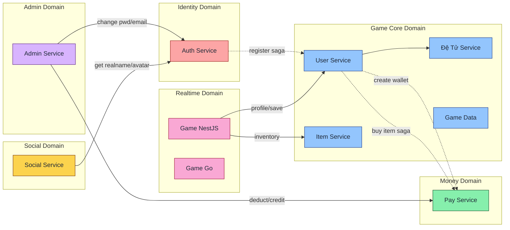
```mermaid
flowchart LR
    subgraph Identity["Identity Domain"]
        Auth[Auth Service]
    end

    subgraph GameCore["Game Core Domain"]
        User[User Service]
        Detu[Đệ Tử Service]
        Item[Item Service]
        GameData[Game Data]
    end

    subgraph Money["Money Domain"]
        Pay[Pay Service]
    end

    subgraph SocialD["Social Domain"]
        SocialSvc[Social Service]
    end

    subgraph AdminBiz["Admin Domain"]
        Admin[Admin Service]
    end

    subgraph Realtime["Realtime Domain"]
        GameNest[Game NestJS]
        GameGo[Game Go]
    end

    Auth -.register saga.-> User
    User -.create wallet.-> Pay
    User --> Detu
    Admin -->|change pwd/email| Auth
    Admin -->|deduct/credit| Pay
    SocialSvc -->|get realname/avatar| Auth
    GameNest -->|profile/save| User
    GameNest -->|inventory| Item
    User -.buy item saga.-> Pay

    classDef identity fill:#fca5a5,stroke:#991b1b,color:#1f2937
    classDef core fill:#93c5fd,stroke:#1e3a8a,color:#1f2937
    classDef money fill:#86efac,stroke:#14532d,color:#1f2937
    classDef social fill:#fcd34d,stroke:#78350f,color:#1f2937
    classDef admin fill:#d8b4fe,stroke:#581c87,color:#1f2937
    classDef realtime fill:#f9a8d4,stroke:#9f1239,color:#1f2937

    class Auth identity
    class User,Detu,Item,GameData core
    class Pay money
    class SocialSvc social
    class Admin admin
    class GameNest,GameGo realtime
```

## 4. ERD - Toàn hệ thống

```mermaid
erDiagram
    AUTH ||--o{ REGISTER_OUTBOX : "saga register"
    AUTH {
        int id PK
        string username UK
        string email
        string realname
        boolean biBan
        string role
        int tokenVersion
        string password
        string avatarUrl
        int type
        timestamp createdAt
    }
    REGISTER_OUTBOX {
        uuid id PK
        json payload
        string status
        int retries
        datetime nextRetryAt
    }
    AUTH_IDEMPOTENCY {
        string key PK
        json response
        datetime expires_at
    }

    USERS ||--|| USER_GAME_STATS : "1-1"
    USERS ||--|| USERS_POSITION : "1-1"
    USERS ||--o{ USERS_WEB_ITEM : "1-n"
    USERS {
        int id PK
        bigint auth_id UK
        string gameName
        string avatarUrl
        timestamp createdAt
    }
    USER_GAME_STATS {
        int id PK
        int userId FK
        bigint vang
        bigint ngoc
        bigint sucManh
        bigint vangNapTuWeb
        bigint ngocNapTuWeb
        boolean daVaoTaiKhoanLanDau
        boolean coDeTu
    }
    USERS_POSITION {
        int id PK
        int userId FK
        float x
        float y
        string mapHienTai
    }
    USERS_WEB_ITEM {
        int id PK
        int userId FK
        bigint item_id
        bigint price
    }
    BUY_ITEM_OUTBOX {
        int id PK
        json payload
        string status
        int retries
        datetime nextRetryAt
    }
    CREATE_PAY_OUTBOX {
        uuid id PK
        json payload
        string status
        int retries
        datetime nextRetryAt
    }

    DETU {
        int id PK
        bigint sucManh
        int userId
    }

    ITEMS {
        int id PK
        string maItem
        string ten
        string loai
        text moTa
        int soLuong
        string hanhTinh
        int soSaoPhaLe
        int soCap
        text chiso
        int userId
        string uuid
    }

    PAY ||..o{ CASH_FLOW_MANAGEMENT : "lịch sử"
    PAY {
        int id PK
        string tien
        int userId UK
        string status
        timestamp updatedAt
    }
    CASH_FLOW_MANAGEMENT {
        int id PK
        int userId
        string type
        int amount
        timestamp create_at
    }
    PAY_IDEMPOTENCY {
        string key PK
        json response
        datetime expires_at
    }

    CHAT_GROUPS ||--o{ CHAT_GROUP_MEMBERS : "có thành viên"
    COMMENTS ||..o{ COMMENT_LIKES : "logical"
    COMMENTS ||..o{ COMMENTS : "parent-child"
    CHAT {
        int id PK
        string roomId
        int userId
        longtext content
        timestamp createdAt
    }
    CHAT_GROUPS {
        int id PK
        string name
        string avatarUrl
        string description
        int ownerId
        int maxMember
    }
    CHAT_GROUP_MEMBERS {
        int id PK
        int groupId FK
        int userId
        int role
    }
    COMMENTS {
        int id PK
        int postId
        int parentId
        int userId
        int likeCount
        boolean isDelete
        string content
    }
    COMMENT_LIKES {
        int id PK
        int commentId
        int userId
    }
    NOTIFICATION {
        int id PK
        int userId
        string title
        longtext content
    }
    SOCIAL_NETWORK {
        int id PK
        int userId
        int friendId
        int status
    }

    ACCOUNTS_SELL ||..o{ OUTBOX_EVENTS : "BUY_ACCOUNT saga"
    OUTBOX_EVENTS ||..|| SAGA_STATE : "tracks progress"
    WITHDRAW_MONEY {
        int id PK
        int userId
        int amount
        string bank_name
        string bank_number
        string bank_owner
        string status
        int finance_id
        timestamp request_at
        timestamp success_at
    }
    POSTS {
        int id PK
        string title
        string url_anh
        text content
        int editor_id
        string editor_realname
        string status
    }
    ACCOUNTS_SELL {
        int id PK
        string username
        string password
        string url
        string description
        int price
        string status
        int partner_id
        int buyer_id
        int version
    }
    OUTBOX_EVENTS {
        uuid id PK
        string sagaType
        jsonb payload
        string status
        int retries
        timestamp nextRetryAt
    }
    SAGA_STATE {
        uuid saga_id PK
        enum phase
        int attempt
        jsonb completed_steps
        text original_password
        text original_email
    }

    MAP_BASE ||--o{ NPC_SPAWN : "có spawn"
    NPC_BASE ||--o{ NPC_SPAWN : "được spawn"
    NPC_BASE ||--o{ NPC_SHOP_ITEM : "shop của NPC"
    ITEM_BASE ||--o{ NPC_SHOP_ITEM : "item bán"
    MAP_BASE {
        int id PK
        string ten UK
    }
    NPC_BASE {
        int id PK
        string ten UK
        enum loai
    }
    ITEM_BASE {
        int id PK
        string ten UK
        string ma UK
    }
    NPC_SPAWN {
        int id PK
        int npc_base_id FK
        int map_id FK
        float x
        float y
        boolean is_active
    }
    NPC_SHOP_ITEM {
        int id PK
        int npc_base_id FK
        int item_base_id FK
        int gia
        enum loaiTien
        enum tab
        boolean is_active
    }

    AUTH ||..|| USERS : "logical"
    USERS ||..|| DETU : "logical"
    USERS ||..o{ ITEMS : "logical"
    USERS ||..|| PAY : "logical"
    USERS ||..o{ CHAT : "logical"
    USERS ||..o{ CHAT_GROUPS : "owner"
    USERS ||..o{ CHAT_GROUP_MEMBERS : "member"
    USERS ||..o{ COMMENTS : "viết"
    USERS ||..o{ NOTIFICATION : "nhận"
    USERS ||..o{ SOCIAL_NETWORK : "friend"
    AUTH ||..o{ WITHDRAW_MONEY : "rút tiền"
    AUTH ||..o{ POSTS : "editor"
    AUTH ||..o{ ACCOUNTS_SELL : "partner"
    POSTS ||..o{ COMMENTS : "logical"
    ITEMS ||..o{ USERS_WEB_ITEM : "logical"
```

## 5. Use Case Diagram

```mermaid
graph LR
    subgraph Actors["Actors"]
        User((User))
        Editor((Editor))
        Partner((Partner))
        Admin((Admin))
        System((System))
    end

    subgraph UC_Auth["Authentication"]
        UC1[Register]
        UC2[Login + OTP]
        UC3[Login Google]
        UC4[Change Password]
        UC5[Reset Password]
        UC6[Refresh Token]
    end

    subgraph UC_Game["Game"]
        UC7[Connect Game]
        UC8[Save Game State]
        UC9[View Leaderboard]
        UC10[Manage Inventory]
        UC11[Buy from NPC]
    end

    subgraph UC_Money["Money"]
        UC12[Deposit Money]
        UC13[Withdraw Request]
        UC14[Buy Item Web]
        UC15[View Transactions]
    end

    subgraph UC_Social["Social"]
        UC16[Add Friend]
        UC17[Chat 1-1]
        UC18[Group Chat]
        UC19[Comment Post]
        UC20[Like Comment]
    end

    subgraph UC_Editor["Content"]
        UC21[Create Post]
        UC22[Update Post]
        UC23[Lock Post]
    end

    subgraph UC_Partner["Account Trading"]
        UC24[Sell Account]
        UC25[Buy Account]
        UC26[View My Listings]
    end

    subgraph UC_Admin["Admin"]
        UC27[Approve Withdraw]
        UC28[Ban User]
        UC29[Change Role]
        UC30[Send Email]
    end

    User --> UC1
    User --> UC2
    User --> UC3
    User --> UC4
    User --> UC5
    User --> UC6
    User --> UC7
    User --> UC8
    User --> UC9
    User --> UC10
    User --> UC11
    User --> UC12
    User --> UC13
    User --> UC14
    User --> UC15
    User --> UC16
    User --> UC17
    User --> UC18
    User --> UC19
    User --> UC20
    User --> UC25

    Editor --> UC21
    Editor --> UC22
    Editor --> UC23

    Partner --> UC24
    Partner --> UC26

    Admin --> UC27
    Admin --> UC28
    Admin --> UC29
    Admin --> UC30

    System -.outbox poller.-> UC1
    System -.saga.-> UC25
    System -.saga.-> UC14

    classDef actor fill:#fbbf24,stroke:#92400e,color:#1f2937
    classDef uc fill:#bfdbfe,stroke:#1e3a8a,color:#1f2937
    class User,Editor,Partner,Admin,System actor
    class UC1,UC2,UC3,UC4,UC5,UC6,UC7,UC8,UC9,UC10,UC11,UC12,UC13,UC14,UC15,UC16,UC17,UC18,UC19,UC20,UC21,UC22,UC23,UC24,UC25,UC26,UC27,UC28,UC29,UC30 uc
```

## 6. Sequence Diagrams

### 6.1. Generic Request Flow

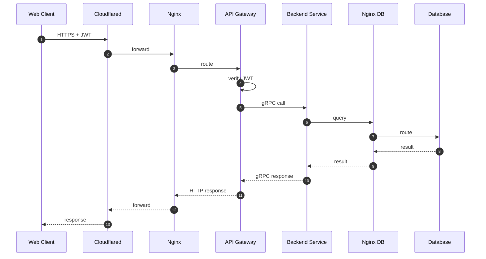
```mermaid
sequenceDiagram
    autonumber
    participant C as Web Client
    participant CF as Cloudflared
    participant Nginx as Nginx
    participant GW as API Gateway
    participant Svc as Backend Service
    participant NginxDB as Nginx DB
    participant DB as Database

    C->>CF: HTTPS + JWT
    CF->>Nginx: forward
    Nginx->>GW: route
    GW->>GW: verify JWT
    GW->>Svc: gRPC call
    Svc->>NginxDB: query
    NginxDB->>DB: route
    DB-->>NginxDB: result
    NginxDB-->>Svc: result
    Svc-->>GW: gRPC response
    GW-->>Nginx: HTTP response
    Nginx-->>CF: forward
    CF-->>C: response
```

### 6.2. Register Flow (Saga)

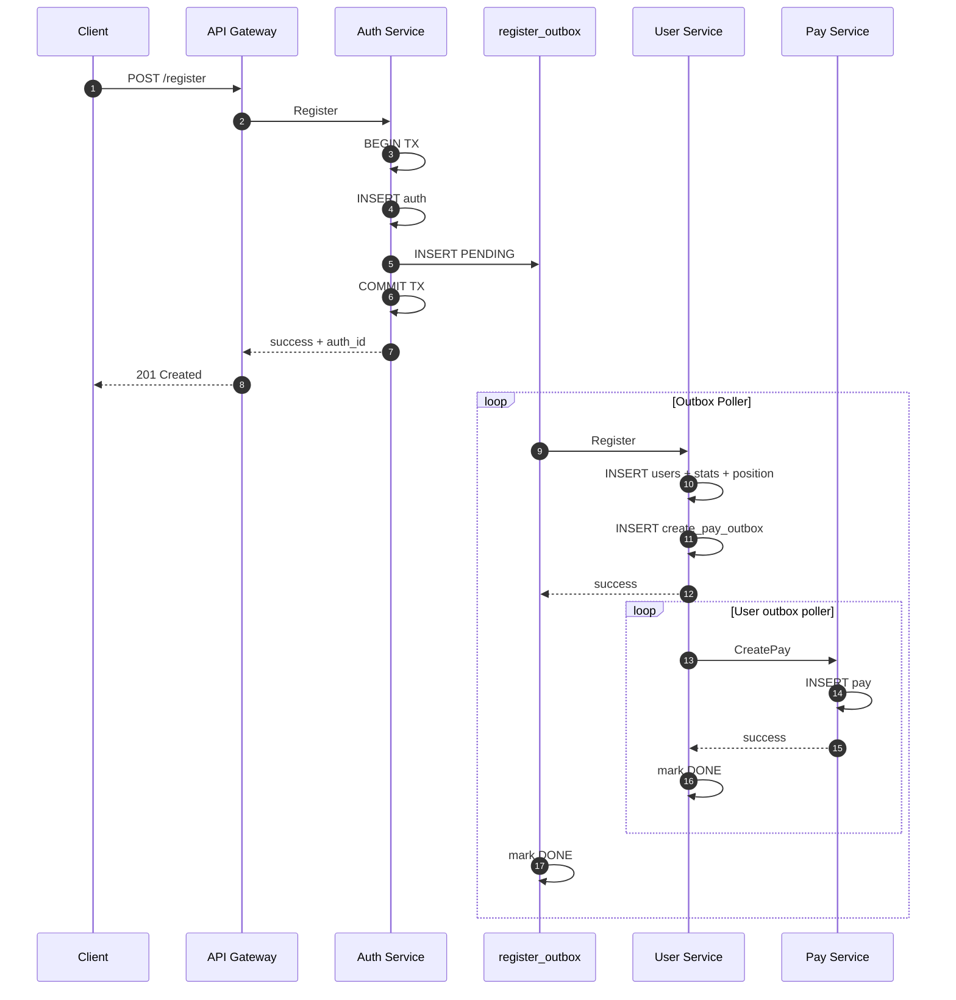
```mermaid
sequenceDiagram
    autonumber
    participant C as Client
    participant GW as API Gateway
    participant Auth as Auth Service
    participant Outbox as register_outbox
    participant User as User Service
    participant Pay as Pay Service

    C->>GW: POST /register
    GW->>Auth: Register
    Auth->>Auth: BEGIN TX
    Auth->>Auth: INSERT auth
    Auth->>Outbox: INSERT PENDING
    Auth->>Auth: COMMIT TX
    Auth-->>GW: success + auth_id
    GW-->>C: 201 Created

    loop Outbox Poller
        Outbox->>User: Register
        User->>User: INSERT users + stats + position
        User->>User: INSERT create_pay_outbox
        User-->>Outbox: success

        loop User outbox poller
            User->>Pay: CreatePay
            Pay->>Pay: INSERT pay
            Pay-->>User: success
            User->>User: mark DONE
        end

        Outbox->>Outbox: mark DONE
    end
```

### 6.3. Login + OTP

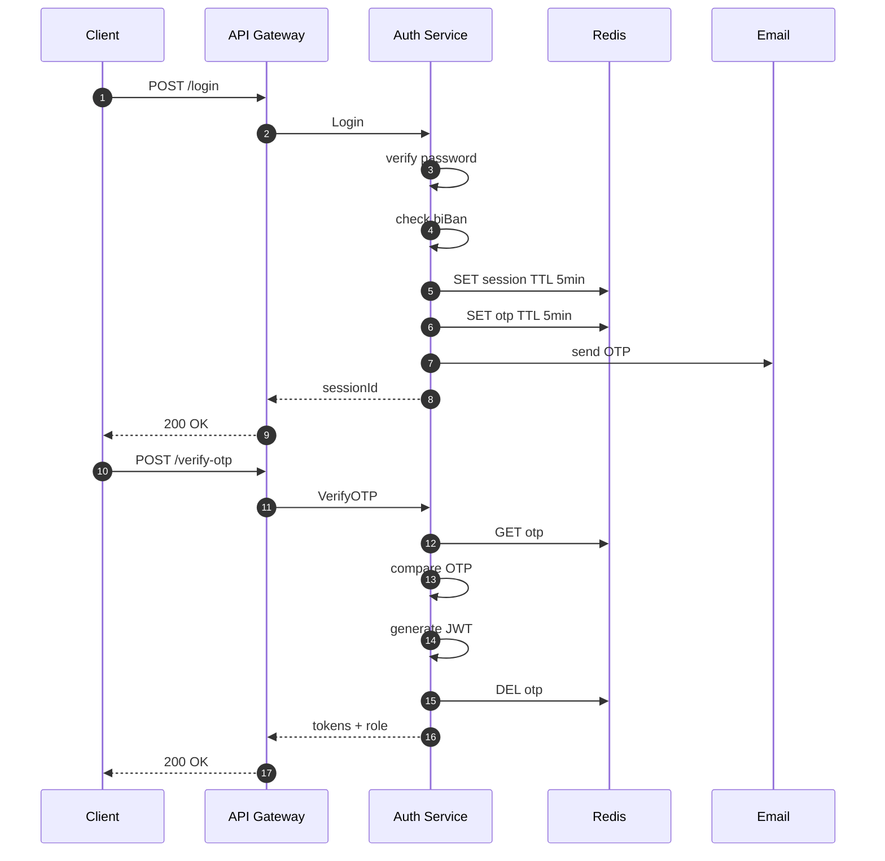
```mermaid
sequenceDiagram
    autonumber
    participant C as Client
    participant GW as API Gateway
    participant Auth as Auth Service
    participant Redis as Redis
    participant Mail as Email

    C->>GW: POST /login
    GW->>Auth: Login
    Auth->>Auth: verify password
    Auth->>Auth: check biBan
    Auth->>Redis: SET session TTL 5min
    Auth->>Redis: SET otp TTL 5min
    Auth->>Mail: send OTP
    Auth-->>GW: sessionId
    GW-->>C: 200 OK

    C->>GW: POST /verify-otp
    GW->>Auth: VerifyOTP
    Auth->>Redis: GET otp
    Auth->>Auth: compare OTP
    Auth->>Auth: generate JWT
    Auth->>Redis: DEL otp
    Auth-->>GW: tokens + role
    GW-->>C: 200 OK
```

### 6.4. Login Google

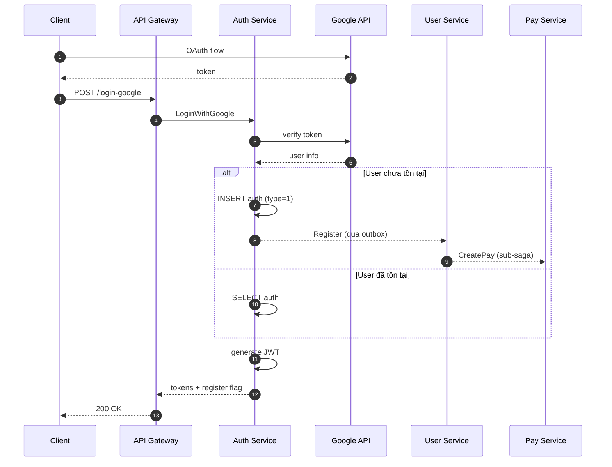
```mermaid
sequenceDiagram
    autonumber
    participant C as Client
    participant GW as API Gateway
    participant Auth as Auth Service
    participant Google as Google API
    participant User as User Service
    participant Pay as Pay Service

    C->>Google: OAuth flow
    Google-->>C: token
    C->>GW: POST /login-google
    GW->>Auth: LoginWithGoogle
    Auth->>Google: verify token
    Google-->>Auth: user info

    alt User chưa tồn tại
        Auth->>Auth: INSERT auth (type=1)
        Auth-->>User: Register (qua outbox)
        User-->>Pay: CreatePay (sub-saga)
    else User đã tồn tại
        Auth->>Auth: SELECT auth
    end

    Auth->>Auth: generate JWT
    Auth-->>GW: tokens + register flag
    GW-->>C: 200 OK
```

### 6.5. Buy Item from Web

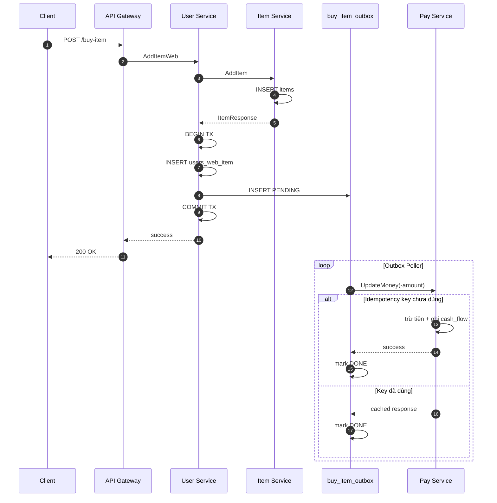
```mermaid
sequenceDiagram
    autonumber
    participant C as Client
    participant GW as API Gateway
    participant User as User Service
    participant Item as Item Service
    participant Outbox as buy_item_outbox
    participant Pay as Pay Service

    C->>GW: POST /buy-item
    GW->>User: AddItemWeb
    User->>Item: AddItem
    Item->>Item: INSERT items
    Item-->>User: ItemResponse

    User->>User: BEGIN TX
    User->>User: INSERT users_web_item
    User->>Outbox: INSERT PENDING
    User->>User: COMMIT TX
    User-->>GW: success
    GW-->>C: 200 OK

    loop Outbox Poller
        Outbox->>Pay: UpdateMoney(-amount)

        alt Idempotency key chưa dùng
            Pay->>Pay: trừ tiền + ghi cash_flow
            Pay-->>Outbox: success
            Outbox->>Outbox: mark DONE
        else Key đã dùng
            Pay-->>Outbox: cached response
            Outbox->>Outbox: mark DONE
        end
    end
```

### 6.6. Buy Account (Saga với Compensation)

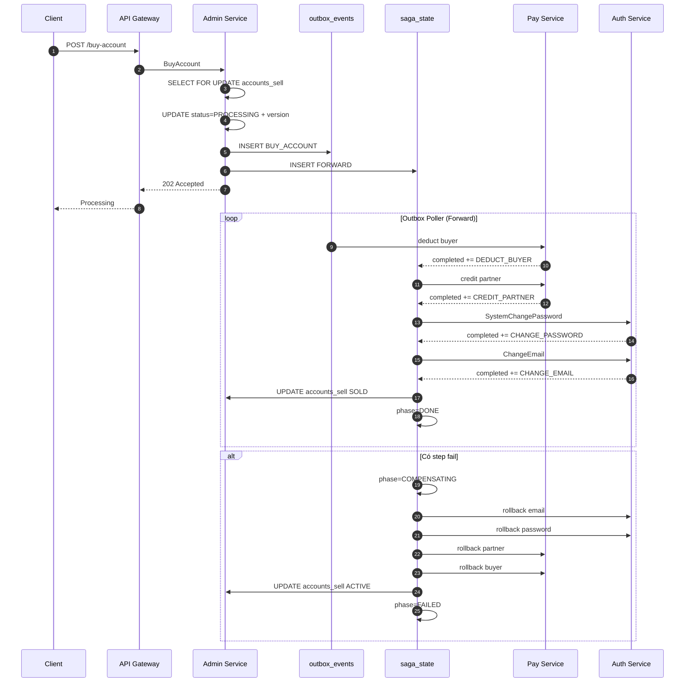
```mermaid
sequenceDiagram
    autonumber
    participant C as Client
    participant GW as API Gateway
    participant Admin as Admin Service
    participant Outbox as outbox_events
    participant Saga as saga_state
    participant Pay as Pay Service
    participant Auth as Auth Service

    C->>GW: POST /buy-account
    GW->>Admin: BuyAccount
    Admin->>Admin: SELECT FOR UPDATE accounts_sell
    Admin->>Admin: UPDATE status=PROCESSING + version
    Admin->>Outbox: INSERT BUY_ACCOUNT
    Admin->>Saga: INSERT FORWARD
    Admin-->>GW: 202 Accepted
    GW-->>C: Processing

    loop Outbox Poller (Forward)
        Outbox->>Pay: deduct buyer
        Pay-->>Saga: completed += DEDUCT_BUYER
        Saga->>Pay: credit partner
        Pay-->>Saga: completed += CREDIT_PARTNER
        Saga->>Auth: SystemChangePassword
        Auth-->>Saga: completed += CHANGE_PASSWORD
        Saga->>Auth: ChangeEmail
        Auth-->>Saga: completed += CHANGE_EMAIL
        Saga->>Admin: UPDATE accounts_sell SOLD
        Saga->>Saga: phase=DONE
    end

    alt Có step fail
        Saga->>Saga: phase=COMPENSATING
        Saga->>Auth: rollback email
        Saga->>Auth: rollback password
        Saga->>Pay: rollback partner
        Saga->>Pay: rollback buyer
        Saga->>Admin: UPDATE accounts_sell ACTIVE
        Saga->>Saga: phase=FAILED
    end
```

### 6.7. Withdraw Money

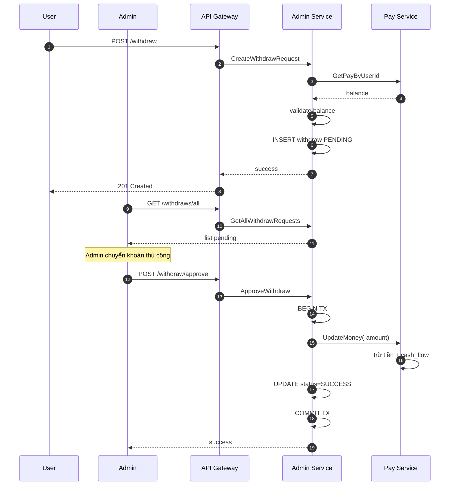
```mermaid
sequenceDiagram
    autonumber
    participant U as User
    participant A as Admin
    participant GW as API Gateway
    participant Cashier as Admin Service
    participant Pay as Pay Service

    U->>GW: POST /withdraw
    GW->>Cashier: CreateWithdrawRequest
    Cashier->>Pay: GetPayByUserId
    Pay-->>Cashier: balance
    Cashier->>Cashier: validate balance
    Cashier->>Cashier: INSERT withdraw PENDING
    Cashier-->>GW: success
    GW-->>U: 201 Created

    A->>GW: GET /withdraws/all
    GW->>Cashier: GetAllWithdrawRequests
    Cashier-->>A: list pending

    Note over A: Admin chuyển khoản thủ công

    A->>GW: POST /withdraw/approve
    GW->>Cashier: ApproveWithdraw
    Cashier->>Cashier: BEGIN TX
    Cashier->>Pay: UpdateMoney(-amount)
    Pay->>Pay: trừ tiền + cash_flow
    Cashier->>Cashier: UPDATE status=SUCCESS
    Cashier->>Cashier: COMMIT TX
    Cashier-->>A: success
```

### 6.8. Game Connect & Realtime

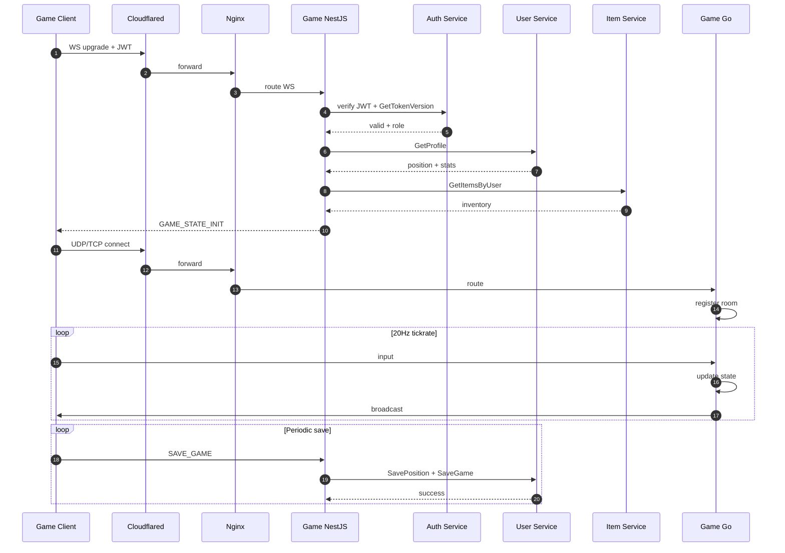
```mermaid
sequenceDiagram
    autonumber
    participant C as Game Client
    participant CF as Cloudflared
    participant Nginx as Nginx
    participant GameNest as Game NestJS
    participant Auth as Auth Service
    participant User as User Service
    participant Item as Item Service
    participant GameGo as Game Go

    C->>CF: WS upgrade + JWT
    CF->>Nginx: forward
    Nginx->>GameNest: route WS
    GameNest->>Auth: verify JWT + GetTokenVersion
    Auth-->>GameNest: valid + role
    GameNest->>User: GetProfile
    User-->>GameNest: position + stats
    GameNest->>Item: GetItemsByUser
    Item-->>GameNest: inventory
    GameNest-->>C: GAME_STATE_INIT

    C->>CF: UDP/TCP connect
    CF->>Nginx: forward
    Nginx->>GameGo: route
    GameGo->>GameGo: register room

    loop 20Hz tickrate
        C->>GameGo: input
        GameGo->>GameGo: update state
        GameGo->>C: broadcast
    end

    loop Periodic save
        C->>GameNest: SAVE_GAME
        GameNest->>User: SavePosition + SaveGame
        User-->>GameNest: success
    end
```

### 6.9. Friend & Chat

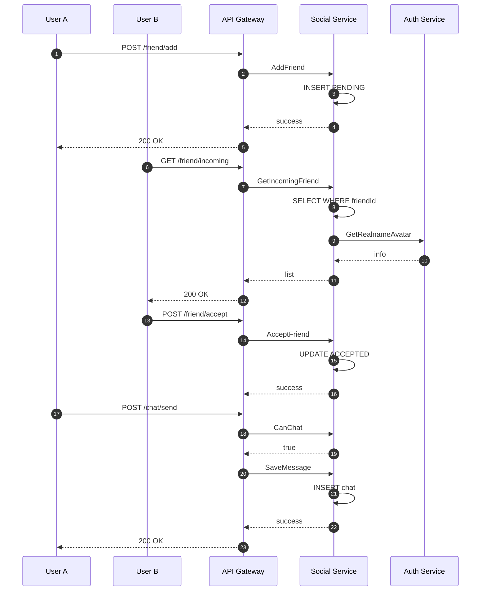
```mermaid
sequenceDiagram
    autonumber
    participant U1 as User A
    participant U2 as User B
    participant GW as API Gateway
    participant Social as Social Service
    participant Auth as Auth Service

    U1->>GW: POST /friend/add
    GW->>Social: AddFriend
    Social->>Social: INSERT PENDING
    Social-->>GW: success
    GW-->>U1: 200 OK

    U2->>GW: GET /friend/incoming
    GW->>Social: GetIncomingFriend
    Social->>Social: SELECT WHERE friendId
    Social->>Auth: GetRealnameAvatar
    Auth-->>Social: info
    Social-->>GW: list
    GW-->>U2: 200 OK

    U2->>GW: POST /friend/accept
    GW->>Social: AcceptFriend
    Social->>Social: UPDATE ACCEPTED
    Social-->>GW: success

    U1->>GW: POST /chat/send
    GW->>Social: CanChat
    Social-->>GW: true
    GW->>Social: SaveMessage
    Social->>Social: INSERT chat
    Social-->>GW: success
    GW-->>U1: 200 OK
```

### 6.10. Leaderboard

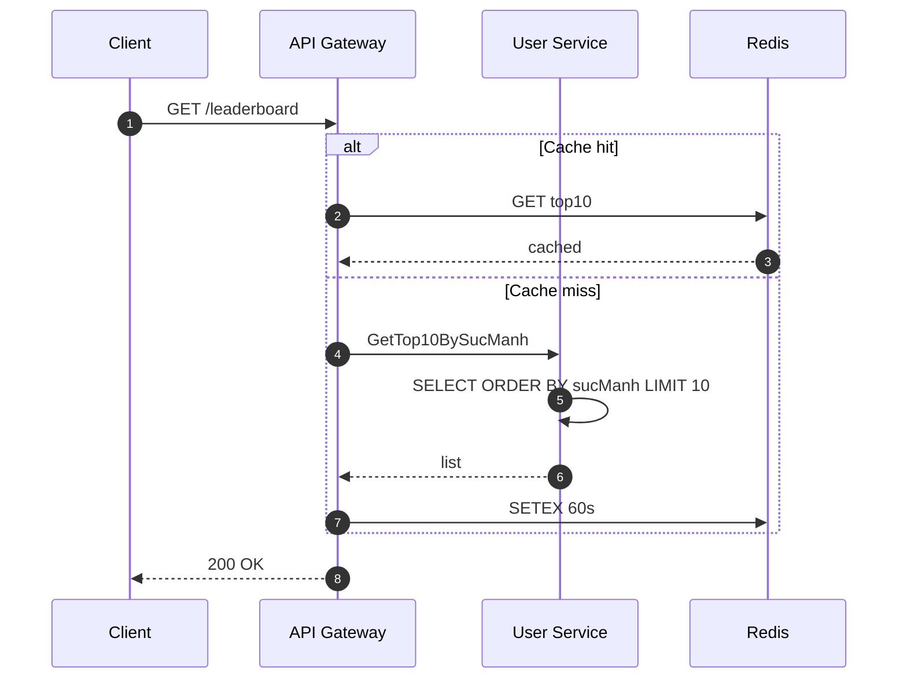
```mermaid
sequenceDiagram
    autonumber
    participant C as Client
    participant GW as API Gateway
    participant User as User Service
    participant Cache as Redis

    C->>GW: GET /leaderboard

    alt Cache hit
        GW->>Cache: GET top10
        Cache-->>GW: cached
    else Cache miss
        GW->>User: GetTop10BySucManh
        User->>User: SELECT ORDER BY sucManh LIMIT 10
        User-->>GW: list
        GW->>Cache: SETEX 60s
    end

    GW-->>C: 200 OK
```

### 6.11. Editor Post + Comment

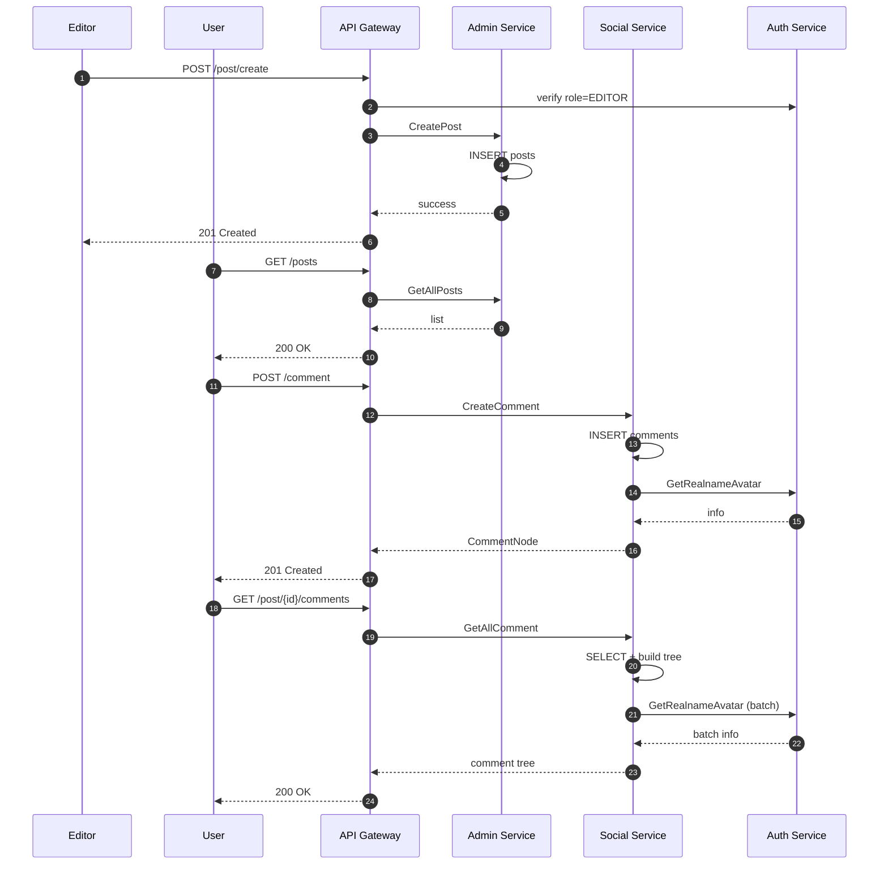
```mermaid
sequenceDiagram
    autonumber
    participant E as Editor
    participant U as User
    participant GW as API Gateway
    participant Admin as Admin Service
    participant Social as Social Service
    participant Auth as Auth Service

    E->>GW: POST /post/create
    GW->>Auth: verify role=EDITOR
    GW->>Admin: CreatePost
    Admin->>Admin: INSERT posts
    Admin-->>GW: success
    GW-->>E: 201 Created

    U->>GW: GET /posts
    GW->>Admin: GetAllPosts
    Admin-->>GW: list
    GW-->>U: 200 OK

    U->>GW: POST /comment
    GW->>Social: CreateComment
    Social->>Social: INSERT comments
    Social->>Auth: GetRealnameAvatar
    Auth-->>Social: info
    Social-->>GW: CommentNode
    GW-->>U: 201 Created

    U->>GW: GET /post/{id}/comments
    GW->>Social: GetAllComment
    Social->>Social: SELECT + build tree
    Social->>Auth: GetRealnameAvatar (batch)
    Auth-->>Social: batch info
    Social-->>GW: comment tree
    GW-->>U: 200 OK
```

## 7. Database Distribution

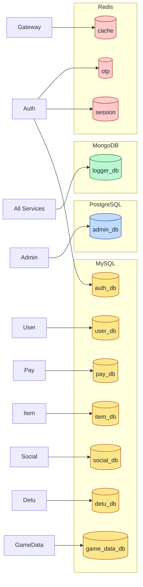
```mermaid
graph LR
    subgraph MySQL_DBs["MySQL"]
        AuthDB[(auth_db)]
        UserDB[(user_db)]
        PayDB[(pay_db)]
        ItemDB[(item_db)]
        SocialDB[(social_db)]
        DetuDB[(detu_db)]
        GameDataDB[(game_data_db)]
    end

    subgraph Postgres_DBs["PostgreSQL"]
        AdminDB[(admin_db)]
    end

    subgraph Mongo_DBs["MongoDB"]
        LoggerDB[(logger_db)]
    end

    subgraph Redis_DBs["Redis"]
        SessionRedis[(session)]
        OtpRedis[(otp)]
        CacheRedis[(cache)]
    end

    Auth[Auth] --> AuthDB
    User[User] --> UserDB
    Pay[Pay] --> PayDB
    Item[Item] --> ItemDB
    Social[Social] --> SocialDB
    Detu[Detu] --> DetuDB
    GameData[GameData] --> GameDataDB
    Admin[Admin] --> AdminDB
    AllSvcs[All Services] --> LoggerDB
    Auth --> SessionRedis
    Auth --> OtpRedis
    Gateway[Gateway] --> CacheRedis

    classDef mysql fill:#fde68a,stroke:#92400e,color:#1f2937
    classDef pg fill:#bfdbfe,stroke:#1e3a8a,color:#1f2937
    classDef mongo fill:#bbf7d0,stroke:#14532d,color:#1f2937
    classDef redis fill:#fecaca,stroke:#991b1b,color:#1f2937
    class AuthDB,UserDB,PayDB,ItemDB,SocialDB,DetuDB,GameDataDB mysql
    class AdminDB pg
    class LoggerDB mongo
    class SessionRedis,OtpRedis,CacheRedis redis
```