# Dragon Boy — Tài liệu Phân tích Nghiệp vụ (Business Analysis Document)

---

## Thông tin tài liệu

| Trường | Nội dung |
|--------|----------|
| **Tên dự án** | Dragon Boy — Hệ thống Game Online (Microservices) |
| **Loại tài liệu** | Business Analysis Document (BA) / Software Requirements & Architecture |
| **Phiên bản** | 1.0 |
| **Người thực hiện** | DANG-PH |
| **Vai trò** | Business Analyst / System Designer |
| **Ngày tạo** | 2026-05-23 |
| **Trạng thái** | Draft for review |

### Lịch sử phiên bản

| Phiên bản | Ngày | Người sửa | Mô tả thay đổi |
|-----------|------|-----------|----------------|
| 0.1 | 2026-05-10 | DANG-PH | Khởi tạo: kiến trúc service, ERD, sequence diagram |
| 0.5 | 2026-05-18 | DANG-PH | Bổ sung use case diagram, data flow domain view |
| 1.0 | 2026-05-23 | DANG-PH | Hoàn thiện tài liệu BA: actor, use case spec, business rules, NFR, glossary, module nhạc nền runtime (entity Music) |
| 2.0 | 2026-05-23 | DANG-PH | Bổ sung: luồng nạp tiền (VietQR/PayOS webhook), ma trận phân quyền 7 role (RBAC), bảng tech stack đầy đủ, observability & alerting, circuit breaker, RAG, phụ lục API |

---

## Mục lục

1. [Giới thiệu](#1-giới-thiệu)
   - 1.1. [Mục đích tài liệu](#11-mục-đích-tài-liệu)
   - 1.2. [Phạm vi hệ thống](#12-phạm-vi-hệ-thống)
   - 1.3. [Đối tượng đọc](#13-đối-tượng-đọc)
   - 1.4. [Tài liệu tham chiếu](#14-tài-liệu-tham-chiếu)
2. [Tổng quan hệ thống](#2-tổng-quan-hệ-thống)
   - 2.1. [Bối cảnh nghiệp vụ](#21-bối-cảnh-nghiệp-vụ)
   - 2.2. [Danh sách microservice](#22-danh-sách-microservice)
3. [Danh sách Actor](#3-danh-sách-actor)
4. [Ma trận phân quyền (RBAC Matrix)](#4-ma-trận-phân-quyền)
5. [Đặc tả Use Case (Use Case Specification)](#5-đặc-tả-use-case)
   - 5.1. [UC-01 Đăng ký tài khoản (Register Saga)](#51-uc-01-đăng-ký-tài-khoản-register-saga)
   - 5.2. [UC-02 Đăng nhập + OTP](#52-uc-02-đăng-nhập--otp)
   - 5.3. [UC-12 Nạp tiền (Deposit qua VietQR + Webhook)](#53-uc-12-nạp-tiền-deposit-qua-vietqr--webhook)
   - 5.4. [UC-14 Mua vật phẩm trên Web (Buy Item Saga)](#54-uc-14-mua-vật-phẩm-trên-web-buy-item-saga)
   - 5.5. [UC-25 Mua tài khoản (Buy Account Saga + Compensation)](#55-uc-25-mua-tài-khoản-buy-account-saga--compensation)
   - 5.6. [UC-13 Rút tiền (Withdraw)](#56-uc-13-rút-tiền-withdraw)
   - 5.7. [UC-07 Kết nối Game & Realtime](#57-uc-07-kết-nối-game--realtime)
   - 5.8. [UC-31 Quản lý nhạc nền (Music Management)](#58-uc-31-quản-lý-nhạc-nền-music-management)
   - 5.9. [UC-24 Đăng bán tài khoản (Confirm qua Email)](#59-uc-24-đăng-bán-tài-khoản-confirm-qua-email)
   - 5.10. [UC-35 Hỏi AI về tài liệu game (RAG Chatbot)](#510-uc-35-hỏi-ai-về-tài-liệu-game-rag-chatbot)
6. [Business Rules (Quy tắc nghiệp vụ)](#6-business-rules)
7. [Yêu cầu phi chức năng (Non-Functional Requirements)](#7-yêu-cầu-phi-chức-năng)
8. [Công nghệ sử dụng (Technology Stack)](#8-công-nghệ-sử-dụng)
9. [Observability, Alerting & Vận hành](#9-observability-alerting--vận-hành)
10. [Thiết kế kiến trúc (Architecture)](#10-thiết-kế-kiến-trúc)
11. [Thiết kế dữ liệu (Data Design / ERD)](#11-thiết-kế-dữ-liệu)
12. [Module nhạc nền Runtime (Music Streaming)](#12-module-nhạc-nền-runtime)
13. [Use Case Diagram](#13-use-case-diagram)
14. [Sequence Diagrams](#14-sequence-diagrams)
15. [Phụ lục: Danh mục API](#15-phụ-lục-danh-mục-api)
16. [Cron & Scheduled Jobs](#16-cron--scheduled-jobs)
17. [Thuật ngữ (Glossary)](#17-thuật-ngữ)

---

## 1. Giới thiệu

### 1.1. Mục đích tài liệu

Tài liệu này mô tả đầy đủ nghiệp vụ, kiến trúc và thiết kế dữ liệu của hệ thống game **Dragon Boy**. Tài liệu phục vụ việc thống nhất hiểu biết giữa các bên liên quan (developer, QA, người chấm/đánh giá) về *hệ thống làm gì*, *ai dùng*, *ràng buộc nghiệp vụ ra sao* và *hệ thống được xây dựng như thế nào*.

Tài liệu kết hợp hai góc nhìn: góc nhìn **nghiệp vụ** (actor, use case, business rule) dành cho stakeholder, và góc nhìn **kỹ thuật** (kiến trúc microservice, ERD, sequence) dành cho đội phát triển.

### 1.2. Phạm vi hệ thống

Trong phạm vi (in scope): xác thực người dùng, quản lý nhân vật và tài sản trong game, hệ thống tiền tệ (nạp/rút/giao dịch), mạng xã hội (bạn bè, chat, bình luận), giao dịch mua bán tài khoản, quản trị nội dung, kết nối game thời gian thực, và quản lý nhạc nền runtime.

Ngoài phạm vi (out of scope): cổng thanh toán bên thứ ba (chỉ mô tả ở mức tích hợp), nội dung gameplay chi tiết (cân bằng game, level design), hạ tầng vận hành chi tiết (CI/CD pipeline cụ thể).

### 1.3. Đối tượng đọc

Tài liệu dành cho: giảng viên/người đánh giá, đội phát triển backend, kỹ sư QA, và bất kỳ ai cần hiểu tổng thể hệ thống trước khi tham gia phát triển hoặc kiểm thử.

### 1.4. Tài liệu tham chiếu

Tham chiếu nội bộ: bộ diagram kiến trúc hệ thống (Mermaid), tài liệu thiết kế module nhạc nền runtime, định nghĩa proto của các service (`game-data.pb`, v.v.).

---

## 2. Tổng quan hệ thống

### 2.1. Bối cảnh nghiệp vụ

Dragon Boy là một game online nhiều người chơi, kết hợp giữa **web client** (cổng thông tin, nạp/rút tiền, mạng xã hội, mua bán) và **game client thời gian thực** (di chuyển nhân vật, chiến đấu, lưu trạng thái). Người chơi tạo tài khoản, sở hữu nhân vật với các chỉ số (sức mạnh, vàng, ngọc), vật phẩm và đệ tử; có thể giao tiếp xã hội, nạp tiền để mua vật phẩm, rút tiền thưởng, và mua bán cả tài khoản với nhau.

Hệ thống được xây dựng theo kiến trúc **microservices**, mỗi nghiệp vụ là một service độc lập, giao tiếp qua gRPC nội bộ và đi qua một API Gateway phía ngoài. Các giao dịch liên-service quan trọng (đăng ký, mua vật phẩm, mua tài khoản) được đảm bảo nhất quán bằng mẫu **Saga + Outbox**, có cơ chế bù trừ (compensation) khi thất bại.

### 2.2. Danh sách microservice

| Service | Vai trò nghiệp vụ |
|---------|-------------------|
| **API Gateway** | Điểm vào duy nhất cho request nghiệp vụ; xác thực JWT, định tuyến tới service đích |
| **Auth Service** | Đăng ký, đăng nhập, OTP, OAuth Google, đổi/đặt lại mật khẩu, quản lý token, ban tài khoản |
| **User Service** | Hồ sơ nhân vật, chỉ số game (sức mạnh, vàng, ngọc), vị trí, vật phẩm web, leaderboard |
| **Pay Service** | Ví tiền người dùng, nạp/trừ tiền, lịch sử dòng tiền (cash flow) |
| **Item Service** | Vật phẩm trong game (tạo, truy vấn theo người dùng, kho đồ) |
| **Social Service** | Bạn bè, chat 1-1, chat nhóm, bình luận, thông báo |
| **Admin Service** | Quản trị: duyệt rút tiền, ban user, đổi role, bài viết, mua bán tài khoản |
| **Đệ Tử Service** | Quản lý đệ tử (pet/companion) gắn với nhân vật |
| **Game Data Service** | Dữ liệu nền của game (bản đồ, NPC, vật phẩm gốc, shop NPC, **nhạc nền**) |
| **Queue Service** | Xử lý hàng đợi tác vụ nền (liên quan vật phẩm) |
| **Devops Service** | Hỗ trợ vận hành |
| **Game Service (NestJS)** | Cổng WebSocket realtime: khởi tạo trạng thái game, lưu game định kỳ |
| **Game Service (Go)** | Vòng lặp game thời gian thực, tickrate 20Hz, đồng bộ trạng thái phòng chơi |

---

## 3. Danh sách Actor

Phần này mô tả các **actor nghiệp vụ** tương tác với hệ thống. Hệ thống dùng cơ chế phân quyền theo vai trò (RBAC) với 7 role định nghĩa trong `enum Role`. Lưu ý: tác giả tài liệu (DANG-PH) **không phải** actor nghiệp vụ; thông tin đó nằm ở mục Thông tin tài liệu.

| Actor / Role | Loại | Mô tả | Quyền hạn chính |
|--------------|------|-------|-----------------|
| **USER (Player)** | Người dùng | Người chơi thông thường, sở hữu tài khoản và nhân vật | Đăng ký/đăng nhập, chơi game, quản lý kho đồ, nạp/rút tiền, mua vật phẩm, mua tài khoản, kết bạn, chat, bình luận |
| **EDITOR** | Nội bộ | Người biên tập nội dung | Tạo/sửa/xóa bài viết; xem bài viết theo editor |
| **PARTNER** | Người dùng | Đối tác bán tài khoản trên sàn giao dịch | Đăng bán/sửa/xóa tài khoản rao bán; xem danh sách rao bán của mình |
| **FINANCE** | Quản trị | Bộ phận tài chính — chỉ xem (read-only) | Xem giao dịch theo user, xem toàn bộ giao dịch, thống kê tổng nạp/rút/số dư hệ thống |
| **CASHIER** | Quản trị | Thủ quỹ — xử lý rút tiền | Xem tất cả yêu cầu rút tiền, **duyệt** và **từ chối** yêu cầu rút tiền sau khi chuyển khoản |
| **PLAYER_MANAGER** | Quản trị | Quản lý người chơi | Xem profile/item/đệ tử/ví của user bất kỳ; gửi email thông báo; **ban tạm thời (tối đa 3 ngày)** và mở khóa; quản lý nhạc nền |
| **ADMIN** | Quản trị | Quản trị viên cấp cao — bao trùm mọi quyền | Toàn bộ quyền của các role trên: đổi role, ban/unban vĩnh viễn, cộng/trừ tài nguyên, quản lý ví, quản lý game data, quản lý nhạc nền, khóa bài viết |
| **System** | Hệ thống | Tác nhân tự động | Outbox poller, saga orchestrator, cron job (alert doanh thu, auto-unban, backup), circuit breaker |
| **Google API** | Hệ thống ngoài | Nhà cung cấp OAuth | Xác thực danh tính khi đăng nhập bằng Google |
| **PayOS / Casso** | Hệ thống ngoài | Cổng nhận webhook thanh toán | Bắn webhook xác nhận giao dịch chuyển khoản về server để cộng tiền |

> **Ghi chú phân cấp quyền:** ADMIN là superset — làm được mọi thứ. Các role chuyên biệt (FINANCE, CASHIER, PLAYER_MANAGER, EDITOR, PARTNER) chỉ có quyền trong phạm vi của mình. Chi tiết xem Ma trận phân quyền (mục 4).
>
> **Ghi chú về quản lý nhạc nền:** Các use case quản lý nhạc nền được gán cho role **ADMIN / PLAYER_MANAGER**. Entity `Music` thuộc Game Data Service và không gắn với thông tin tác giả tài liệu.

---

## 4. Ma trận phân quyền

Hệ thống phân quyền theo vai trò (Role-Based Access Control). `enum Role` gồm 7 giá trị:

```typescript
export enum Role {
  ADMIN = 'ADMIN',
  USER = 'USER',
  PARTNER = 'PARTNER',
  FINANCE = 'FINANCE',
  CASHIER = 'CASHIER',
  EDITOR = 'EDITOR',
  PLAYER_MANAGER = 'PLAYER_MANAGER',
}
```

Ma trận dưới đây tổng hợp quyền theo nhóm chức năng. Ký hiệu: ✅ có quyền · ⬜ không · *(self)* chỉ thao tác trên dữ liệu của chính mình.

| Nhóm chức năng | USER | PARTNER | EDITOR | FINANCE | CASHIER | PLAYER_MANAGER | ADMIN |
|----------------|:----:|:-------:|:------:|:-------:|:-------:|:--------------:|:-----:|
| Đăng ký / đăng nhập / OTP | ✅ | ✅ | ✅ | ✅ | ✅ | ✅ | ✅ |
| Chơi game / lưu game / kho đồ | ✅(self) | ⬜ | ⬜ | ⬜ | ⬜ | ⬜ | ✅ |
| Nạp tiền (deposit) | ✅(self) | ✅ | ⬜ | ⬜ | ⬜ | ⬜ | ✅ |
| Tạo yêu cầu rút tiền | ✅(self) | ✅ | ⬜ | ⬜ | ⬜ | ⬜ | ✅ |
| Duyệt / từ chối rút tiền | ⬜ | ⬜ | ⬜ | ⬜ | ✅ | ⬜ | ✅ |
| Xem giao dịch / thống kê dòng tiền | ⬜ | ⬜ | ⬜ | ✅ | ⬜ | ⬜ | ✅ |
| Mua vật phẩm web | ✅(self) | ✅ | ⬜ | ⬜ | ⬜ | ⬜ | ✅ |
| Mua tài khoản | ✅ | ✅ | ⬜ | ⬜ | ⬜ | ⬜ | ✅ |
| Đăng / sửa / xóa tài khoản rao bán | ⬜ | ✅(self) | ⬜ | ⬜ | ⬜ | ⬜ | ✅ |
| Mạng xã hội (bạn bè, chat, comment) | ✅ | ✅ | ✅ | ✅ | ✅ | ✅ | ✅ |
| Tạo / sửa / xóa bài viết | ⬜ | ⬜ | ✅ | ⬜ | ⬜ | ⬜ | ✅ |
| Khóa / mở khóa bài viết | ⬜ | ⬜ | ⬜ | ⬜ | ⬜ | ⬜ | ✅ |
| Xem profile/ví/item/đệ tử của user khác | ⬜ | ⬜ | ⬜ | ⬜ | ⬜ | ✅ | ✅ |
| Gửi email thông báo | ⬜ | ⬜ | ⬜ | ⬜ | ⬜ | ✅ | ✅ |
| Ban tạm thời (≤ 3 ngày) / mở khóa | ⬜ | ⬜ | ⬜ | ⬜ | ⬜ | ✅ | ✅ |
| Ban / unban vĩnh viễn | ⬜ | ⬜ | ⬜ | ⬜ | ⬜ | ⬜ | ✅ |
| Đổi role của user | ⬜ | ⬜ | ⬜ | ⬜ | ⬜ | ⬜ | ✅ |
| Cộng / trừ tài nguyên (vàng/ngọc) cho user | ⬜ | ⬜ | ⬜ | ⬜ | ⬜ | ⬜ | ✅ |
| Quản lý ví user (tiền, khóa/mở ví) | ⬜ | ⬜ | ⬜ | ⬜ | ⬜ | ⬜ | ✅ |
| Quản lý game data (map, NPC, shop, item base) | ⬜ | ⬜ | ⬜ | ⬜ | ⬜ | ⬜ | ✅ |
| Quản lý nhạc nền (upload/sửa/xóa) | ⬜ | ⬜ | ⬜ | ⬜ | ⬜ | ✅ | ✅ |

> **Lưu ý self-service vs quản trị:** USER thao tác tài chính/tài sản trên *chính mình* (`/user/*`, `/pay/pay`, `/cashier/create-withdraw`). Các role quản trị thao tác trên *user bất kỳ* qua nhóm API riêng (`/admin/*`, `/player_manager/*`, `/cashier/*`, `/finance/*`). Việc tách nhóm API theo role giúp phân quyền rõ ràng ở tầng Gateway.
---

## 5. Đặc tả Use Case

Phần này đặc tả chi tiết các use case quan trọng nhất (luồng chính, luồng phụ, ngoại lệ, tiền/hậu điều kiện). Các use case còn lại được liệt kê ở Use Case Diagram (mục 13) và Phụ lục API (mục 15).

### 5.1. UC-01 Đăng ký tài khoản (Register Saga)

| Trường | Nội dung |
|--------|----------|
| **Mã** | UC-01 |
| **Actor chính** | Player |
| **Actor phụ** | System (outbox poller), Auth / User / Pay Service |
| **Mô tả** | Người dùng tạo tài khoản mới; hệ thống khởi tạo đồng bộ bản ghi auth, hồ sơ nhân vật và ví tiền qua mẫu Saga + Outbox |
| **Tiền điều kiện** | Username chưa tồn tại; email hợp lệ |
| **Hậu điều kiện** | Tồn tại bản ghi ở `auth`, `users` (+ stats + position) và `pay`; tất cả outbox ở trạng thái DONE |

**Luồng chính:**
1. Player gửi yêu cầu đăng ký (username, email, password).
2. Auth Service mở transaction, ghi bản ghi `auth` và một bản ghi `register_outbox` trạng thái PENDING, rồi commit.
3. Auth trả về thành công kèm `auth_id`; Player nhận phản hồi 201 ngay (không phải chờ các bước sau).
4. Outbox poller (System) đọc bản ghi PENDING, gọi User Service tạo `users` + `user_game_stats` + `users_position`, đồng thời ghi `create_pay_outbox`.
5. Poller của User Service gọi Pay Service tạo ví (`pay`); khi thành công, đánh dấu các outbox là DONE.

**Luồng ngoại lệ:**
- **E1 — Username đã tồn tại:** Auth từ chối, trả lỗi trùng tên, không tạo outbox.
- **E2 — Bước sau saga thất bại:** Bản ghi outbox giữ trạng thái PENDING/FAILED và được retry theo `nextRetryAt`; tài khoản auth vẫn tồn tại nhưng hồ sơ/ví sẽ được hoàn tất khi retry thành công (eventual consistency).

---

### 5.2. UC-02 Đăng nhập + OTP

| Trường | Nội dung |
|--------|----------|
| **Mã** | UC-02 |
| **Actor chính** | Player |
| **Actor phụ** | Auth Service, Redis, Email |
| **Mô tả** | Đăng nhập hai bước: xác thực mật khẩu rồi xác minh OTP gửi qua email |
| **Tiền điều kiện** | Tài khoản tồn tại, không bị ban (`biBan = false`) |
| **Hậu điều kiện** | Người dùng nhận được cặp token (access + refresh) và role |

**Luồng chính:**
1. Player gửi username + password.
2. Auth xác thực mật khẩu và kiểm tra cờ `biBan`.
3. Auth tạo session (TTL 5 phút) và OTP (TTL 5 phút) lưu trong Redis, gửi OTP qua email, trả về `sessionId`.
4. Player gửi `sessionId` + OTP.
5. Auth lấy OTP từ Redis, so khớp, sinh JWT, xóa OTP, trả về token + role.

**Luồng ngoại lệ:**
- **E1 — Sai mật khẩu:** trả lỗi xác thực, không gửi OTP.
- **E2 — Tài khoản bị ban:** từ chối đăng nhập.
- **E3 — OTP sai/hết hạn:** từ chối; người dùng phải đăng nhập lại để nhận OTP mới.

---

### 5.3. UC-12 Nạp tiền (Deposit qua VietQR + Webhook)

| Trường | Nội dung |
|--------|----------|
| **Mã** | UC-12 |
| **Actor chính** | Player |
| **Actor phụ** | Pay Service, PayOS / Casso (cổng webhook), Ngân hàng (VietQR) |
| **Mô tả** | Người dùng nạp tiền bằng cách quét mã QR VietQR và chuyển khoản; cổng thanh toán bắn webhook về server; server đối chiếu nội dung CK + số tiền + idempotency để cộng tiền vào ví |
| **Tiền điều kiện** | Người dùng đã đăng nhập; có tài khoản ví (`pay`) |
| **Hậu điều kiện** | Số dư ví `pay` tăng đúng số tiền nạp; ghi `cash_flow_management` loại nạp; mỗi giao dịch chỉ cộng đúng một lần |

**Luồng chính:**
1. Player yêu cầu nạp tiền; hệ thống trả về mã QR VietQR (kèm nội dung chuyển khoản định danh được giao dịch/người dùng).
2. Player quét QR và chuyển khoản qua app ngân hàng.
3. Ngân hàng xử lý; cổng PayOS/Casso phát hiện giao dịch và gửi **webhook** về server.
4. Server xác thực webhook (chữ ký/secret), đọc nội dung CK + số tiền + mã giao dịch.
5. Server kiểm tra **idempotency key** (mã giao dịch của cổng): nếu chưa xử lý thì cộng tiền vào ví `pay` và ghi `cash_flow_management`; nếu đã xử lý thì bỏ qua (trả 200 để cổng không retry vô hạn).

**Luồng ngoại lệ:**
- **E1 — Webhook trùng (đã xử lý):** nhờ idempotency, server không cộng tiền lần hai (chống double-credit khi cổng retry).
- **E2 — Nội dung CK không khớp user nào:** ghi nhận giao dịch "treo" để đối soát thủ công, không cộng tự động.
- **E3 — Sai chữ ký webhook:** từ chối, không xử lý.

> **Ghi chú thiết kế (cần xác nhận lại với bản cài đặt thực tế):** tiền nạp được cộng vào **ví `pay`** (số dư rút được). Việc quy đổi sang vàng/ngọc in-game (`vangNapTuWeb`/`ngocNapTuWeb`) là thao tác riêng do người dùng chủ động qua `/user/add-vang-web`, `/user/add-ngoc-web`. Nếu luồng thực tế khác, chỉ cần sửa lại đoạn này.

**Quy tắc liên quan:** BR-06, BR-07, BR-16 (mục 6).

---

### 5.4. UC-14 Mua vật phẩm trên Web (Buy Item Saga)

| Trường | Nội dung |
|--------|----------|
| **Mã** | UC-14 |
| **Actor chính** | Player |
| **Actor phụ** | User / Item / Pay Service, System (outbox poller) |
| **Mô tả** | Người dùng mua vật phẩm; vật phẩm được tạo trước, việc trừ tiền diễn ra bất đồng bộ qua outbox có idempotency |
| **Tiền điều kiện** | Người dùng đã đăng nhập; có đủ số dư (kiểm tra ở bước trừ tiền) |
| **Hậu điều kiện** | Vật phẩm thuộc về người dùng; tiền đã bị trừ đúng một lần; cash flow được ghi |

**Luồng chính:**
1. Player gửi yêu cầu mua vật phẩm.
2. User Service gọi Item Service tạo bản ghi `items`.
3. User Service mở transaction: ghi `users_web_item` + `buy_item_outbox` (PENDING), commit, trả về thành công.
4. Outbox poller gọi Pay Service trừ tiền (kèm idempotency key).
5. Pay trừ tiền, ghi `cash_flow_management`; outbox chuyển DONE.

**Luồng ngoại lệ:**
- **E1 — Idempotency key đã dùng:** Pay trả về phản hồi đã lưu (cached), outbox vẫn chuyển DONE (chống trừ tiền hai lần).
- **E2 — Không đủ số dư:** bước trừ tiền thất bại; saga thực hiện **bù trừ (compensation)** — thu hồi vật phẩm đã tạo và xóa bản ghi `users_web_item`, đưa trạng thái về như trước khi mua. Đây là hành vi đúng theo bản chất saga: bất kỳ bước nào fail thì rollback các bước trước đó.

---

### 5.5. UC-25 Mua tài khoản (Buy Account Saga + Compensation)

| Trường | Nội dung |
|--------|----------|
| **Mã** | UC-25 |
| **Actor chính** | Player (buyer) |
| **Actor phụ** | Admin Service, System (saga orchestrator), Pay Service, Auth Service |
| **Mô tả** | Mua một tài khoản đang rao bán; saga thực hiện trừ tiền người mua, cộng tiền đối tác, đổi mật khẩu và email của tài khoản được bán; nếu bất kỳ bước nào lỗi thì bù trừ toàn bộ |
| **Tiền điều kiện** | Tài khoản đang ở trạng thái rao bán (ACTIVE); người mua đủ số dư |
| **Hậu điều kiện (thành công)** | Tài khoản chuyển SOLD; mật khẩu/email đổi sang chủ mới; tiền chuyển từ buyer sang partner |
| **Hậu điều kiện (thất bại)** | Tài khoản trở lại ACTIVE; mọi thay đổi tiền/mật khẩu/email được hoàn nguyên |

**Luồng chính (Forward):**
1. Player gửi yêu cầu mua tài khoản.
2. Admin Service khóa bản ghi (`SELECT FOR UPDATE`), chuyển trạng thái PROCESSING và tăng `version` (chống mua trùng).
3. Ghi `outbox_events` (BUY_ACCOUNT) và `saga_state` (phase=FORWARD), trả về 202 Accepted.
4. Saga thực hiện tuần tự: trừ tiền buyer → cộng tiền partner → đổi mật khẩu → đổi email → cập nhật tài khoản SOLD. Mỗi bước hoàn tất được ghi vào `completed_steps`.
5. Khi đủ các bước, `saga_state.phase = DONE`.

**Luồng bù trừ (Compensation):**
- Nếu một bước thất bại, saga chuyển `phase = COMPENSATING` và hoàn nguyên theo thứ tự ngược: rollback email → rollback mật khẩu → hoàn tiền partner → hoàn tiền buyer → đưa tài khoản về ACTIVE → `phase = FAILED`.

**Quy tắc liên quan:** xem BR-09, BR-10, BR-11 (mục 6).

---

### 5.6. UC-13 Rút tiền (Withdraw)

| Trường | Nội dung |
|--------|----------|
| **Mã** | UC-13 |
| **Actor chính** | Player (yêu cầu), ADMIN / Player Manager (duyệt) |
| **Actor phụ** | Admin Service, Pay Service |
| **Mô tả** | Người dùng tạo yêu cầu rút tiền; admin chuyển khoản thủ công rồi duyệt để hệ thống trừ tiền |
| **Tiền điều kiện** | Số dư người dùng ≥ số tiền rút |
| **Hậu điều kiện** | Yêu cầu chuyển SUCCESS; số dư bị trừ; cash flow được ghi |

**Luồng chính:**
1. Player gửi yêu cầu rút (số tiền, thông tin ngân hàng).
2. Admin Service lấy số dư từ Pay, kiểm tra hợp lệ, ghi `withdraw_money` trạng thái PENDING.
3. Admin xem danh sách yêu cầu đang chờ.
4. Admin **chuyển khoản thủ công bên ngoài hệ thống**.
5. Admin bấm duyệt; trong một transaction, Admin Service gọi Pay trừ tiền + ghi cash flow, cập nhật yêu cầu SUCCESS.

**Luồng ngoại lệ:**
- **E1 — Số dư không đủ:** từ chối ngay khi tạo yêu cầu.
- **E2 — Admin từ chối:** yêu cầu chuyển trạng thái bị từ chối, không trừ tiền.

---

### 5.7. UC-07 Kết nối Game & Realtime

| Trường | Nội dung |
|--------|----------|
| **Mã** | UC-07 |
| **Actor chính** | Player (game client) |
| **Actor phụ** | Game NestJS, Auth / User / Item Service, Game Go |
| **Mô tả** | Client kết nối WebSocket để khởi tạo trạng thái game, sau đó kết nối tới server Go cho vòng lặp realtime 20Hz |
| **Tiền điều kiện** | JWT hợp lệ; `tokenVersion` khớp |
| **Hậu điều kiện** | Client nhận `GAME_STATE_INIT`; tham gia vòng lặp realtime; trạng thái được lưu định kỳ |

**Luồng chính:**
1. Client mở WebSocket kèm JWT; Game NestJS xác thực JWT và `tokenVersion` với Auth.
2. Game NestJS lấy hồ sơ (vị trí, chỉ số) từ User, lấy kho đồ từ Item, gửi `GAME_STATE_INIT`.
3. Client kết nối tới Game Go (UDP/TCP); Game Go đăng ký phòng chơi.
4. Vòng lặp 20Hz: client gửi input → Go cập nhật trạng thái → broadcast.
5. Định kỳ, client gửi `SAVE_GAME`; Game NestJS gọi User lưu vị trí và trạng thái.

**Luồng ngoại lệ:**
- **E1 — JWT không hợp lệ / sai tokenVersion:** từ chối kết nối (ví dụ sau khi đổi mật khẩu, token cũ vô hiệu).

---

### 5.8. UC-31 Quản lý nhạc nền (Music Management)

| Trường | Nội dung |
|--------|----------|
| **Mã** | UC-31 |
| **Actor chính** | ADMIN / Player Manager |
| **Actor phụ** | Game Data Service, Object Storage (Supabase), CDN/Worker |
| **Mô tả** | Quản trị viên tải lên, cập nhật, đổi trạng thái hoặc gỡ nhạc nền mà **không cần build lại client**; client tải nhạc theo URL bất biến (content-addressable) |
| **Tiền điều kiện** | Người dùng có role ADMIN / Player Manager; file là định dạng âm thanh hợp lệ |
| **Hậu điều kiện** | Bản ghi `music` được tạo/cập nhật; file tồn tại trên object storage theo key = hash; client có thể tải về khi status = ACTIVE |

**Luồng chính (Upload):**
1. Admin tải file nhạc lên qua giao diện quản trị.
2. Game Data Service tính hash MD5 của nội dung file, tạo key `{hash}.{ext}`.
3. Upload file lên object storage với key đó (idempotent: cùng nội dung → cùng key, ghi đè vô hại).
4. Ghi/cập nhật bản ghi `music` (name, fileUrl, hash, status = PROCESSING).
5. Sau khi xử lý xong, đổi `status = ACTIVE`; client sẽ thấy bài nhạc ở lần tải danh sách kế tiếp.

**Luồng phụ:**
- **A1 — Đổi trạng thái:** Admin chuyển một bài giữa PROCESSING / ACTIVE / (ẩn) để bật/tắt mà không xóa.
- **A2 — Cập nhật nội dung:** Upload file mới → hash mới → URL mới → cache cũ tự vô hiệu (không cần purge).
- **A3 — Xóa/gỡ:** Đánh dấu ẩn hoặc xóa bản ghi; file binary có thể giữ lại do dedup.

**Luồng ngoại lệ:**
- **E1 — Trùng hash:** file đã tồn tại → không tốn thêm dung lượng (deduplication), chỉ cập nhật metadata nếu cần.
- **E2 — Không đủ quyền:** người dùng không phải ADMIN / Player Manager bị từ chối.

**Quy tắc liên quan:** BR-12, BR-13 (mục 6).

---

### 5.9. UC-24 Đăng bán tài khoản (Confirm qua Email)

| Trường | Nội dung |
|--------|----------|
| **Mã** | UC-24 |
| **Actor chính** | Partner (hoặc ADMIN) |
| **Actor phụ** | Admin Service, Email |
| **Mô tả** | Partner đăng một tài khoản game lên sàn để bán; tài khoản chỉ chuyển sang trạng thái rao bán (ACTIVE) sau khi partner xác nhận qua link gửi trong email |
| **Tiền điều kiện** | Người dùng có role PARTNER hoặc ADMIN; cung cấp thông tin tài khoản cần bán (username, password, mô tả, giá) |
| **Hậu điều kiện** | Tài khoản tồn tại trong kho rao bán với trạng thái ACTIVE và hiển thị cho người mua |

**Luồng chính:**
1. Partner gửi yêu cầu đăng bán tài khoản (`POST /partner/create-account-sell`).
2. Admin Service tạo bản ghi `accounts_sell` ở trạng thái chờ xác nhận (chưa ACTIVE), gửi email chứa link xác nhận tới partner.
3. Partner mở email, bấm link xác nhận (`GET /partner/confirm-sell`).
4. Admin Service xác thực token trong link, chuyển trạng thái tài khoản sang **ACTIVE**.
5. Tài khoản xuất hiện trong danh sách rao bán cho người mua xem.

**Luồng ngoại lệ:**
- **E1 — Không xác nhận email:** tài khoản giữ trạng thái chờ, không hiển thị cho người mua; có thể hết hạn theo chính sách.
- **E2 — Token xác nhận sai/hết hạn:** từ chối kích hoạt.

> **Mục đích bước xác nhận email:** đảm bảo người đăng bán thực sự kiểm soát email (chống đăng bán nhầm/giả mạo) trước khi tài khoản được công khai trên sàn.

---

### 5.10. UC-35 Hỏi AI về tài liệu game (RAG Chatbot)

| Trường | Nội dung |
|--------|----------|
| **Mã** | UC-35 |
| **Actor chính** | Player |
| **Actor phụ** | AI Service, Gemini (embedding + LLM), kho tài liệu (PDF) |
| **Mô tả** | Người chơi đặt câu hỏi về cách chơi/chính sách; hệ thống dùng Retrieval-Augmented Generation truy xuất nội dung liên quan từ tài liệu rồi sinh câu trả lời |
| **Tiền điều kiện** | Tài liệu nguồn (hướng dẫn chơi game, chính sách) đã được đọc từ PDF, embed và cache sẵn |
| **Hậu điều kiện** | Người dùng nhận câu trả lời dựa trên nội dung tài liệu chính thức |

**Luồng chuẩn bị (offline / một lần):**
1. Hệ thống đọc tài liệu PDF (hướng dẫn chơi, chính sách).
2. Chia nhỏ (chunk), tạo embedding bằng model của Gemini.
3. Cache embedding ở local để truy vấn nhanh, không phải embed lại mỗi lần.

**Luồng chính (runtime):**
1. Player gửi câu hỏi (`POST /ai/ask`).
2. AI Service embed câu hỏi, truy xuất các đoạn tài liệu liên quan nhất từ cache.
3. Ghép ngữ cảnh + câu hỏi thành prompt, gọi LLM Gemini sinh câu trả lời.
4. Trả về câu trả lời cho người dùng.

**Luồng ngoại lệ:**
- **E1 — Không tìm thấy ngữ cảnh liên quan:** trả lời rằng không có thông tin trong tài liệu thay vì bịa (giảm hallucination).

> **Ghi chú:** đây là tính năng dành cho **người chơi** (không phải công cụ nội bộ), giúp tra cứu hướng dẫn và chính sách ngay trong sản phẩm.

---

## 6. Business Rules

Các quy tắc nghiệp vụ được trích xuất và tổng hợp từ thiết kế hệ thống.

| Mã | Quy tắc | Áp dụng tại |
|----|---------|-------------|
| **BR-01** | Username phải là duy nhất trong toàn hệ thống | UC-01 |
| **BR-02** | OTP và session đăng nhập hết hạn sau **5 phút**; OTP bị xóa ngay sau khi xác minh thành công (dùng một lần) | UC-02 |
| **BR-03** | Tài khoản có cờ `biBan = true` không được phép đăng nhập | UC-02 |
| **BR-04** | Mỗi lần đổi mật khẩu làm tăng `tokenVersion`, vô hiệu hóa toàn bộ token cũ (buộc đăng nhập lại) | UC-02, UC-07 |
| **BR-05** | Đăng nhập Google: nếu chưa tồn tại tài khoản thì tự tạo mới (`type = 1`) qua saga đăng ký; nếu đã tồn tại thì đăng nhập trực tiếp | Login Google |
| **BR-06** | Mọi thao tác trừ tiền phải đi kèm **idempotency key** để chống trừ tiền nhiều lần | UC-14, UC-25 |
| **BR-07** | Mọi biến động số dư phải ghi một bản ghi `cash_flow_management` (audit dòng tiền) | UC-13, UC-14, UC-25 |
| **BR-08** | Yêu cầu rút tiền chỉ được tạo khi số dư hiện tại ≥ số tiền rút | UC-13 |
| **BR-09** | Việc trừ tiền khi rút chỉ thực hiện tại bước Admin **duyệt**, không phải lúc tạo yêu cầu | UC-13 |
| **BR-10** | Mua tài khoản dùng khóa bi quan (`SELECT FOR UPDATE`) + trường `version` để chống hai người mua trùng một tài khoản | UC-25 |
| **BR-11** | Saga mua tài khoản phải bù trừ toàn bộ (email → password → tiền partner → tiền buyer → trạng thái account) nếu bất kỳ bước nào thất bại | UC-25 |
| **BR-12** | Tên file nhạc trên storage = **hash MD5 của nội dung** (`{hash}.{ext}`); URL là bất biến (immutable / content-addressable) | UC-31 |
| **BR-13** | Client chỉ tải/hiển thị các bài nhạc có `status = ACTIVE`; bài `PROCESSING` chưa sẵn sàng phục vụ | UC-31 |
| **BR-14** | Quan hệ bạn bè phải ở trạng thái ACCEPTED thì hai người mới được chat 1-1 | UC-17 |
| **BR-15** | Chỉ Editor mới được tạo/sửa/xóa bài viết; chỉ ADMIN mới được khóa/mở khóa bài viết, ban/unban vĩnh viễn, đổi role, quản lý ví và tài nguyên user; CASHIER duyệt rút tiền; FINANCE chỉ xem; PLAYER_MANAGER ban tạm và gửi email | UC-13, UC-31, mục 4 |
| **BR-16** | Webhook nạp tiền phải idempotent theo mã giao dịch của cổng (PayOS/Casso); một giao dịch chỉ cộng tiền đúng một lần dù webhook bị gửi lặp | UC-12 |
| **BR-17** | Xóa nhạc nền là **soft delete**: chuyển `status = INACTIVE` thay vì xóa vật lý; client chỉ tải bài có `status = ACTIVE` | UC-31 |
| **BR-18** | Ban tạm thời tối đa **3 ngày**; khác với ban vĩnh viễn (`biBan`). PLAYER_MANAGER được ban tạm; chỉ ADMIN ban vĩnh viễn | UC-28 |

---

## 7. Yêu cầu phi chức năng

| Mã | Loại | Yêu cầu |
|----|------|---------|
| **NFR-01** | Hiệu năng (realtime) | Vòng lặp game chạy ở tickrate **20Hz** (cập nhật/đồng bộ trạng thái 20 lần/giây) trên Game Service Go |
| **NFR-02** | Hiệu năng (cache) | Leaderboard được cache trong Redis với TTL **60 giây** để giảm tải truy vấn xếp hạng |
| **NFR-03** | Độ tin cậy / Nhất quán | Các giao dịch liên-service đảm bảo *eventual consistency* qua Saga + Outbox; có retry theo `nextRetryAt` |
| **NFR-04** | Bảo mật | Toàn bộ lưu lượng vào hệ thống đi qua HTTPS (Cloudflared Tunnel); xác thực bằng JWT có versioning |
| **NFR-05** | Bảo mật | Đăng nhập hai lớp (mật khẩu + OTP email) cho tài khoản thường; webhook thanh toán xác thực bằng chữ ký/secret |
| **NFR-06** | Khả năng mở rộng (nội dung) | Nội dung động (nhạc nền) cập nhật ở **runtime** qua upload + DB, không cần rebuild/release client |
| **NFR-07** | Hiệu năng (phân phối file) | File nhạc phục vụ qua cache nhiều tầng (local client → Cloudflare Worker edge → Supabase CDN → origin storage) để tối ưu độ trễ cho người dùng VN |
| **NFR-08** | Lưu trữ | File binary lưu ở object storage, không lưu BLOB trong DB; metadata lưu ở DB quan hệ |
| **NFR-09** | Tính sẵn sàng | API Gateway là điểm vào duy nhất; áp dụng **circuit breaker** cho các downstream service để tránh lỗi lan truyền (cascading failure) |
| **NFR-10** | Khả năng bảo trì | Mỗi nghiệp vụ tách thành service riêng với database riêng (database-per-service) |
| **NFR-11** | Khả năng mở rộng (realtime) | WebSocket scale ngang nhiều instance nhờ **NATS / Redis Pub-Sub** đồng bộ sự kiện giữa các node |
| **NFR-12** | Xử lý bất đồng bộ | Tác vụ có độ trễ (delayed job) chạy qua **BullMQ** (trên Redis); messaging liên-service qua **RabbitMQ** |
| **NFR-13** | Giám sát (observability) | Thu thập metric bằng **Prometheus**, trực quan hóa bằng **Grafana**; có endpoint kiểm tra sức khỏe (`/health`) và trạng thái circuit breaker (`/health/circuit-breakers`) |
| **NFR-14** | Cảnh báo (alerting) | Gửi cảnh báo qua **Discord / Telegram / Email** cho sự cố hệ thống; **báo cáo doanh thu tự động lúc 0h hằng ngày** cho admin |
| **NFR-15** | Sao lưu / phục hồi | Có cơ chế **backup & restore database** định kỳ để phục hồi khi sự cố |

---

## 8. Công nghệ sử dụng

### 8.1. Tổng quan stack

| Lớp | Công nghệ | Vai trò |
|-----|-----------|---------|
| **Game client** | LibGDX (Java) | Client game, cache nhạc nền local (`Gdx.files.local`) |
| **Backend service** | NestJS (TypeScript) | Phần lớn microservice nghiệp vụ (auth, user, pay, item, social, admin, game-data...) |
| **Realtime engine** | Go | Game Service Go — vòng lặp 20Hz, xử lý input/broadcast |
| **Realtime gateway** | NestJS (WebSocket) | Game Service NestJS — khởi tạo trạng thái, lưu game định kỳ |
| **ORM** | TypeORM | Ánh xạ entity ↔ bảng (vd `MusicEntity`) |
| **Reverse proxy** | Nginx | Edge proxy + định tuyến tới service và DB |
| **Tunnel** | Cloudflared | Đưa lưu lượng HTTPS/WS từ Internet vào nội bộ |

### 8.2. Dữ liệu & lưu trữ

| Hệ | Dùng cho |
|----|----------|
| **MySQL** | `auth_db`, `user_db`, `pay_db`, `item_db`, `social_db`, `detu_db`, `game_data_db` (gồm cả entity `music`) |
| **PostgreSQL** | `admin_db` (saga, outbox events, accounts sell) |
| **MongoDB** | `logger_db` (log tập trung của toàn bộ service) |
| **Redis** | session, OTP, cache (leaderboard), backing store cho BullMQ và Pub-Sub |
| **Object Storage (Supabase)** | File nhạc binary (content-addressable theo hash) |

### 8.3. Giao tiếp & hàng đợi

| Thành phần | Công nghệ | Vai trò |
|------------|-----------|---------|
| **Giao tiếp nội bộ** | gRPC | Gọi hàm giữa các service |
| **Messaging** | RabbitMQ | Truyền message liên-service (event-driven) |
| **Delayed jobs** | BullMQ (trên Redis) | Tác vụ trễ/đặt lịch (vd hết hạn ban tạm, retry) |
| **WS horizontal scaling** | NATS / Redis Pub-Sub | Đồng bộ sự kiện WebSocket giữa nhiều instance để scale ngang |
| **Thanh toán** | VietQR + PayOS / Casso | Sinh QR, nhận webhook xác nhận chuyển khoản |
| **OAuth** | Google API | Đăng nhập bằng Google |
| **Email** | SMTP / mail service | Gửi OTP, thông báo từ PLAYER_MANAGER/ADMIN |
| **AI / RAG** | OpenAI (qua `/ai/ask`) | Hỏi đáp tài liệu dự án bằng Retrieval-Augmented Generation |

---

## 9. Observability, Alerting & Vận hành

### 9.1. Giám sát (Monitoring)

Hệ thống dùng **Prometheus** thu thập metric và **Grafana** trực quan hóa. Hai endpoint sức khỏe phục vụ CI/CD và giám sát:

| Endpoint | Mục đích |
|----------|----------|
| `GET /health` | Health check tổng quát cho CI/CD |
| `GET /health/circuit-breakers` | Trạng thái circuit breaker của tất cả downstream service |

### 9.2. Circuit Breaker

API Gateway áp dụng mẫu **Circuit Breaker** cho các lời gọi downstream: khi một service lỗi liên tục, mạch "ngắt" để tránh dồn request vào service đang hỏng và ngăn lỗi lan truyền toàn hệ thống (cascading failure). Trạng thái mạch quan sát được qua `/health/circuit-breakers`.

### 9.3. Alerting

| Kênh | Dùng cho |
|------|----------|
| **Discord / Telegram / Email** | Cảnh báo sự cố hệ thống (service down, lỗi nghiêm trọng, ngưỡng tài nguyên) |
| **Báo cáo định kỳ** | Báo cáo doanh thu tự động (tổng nạp / rút / lợi nhuận) gửi email cho admin lúc 0h hằng ngày |

### 9.4. Backup & Restore

Hệ thống có cơ chế sao lưu và phục hồi database định kỳ phục vụ khắc phục sự cố. *(Chi tiết lịch chạy và nơi lưu trữ tùy cấu hình vận hành thực tế — nên bổ sung nếu cần làm rõ trong phần triển khai.)*

### 9.5. Cron jobs (tác vụ định kỳ)

Hệ thống có nhiều tác vụ chạy theo lịch (event hằng ngày, báo cáo doanh thu, bảo trì, auto-unban, backup). Chi tiết lịch chạy, cơ chế chống chạy trùng (Redlock) và luồng bảo trì được mô tả riêng ở **chương 16 — Cron & Scheduled Jobs**.
---

## 10. Thiết kế kiến trúc

### 10.1. Service Topology

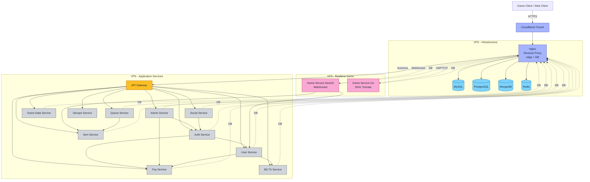
```mermaid
graph TB
    Client[Game Client / Web Client]
    CF[Cloudflared Tunnel]

    Client -->|HTTPS| CF

    subgraph VPS_Infra["VPS - Infrastructure"]
        Nginx[Nginx<br/>Reverse Proxy<br/>edge + DB]
        MySQL[(MySQL)]
        Postgres[(PostgreSQL)]
        Mongo[(MongoDB)]
        Redis[(Redis)]
    end

    subgraph VPS_App["VPS - Application Services"]
        Gateway[API Gateway]
        Auth[Auth Service]
        User[User Service]
        Pay[Pay Service]
        Item[Item Service]
        Social[Social Service]
        Admin[Admin Service]
        Detu[Đệ Tử Service]
        GameData[Game Data Service]
        Queue[Queue Service]
        Devops[Devops Service]
    end

    subgraph VPS_Game["VPS - Realtime Game"]
        GameNest[Game Service NestJS<br/>WebSocket]
        GameGo[Game Service Go<br/>20Hz Tickrate]
    end

    CF --> Nginx
    Nginx -->|business| Gateway
    Nginx -.WebSocket.-> GameNest
    Nginx -.UDP/TCP.-> GameGo

    Gateway --> Auth
    Gateway --> User
    Gateway --> Pay
    Gateway --> Item
    Gateway --> Social
    Gateway --> Admin
    Gateway --> Detu
    Gateway --> GameData
    Gateway --> Queue
    Gateway --> Devops

    Auth --> User
    Auth --> Pay
    Admin --> Auth
    Admin --> Pay
    Social --> Auth
    User --> Pay
    User --> Detu
    GameNest --> User
    GameNest --> Item
    Queue --> Item

    Auth -.DB.-> Nginx
    User -.DB.-> Nginx
    Pay -.DB.-> Nginx
    Item -.DB.-> Nginx
    Social -.DB.-> Nginx
    Admin -.DB.-> Nginx
    Detu -.DB.-> Nginx
    GameData -.DB.-> Nginx
    Queue -.DB.-> Nginx
    GameNest -.DB.-> Nginx
    GameGo -.DB.-> Nginx

    Nginx --> MySQL
    Nginx --> Postgres
    Nginx --> Mongo
    Nginx --> Redis

    classDef gateway fill:#fbbf24,stroke:#92400e,color:#1f2937
    classDef game fill:#f9a8d4,stroke:#9f1239,color:#1f2937
    classDef infra fill:#a5b4fc,stroke:#3730a3,color:#1f2937
    classDef db fill:#7dd3fc,stroke:#075985,color:#1f2937
    classDef svc fill:#d1d5db,stroke:#374151,color:#1f2937
    class Gateway gateway
    class GameNest,GameGo game
    class CF,Nginx infra
    class MySQL,Postgres,Mongo,Redis db
    class Auth,User,Pay,Item,Social,Admin,Detu,GameData,Queue,Devops svc
```

### 10.2. Database Distribution

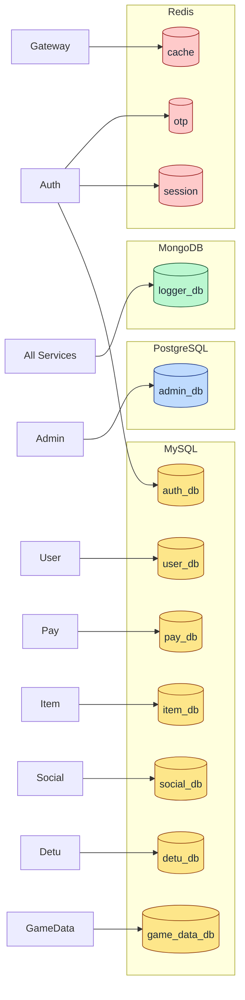
```mermaid
graph LR
    subgraph MySQL_DBs["MySQL"]
        AuthDB[(auth_db)]
        UserDB[(user_db)]
        PayDB[(pay_db)]
        ItemDB[(item_db)]
        SocialDB[(social_db)]
        DetuDB[(detu_db)]
        GameDataDB[(game_data_db)]
    end

    subgraph Postgres_DBs["PostgreSQL"]
        AdminDB[(admin_db)]
    end

    subgraph Mongo_DBs["MongoDB"]
        LoggerDB[(logger_db)]
    end

    subgraph Redis_DBs["Redis"]
        SessionRedis[(session)]
        OtpRedis[(otp)]
        CacheRedis[(cache)]
    end

    Auth[Auth] --> AuthDB
    User[User] --> UserDB
    Pay[Pay] --> PayDB
    Item[Item] --> ItemDB
    Social[Social] --> SocialDB
    Detu[Detu] --> DetuDB
    GameData[GameData] --> GameDataDB
    Admin[Admin] --> AdminDB
    AllSvcs[All Services] --> LoggerDB
    Auth --> SessionRedis
    Auth --> OtpRedis
    Gateway[Gateway] --> CacheRedis

    classDef mysql fill:#fde68a,stroke:#92400e,color:#1f2937
    classDef pg fill:#bfdbfe,stroke:#1e3a8a,color:#1f2937
    classDef mongo fill:#bbf7d0,stroke:#14532d,color:#1f2937
    classDef redis fill:#fecaca,stroke:#991b1b,color:#1f2937
    class AuthDB,UserDB,PayDB,ItemDB,SocialDB,DetuDB,GameDataDB mysql
    class AdminDB pg
    class LoggerDB mongo
    class SessionRedis,OtpRedis,CacheRedis redis
```

> **Lưu ý:** Entity `music` thuộc `game_data_db` (MySQL). File nhạc binary **không** lưu trong DB mà ở object storage (Supabase) — xem mục 9.

### 10.3. Data Flow Map (Domain View)

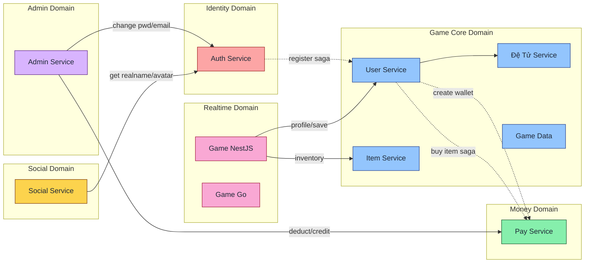
```mermaid
flowchart LR
    subgraph Identity["Identity Domain"]
        Auth[Auth Service]
    end

    subgraph GameCore["Game Core Domain"]
        User[User Service]
        Detu[Đệ Tử Service]
        Item[Item Service]
        GameData[Game Data]
    end

    subgraph Money["Money Domain"]
        Pay[Pay Service]
    end

    subgraph SocialD["Social Domain"]
        SocialSvc[Social Service]
    end

    subgraph AdminBiz["Admin Domain"]
        Admin[Admin Service]
    end

    subgraph Realtime["Realtime Domain"]
        GameNest[Game NestJS]
        GameGo[Game Go]
    end

    Auth -.register saga.-> User
    User -.create wallet.-> Pay
    User --> Detu
    Admin -->|change pwd/email| Auth
    Admin -->|deduct/credit| Pay
    SocialSvc -->|get realname/avatar| Auth
    GameNest -->|profile/save| User
    GameNest -->|inventory| Item
    User -.buy item saga.-> Pay

    classDef identity fill:#fca5a5,stroke:#991b1b,color:#1f2937
    classDef core fill:#93c5fd,stroke:#1e3a8a,color:#1f2937
    classDef money fill:#86efac,stroke:#14532d,color:#1f2937
    classDef social fill:#fcd34d,stroke:#78350f,color:#1f2937
    classDef admin fill:#d8b4fe,stroke:#581c87,color:#1f2937
    classDef realtime fill:#f9a8d4,stroke:#9f1239,color:#1f2937

    class Auth identity
    class User,Detu,Item,GameData core
    class Pay money
    class SocialSvc social
    class Admin admin
    class GameNest,GameGo realtime
```

---

## 11. Thiết kế dữ liệu

ERD toàn hệ thống, đã bổ sung entity **MUSIC** (thuộc Game Data Service). Quan hệ logic (`..`) thể hiện liên kết xuyên service không có khóa ngoại vật lý.


```mermaid
erDiagram
    AUTH ||--o{ REGISTER_OUTBOX : "saga register"
    AUTH {
        int id PK
        string username UK
        string email
        string realname
        boolean biBan
        string role
        int tokenVersion
        string password
        string avatarUrl
        int type
        timestamp createdAt
    }
    REGISTER_OUTBOX {
        uuid id PK
        json payload
        string status
        int retries
        datetime nextRetryAt
    }
    AUTH_IDEMPOTENCY {
        string key PK
        json response
        datetime expires_at
    }

    USERS ||--|| USER_GAME_STATS : "1-1"
    USERS ||--|| USERS_POSITION : "1-1"
    USERS ||--o{ USERS_WEB_ITEM : "1-n"
    USERS {
        int id PK
        bigint auth_id UK
        string gameName
        string avatarUrl
        timestamp createdAt
    }
    USER_GAME_STATS {
        int id PK
        int userId FK
        bigint vang
        bigint ngoc
        bigint sucManh
        bigint vangNapTuWeb
        bigint ngocNapTuWeb
        boolean daVaoTaiKhoanLanDau
        boolean coDeTu
    }
    USERS_POSITION {
        int id PK
        int userId FK
        float x
        float y
        string mapHienTai
    }
    USERS_WEB_ITEM {
        int id PK
        int userId FK
        bigint item_id
        bigint price
    }
    BUY_ITEM_OUTBOX {
        int id PK
        json payload
        string status
        int retries
        datetime nextRetryAt
    }
    CREATE_PAY_OUTBOX {
        uuid id PK
        json payload
        string status
        int retries
        datetime nextRetryAt
    }

    DETU {
        int id PK
        bigint sucManh
        int userId
    }

    ITEMS {
        int id PK
        string maItem
        string ten
        string loai
        text moTa
        int soLuong
        string hanhTinh
        int soSaoPhaLe
        int soCap
        text chiso
        int userId
        string uuid
    }

    PAY ||..o{ CASH_FLOW_MANAGEMENT : "lịch sử"
    PAY {
        int id PK
        string tien
        int userId UK
        string status
        timestamp updatedAt
    }
    CASH_FLOW_MANAGEMENT {
        int id PK
        int userId
        string type
        int amount
        timestamp create_at
    }
    PAY_IDEMPOTENCY {
        string key PK
        json response
        datetime expires_at
    }

    CHAT_GROUPS ||--o{ CHAT_GROUP_MEMBERS : "có thành viên"
    COMMENTS ||..o{ COMMENT_LIKES : "logical"
    COMMENTS ||..o{ COMMENTS : "parent-child"
    CHAT {
        int id PK
        string roomId
        int userId
        longtext content
        timestamp createdAt
    }
    CHAT_GROUPS {
        int id PK
        string name
        string avatarUrl
        string description
        int ownerId
        int maxMember
    }
    CHAT_GROUP_MEMBERS {
        int id PK
        int groupId FK
        int userId
        int role
    }
    COMMENTS {
        int id PK
        int postId
        int parentId
        int userId
        int likeCount
        boolean isDelete
        string content
    }
    COMMENT_LIKES {
        int id PK
        int commentId
        int userId
    }
    NOTIFICATION {
        int id PK
        int userId
        string title
        longtext content
    }
    SOCIAL_NETWORK {
        int id PK
        int userId
        int friendId
        int status
    }

    ACCOUNTS_SELL ||..o{ OUTBOX_EVENTS : "BUY_ACCOUNT saga"
    OUTBOX_EVENTS ||..|| SAGA_STATE : "tracks progress"
    WITHDRAW_MONEY {
        int id PK
        int userId
        int amount
        string bank_name
        string bank_number
        string bank_owner
        string status
        int finance_id
        timestamp request_at
        timestamp success_at
    }
    POSTS {
        int id PK
        string title
        string url_anh
        text content
        int editor_id
        string editor_realname
        string status
    }
    ACCOUNTS_SELL {
        int id PK
        string username
        string password
        string url
        string description
        int price
        string status
        int partner_id
        int buyer_id
        int version
    }
    OUTBOX_EVENTS {
        uuid id PK
        string sagaType
        jsonb payload
        string status
        int retries
        timestamp nextRetryAt
    }
    SAGA_STATE {
        uuid saga_id PK
        enum phase
        int attempt
        jsonb completed_steps
        text original_password
        text original_email
    }

    MAP_BASE ||--o{ NPC_SPAWN : "có spawn"
    NPC_BASE ||--o{ NPC_SPAWN : "được spawn"
    NPC_BASE ||--o{ NPC_SHOP_ITEM : "shop của NPC"
    ITEM_BASE ||--o{ NPC_SHOP_ITEM : "item bán"
    MAP_BASE {
        int id PK
        string ten UK
    }
    NPC_BASE {
        int id PK
        string ten UK
        enum loai
    }
    ITEM_BASE {
        int id PK
        string ten UK
        string ma UK
    }
    NPC_SPAWN {
        int id PK
        int npc_base_id FK
        int map_id FK
        float x
        float y
        boolean is_active
    }
    NPC_SHOP_ITEM {
        int id PK
        int npc_base_id FK
        int item_base_id FK
        int gia
        enum loaiTien
        enum tab
        boolean is_active
    }

    MUSIC {
        int id PK
        string name
        string fileUrl
        string hash UK
        enum status
    }

    AUTH ||..|| USERS : "logical"
    USERS ||..|| DETU : "logical"
    USERS ||..o{ ITEMS : "logical"
    USERS ||..|| PAY : "logical"
    USERS ||..o{ CHAT : "logical"
    USERS ||..o{ CHAT_GROUPS : "owner"
    USERS ||..o{ CHAT_GROUP_MEMBERS : "member"
    USERS ||..o{ COMMENTS : "viết"
    USERS ||..o{ NOTIFICATION : "nhận"
    USERS ||..o{ SOCIAL_NETWORK : "friend"
    AUTH ||..o{ WITHDRAW_MONEY : "rút tiền"
    AUTH ||..o{ POSTS : "editor"
    AUTH ||..o{ ACCOUNTS_SELL : "partner"
    POSTS ||..o{ COMMENTS : "logical"
    ITEMS ||..o{ USERS_WEB_ITEM : "logical"
```

### 11.1. Mô tả entity MUSIC

| Cột | Kiểu | Ràng buộc | Mô tả |
|-----|------|-----------|-------|
| `id` | int | PK, auto-increment | Khóa chính |
| `name` | string | not null | Tên hiển thị của bài nhạc (cho người dùng/admin xem) |
| `fileUrl` | string | not null | URL công khai tới file nhạc trên storage/CDN |
| `hash` | string(32) | **unique** | Hash MD5 của nội dung file — vừa để dedup, vừa làm tên file (`{hash}.{ext}`) |
| `status` | enum (`MusicStatus`) | default `PROCESSING` | Trạng thái: `PROCESSING` (đang xử lý, chưa phục vụ) / `ACTIVE` (sẵn sàng cho client tải) / `INACTIVE` (đã soft-delete, ẩn khỏi client) |

> Vì `name` được lưu tách khỏi `hash`, URL bất biến không cần "đẹp" — người dùng không bao giờ nhìn thấy URL trực tiếp, chỉ thấy `name`. Xóa nhạc là **soft delete** (chuyển `INACTIVE`), không xóa vật lý — file binary có thể giữ lại nhờ deduplication.

---

## 12. Module nhạc nền Runtime

### 12.1. Vấn đề cốt lõi

Danh sách nhạc ban đầu là **build-time data** (biên dịch thẳng vào APK). Để admin sửa được mà không phải build lại và phát hành client, phải chuyển sang **runtime data** (tải từ network khi game chạy).

```
BUILD-TIME (cố định)            RUNTIME (động)
────────────────                ─────────────────
File mp3 trong APK              File mp3 trên server
List bài trong code             List bài trong DB
Update = rebuild + release      Update = upload + DB insert
```

### 12.2. Tách metadata và file binary

Một bài nhạc gồm hai phần thông tin, lưu ở hai nơi khác nhau:

| Loại | Dữ liệu | Lưu ở |
|------|---------|-------|
| Metadata | id, tên, status, hash | Database (MySQL — `game_data_db`) |
| Binary | File mp3 (~5MB) | Object storage (Supabase / S3 / R2) |

Lý do tách: truy vấn metadata cần SQL/index/transaction → DB phù hợp; phục vụ file binary cần CDN và băng thông lớn, không cần query phức tạp → object storage phù hợp. Lưu binary dạng BLOB trong DB là anti-pattern (DB chậm, backup tốn, khó scale).

### 12.3. URL bất biến (content-addressable storage)

Quyết định quan trọng nhất: **tên file = hash MD5 của nội dung**.

```typescript
const hash = crypto.createHash('md5').update(file.buffer).digest('hex');
const key = `${hash}.${ext}`;  // VD: "2a678803b231fa974dca1c7ab108a264.mp3"
```

Lợi ích: deduplication (hai file giống hệt → cùng hash → không tốn thêm dung lượng); cache busting tự động (đổi nội dung → đổi hash → đổi URL → cache cũ vô hiệu); không bao giờ phải purge cache vì mỗi version có URL riêng; upload idempotent (upload lại cùng file thì ghi đè cùng key).

Trade-off: tên file không "đẹp" (`2a67...264.mp3` thay vì `khauthitamphi.mp3`), nhưng người dùng không nhìn URL nên không thành vấn đề; cần lưu `name` riêng trong DB để hiển thị.

### 12.4. Cache nhiều tầng

```
┌─────────────────────────────────────────────────┐
│ TẦNG 3: Local cache (LibGDX)                    │
│ File mp3 lưu trong Gdx.files.local("nhacnen/")  │
└─────────────────────────────────────────────────┘
                    ↓ cache miss
┌─────────────────────────────────────────────────┐
│ TẦNG 2: Cloudflare Worker cache                 │
│ Edge cache ở Singapore/HK cho user VN           │
└─────────────────────────────────────────────────┘
                    ↓ cache miss
┌─────────────────────────────────────────────────┐
│ TẦNG 1: Supabase CDN (mặc định)                 │
│ Built-in CDN của Supabase                       │
└─────────────────────────────────────────────────┘
                    ↓ cache miss
┌─────────────────────────────────────────────────┐
│ ORIGIN: Supabase Storage                        │
│ File mp3 thật (Singapore region)                │
└─────────────────────────────────────────────────┘
```

### 12.5. Entity Music (TypeORM)

```typescript
import { MusicStatus } from 'proto/game-data.pb';
import {
  Entity,
  PrimaryGeneratedColumn,
  Column,
} from 'typeorm';

@Entity('music')
export class MusicEntity {
  @PrimaryGeneratedColumn()
  id: number;

  @Column()
  name: string;

  @Column()
  fileUrl: string;

  @Column({ unique: true, length: 32 })
  hash: string;

  @Column({ type: 'enum', enum: MusicStatus, default: MusicStatus.PROCESSING })
  status: MusicStatus;
}
```

### 12.6. Vòng đời một bài nhạc (state)

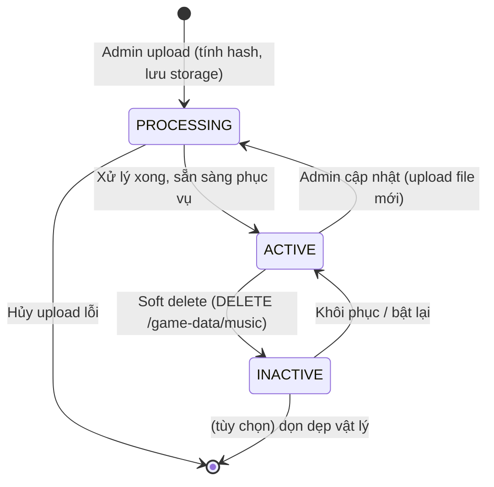
```mermaid
stateDiagram-v2
    [*] --> PROCESSING : Admin upload (tính hash, lưu storage)
    PROCESSING --> ACTIVE : Xử lý xong, sẵn sàng phục vụ
    ACTIVE --> PROCESSING : Admin cập nhật (upload file mới)
    ACTIVE --> INACTIVE : Soft delete (DELETE /game-data/music)
    INACTIVE --> ACTIVE : Khôi phục / bật lại
    PROCESSING --> [*] : Hủy upload lỗi
    INACTIVE --> [*] : (tùy chọn) dọn dẹp vật lý
```

---

## 13. Use Case Diagram

Sơ đồ tổng hợp các use case, đã bổ sung nhóm **Music Management** gắn với ADMIN / Player Manager.


```mermaid
graph LR
    subgraph Actors["Actors"]
        User((Player))
        Editor((Editor))
        Partner((Partner))
        Admin((ADMIN / Player Manager))
        System((System))
    end

    subgraph UC_Auth["Authentication"]
        UC1[Register]
        UC2[Login + OTP]
        UC3[Login Google]
        UC4[Change Password]
        UC5[Reset Password]
        UC6[Refresh Token]
    end

    subgraph UC_Game["Game"]
        UC7[Connect Game]
        UC8[Save Game State]
        UC9[View Leaderboard]
        UC10[Manage Inventory]
        UC11[Buy from NPC]
    end

    subgraph UC_Money["Money"]
        UC12[Deposit Money]
        UC13[Withdraw Request]
        UC14[Buy Item Web]
        UC15[View Transactions]
    end

    subgraph UC_Social["Social"]
        UC16[Add Friend]
        UC17[Chat 1-1]
        UC18[Group Chat]
        UC19[Comment Post]
        UC20[Like Comment]
    end

    subgraph UC_Editor["Content"]
        UC21[Create Post]
        UC22[Update Post]
        UC23[Lock Post]
    end

    subgraph UC_Partner["Account Trading"]
        UC24[Sell Account]
        UC25[Buy Account]
        UC26[View My Listings]
    end

    subgraph UC_Admin["Admin"]
        UC27[Approve Withdraw]
        UC28[Ban User]
        UC29[Change Role]
        UC30[Send Email]
    end

    subgraph UC_Music["Music Management"]
        UC31[Upload Music]
        UC32[Update Music]
        UC33[Toggle Music Status]
        UC34[Delete Music]
    end

    subgraph UC_AI["AI Support"]
        UC35[Ask AI - RAG]
    end

    User --> UC1
    User --> UC2
    User --> UC3
    User --> UC4
    User --> UC5
    User --> UC6
    User --> UC7
    User --> UC8
    User --> UC9
    User --> UC10
    User --> UC11
    User --> UC12
    User --> UC13
    User --> UC14
    User --> UC15
    User --> UC16
    User --> UC17
    User --> UC18
    User --> UC19
    User --> UC20
    User --> UC25
    User --> UC35

    Editor --> UC21
    Editor --> UC22
    Editor --> UC23

    Partner --> UC24
    Partner --> UC26

    Admin --> UC27
    Admin --> UC28
    Admin --> UC29
    Admin --> UC30
    Admin --> UC31
    Admin --> UC32
    Admin --> UC33
    Admin --> UC34

    System -.outbox poller.-> UC1
    System -.saga.-> UC25
    System -.saga.-> UC14

    classDef actor fill:#fbbf24,stroke:#92400e,color:#1f2937
    classDef uc fill:#bfdbfe,stroke:#1e3a8a,color:#1f2937
    classDef music fill:#bbf7d0,stroke:#14532d,color:#1f2937
    class User,Editor,Partner,Admin,System actor
    class UC1,UC2,UC3,UC4,UC5,UC6,UC7,UC8,UC9,UC10,UC11,UC12,UC13,UC14,UC15,UC16,UC17,UC18,UC19,UC20,UC21,UC22,UC23,UC24,UC25,UC26,UC27,UC28,UC29,UC30 uc
    class UC31,UC32,UC33,UC34 music
    class UC35 uc
```

---

## 14. Sequence Diagrams

### 14.1. Generic Request Flow

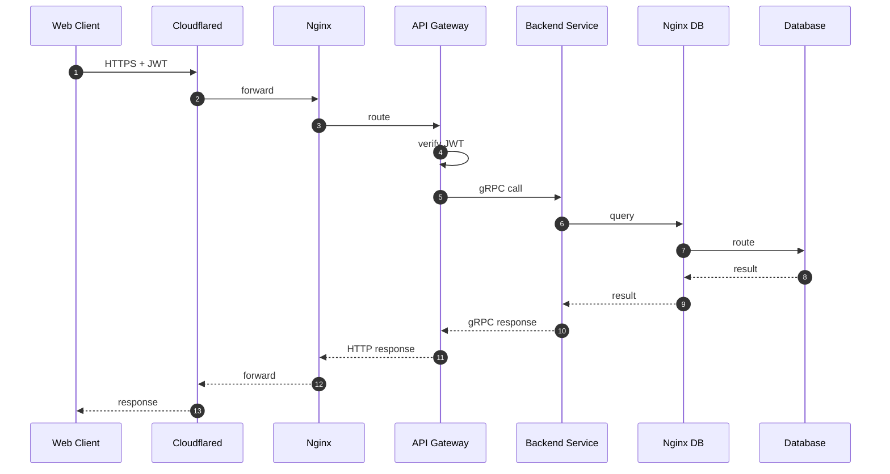
```mermaid
sequenceDiagram
    autonumber
    participant C as Web Client
    participant CF as Cloudflared
    participant Nginx as Nginx
    participant GW as API Gateway
    participant Svc as Backend Service
    participant NginxDB as Nginx DB
    participant DB as Database

    C->>CF: HTTPS + JWT
    CF->>Nginx: forward
    Nginx->>GW: route
    GW->>GW: verify JWT
    GW->>Svc: gRPC call
    Svc->>NginxDB: query
    NginxDB->>DB: route
    DB-->>NginxDB: result
    NginxDB-->>Svc: result
    Svc-->>GW: gRPC response
    GW-->>Nginx: HTTP response
    Nginx-->>CF: forward
    CF-->>C: response
```

### 14.2. Register Flow (Saga)

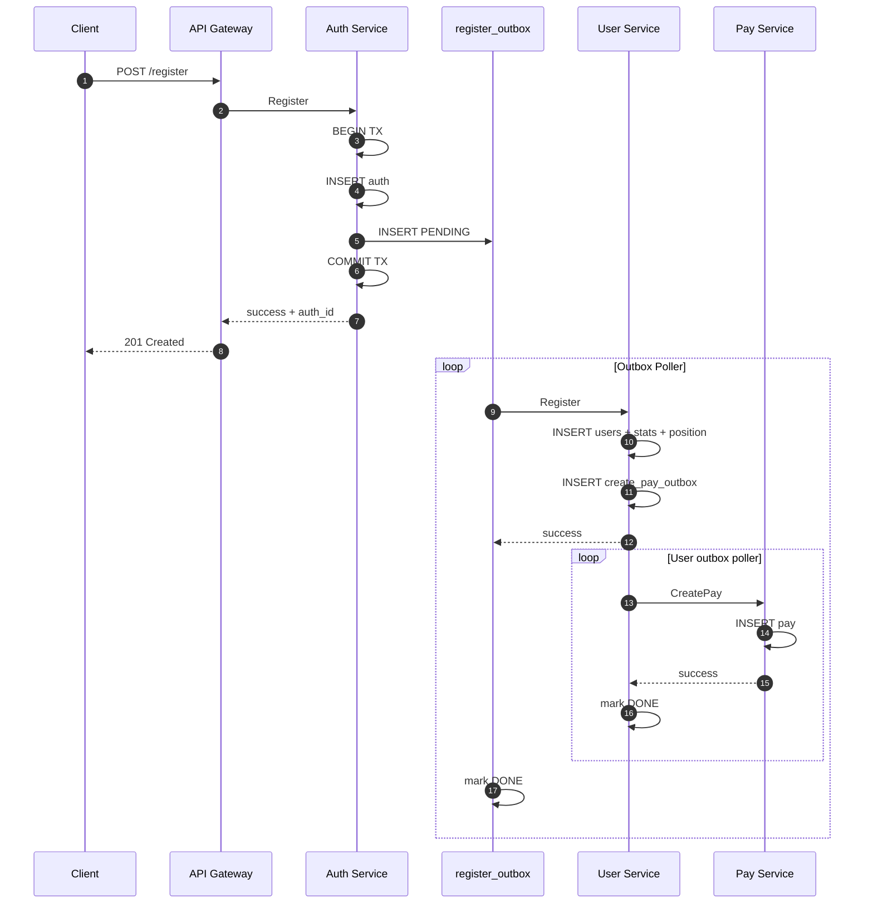
```mermaid
sequenceDiagram
    autonumber
    participant C as Client
    participant GW as API Gateway
    participant Auth as Auth Service
    participant Outbox as register_outbox
    participant User as User Service
    participant Pay as Pay Service

    C->>GW: POST /register
    GW->>Auth: Register
    Auth->>Auth: BEGIN TX
    Auth->>Auth: INSERT auth
    Auth->>Outbox: INSERT PENDING
    Auth->>Auth: COMMIT TX
    Auth-->>GW: success + auth_id
    GW-->>C: 201 Created

    loop Outbox Poller
        Outbox->>User: Register
        User->>User: INSERT users + stats + position
        User->>User: INSERT create_pay_outbox
        User-->>Outbox: success

        loop User outbox poller
            User->>Pay: CreatePay
            Pay->>Pay: INSERT pay
            Pay-->>User: success
            User->>User: mark DONE
        end

        Outbox->>Outbox: mark DONE
    end
```

### 14.3. Login + OTP

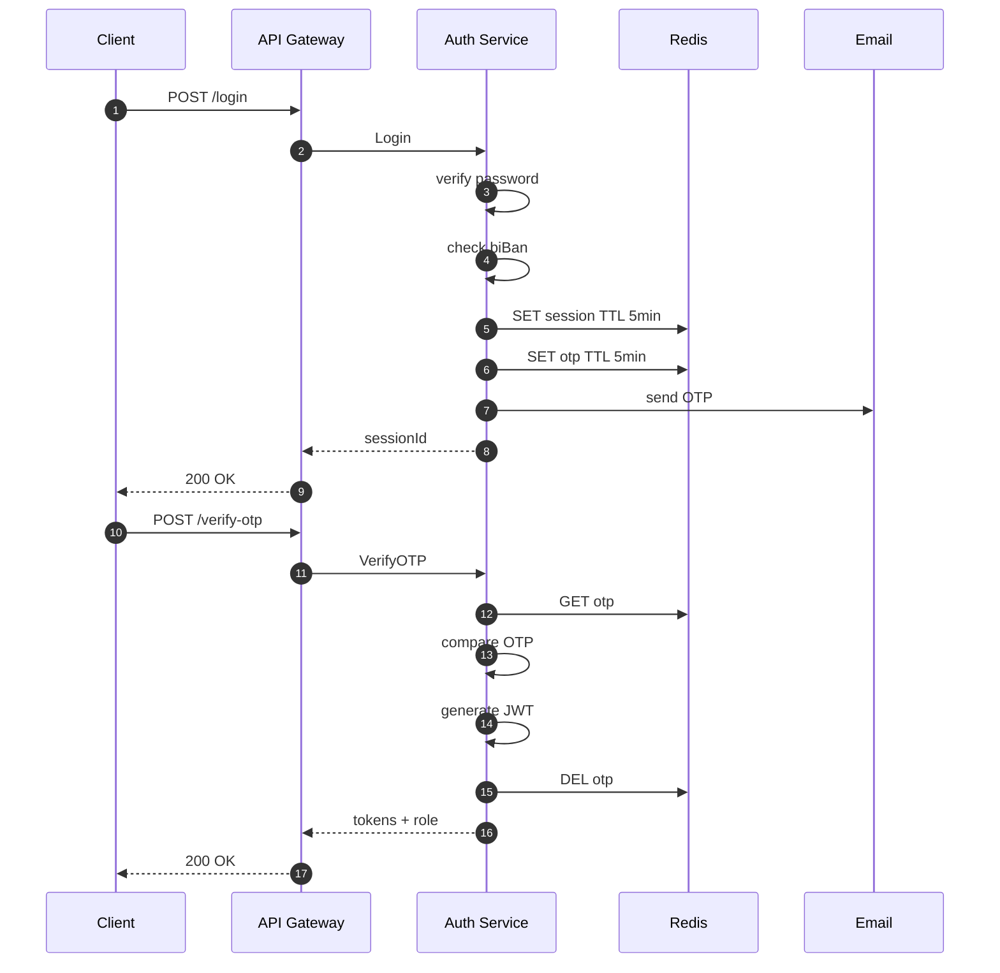
```mermaid
sequenceDiagram
    autonumber
    participant C as Client
    participant GW as API Gateway
    participant Auth as Auth Service
    participant Redis as Redis
    participant Mail as Email

    C->>GW: POST /login
    GW->>Auth: Login
    Auth->>Auth: verify password
    Auth->>Auth: check biBan
    Auth->>Redis: SET session TTL 5min
    Auth->>Redis: SET otp TTL 5min
    Auth->>Mail: send OTP
    Auth-->>GW: sessionId
    GW-->>C: 200 OK

    C->>GW: POST /verify-otp
    GW->>Auth: VerifyOTP
    Auth->>Redis: GET otp
    Auth->>Auth: compare OTP
    Auth->>Auth: generate JWT
    Auth->>Redis: DEL otp
    Auth-->>GW: tokens + role
    GW-->>C: 200 OK
```

### 14.4. Login Google

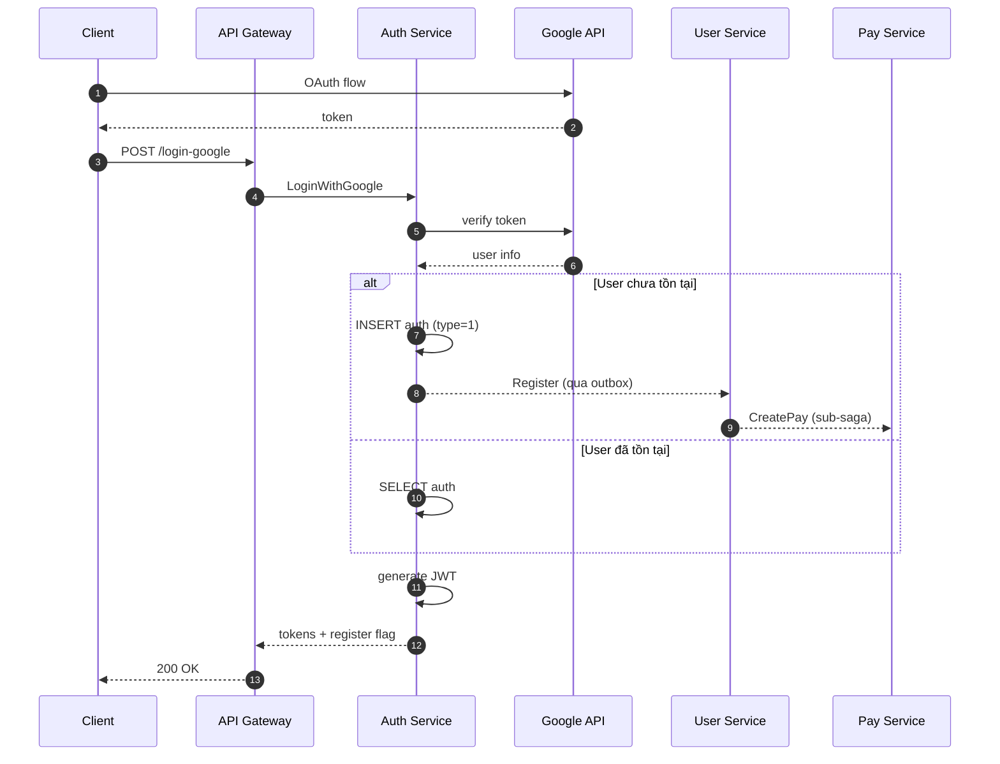
```mermaid
sequenceDiagram
    autonumber
    participant C as Client
    participant GW as API Gateway
    participant Auth as Auth Service
    participant Google as Google API
    participant User as User Service
    participant Pay as Pay Service

    C->>Google: OAuth flow
    Google-->>C: token
    C->>GW: POST /login-google
    GW->>Auth: LoginWithGoogle
    Auth->>Google: verify token
    Google-->>Auth: user info

    alt User chưa tồn tại
        Auth->>Auth: INSERT auth (type=1)
        Auth-->>User: Register (qua outbox)
        User-->>Pay: CreatePay (sub-saga)
    else User đã tồn tại
        Auth->>Auth: SELECT auth
    end

    Auth->>Auth: generate JWT
    Auth-->>GW: tokens + register flag
    GW-->>C: 200 OK
```

### 14.5. Buy Item from Web

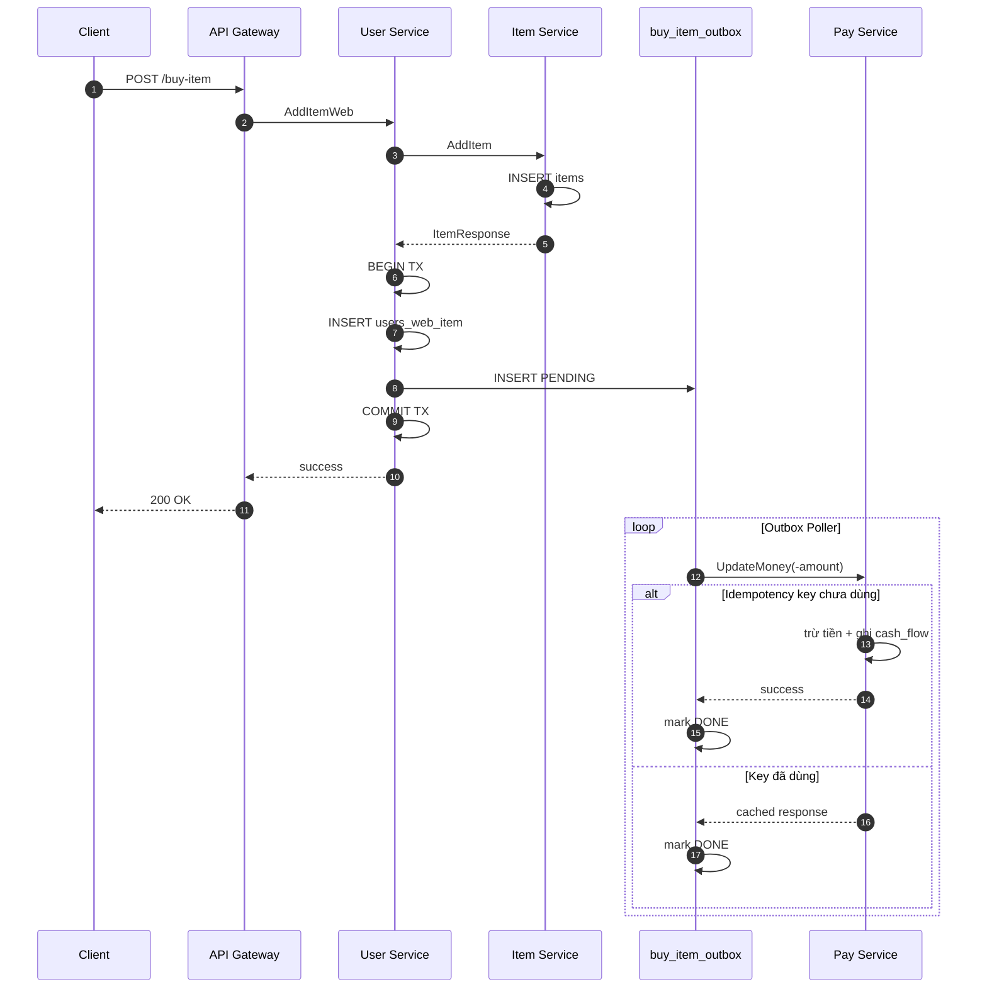
```mermaid
sequenceDiagram
    autonumber
    participant C as Client
    participant GW as API Gateway
    participant User as User Service
    participant Item as Item Service
    participant Outbox as buy_item_outbox
    participant Pay as Pay Service

    C->>GW: POST /buy-item
    GW->>User: AddItemWeb
    User->>Item: AddItem
    Item->>Item: INSERT items
    Item-->>User: ItemResponse

    User->>User: BEGIN TX
    User->>User: INSERT users_web_item
    User->>Outbox: INSERT PENDING
    User->>User: COMMIT TX
    User-->>GW: success
    GW-->>C: 200 OK

    loop Outbox Poller
        Outbox->>Pay: UpdateMoney(-amount)

        alt Idempotency key chưa dùng
            Pay->>Pay: trừ tiền + ghi cash_flow
            Pay-->>Outbox: success
            Outbox->>Outbox: mark DONE
        else Key đã dùng
            Pay-->>Outbox: cached response
            Outbox->>Outbox: mark DONE
        end
    end
```

### 14.6. Buy Account (Saga với Compensation)

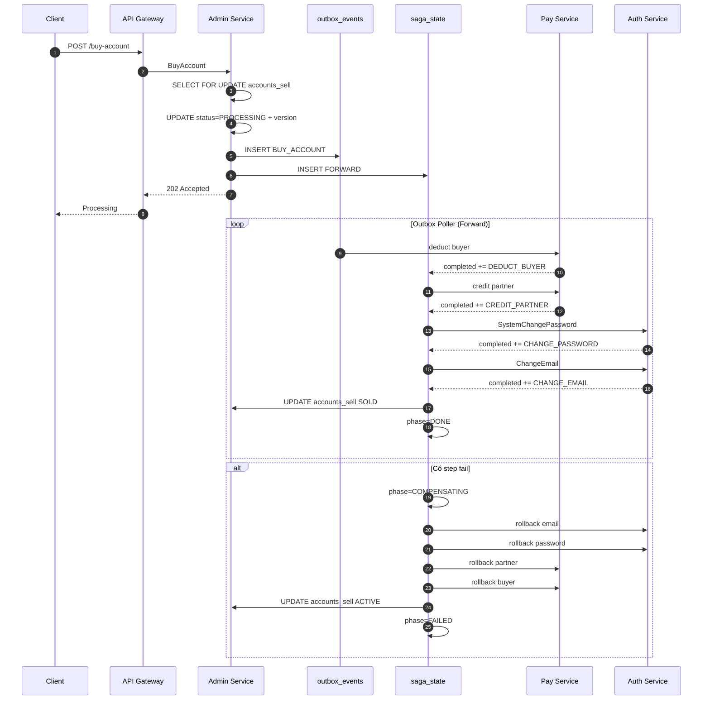
```mermaid
sequenceDiagram
    autonumber
    participant C as Client
    participant GW as API Gateway
    participant Admin as Admin Service
    participant Outbox as outbox_events
    participant Saga as saga_state
    participant Pay as Pay Service
    participant Auth as Auth Service

    C->>GW: POST /buy-account
    GW->>Admin: BuyAccount
    Admin->>Admin: SELECT FOR UPDATE accounts_sell
    Admin->>Admin: UPDATE status=PROCESSING + version
    Admin->>Outbox: INSERT BUY_ACCOUNT
    Admin->>Saga: INSERT FORWARD
    Admin-->>GW: 202 Accepted
    GW-->>C: Processing

    loop Outbox Poller (Forward)
        Outbox->>Pay: deduct buyer
        Pay-->>Saga: completed += DEDUCT_BUYER
        Saga->>Pay: credit partner
        Pay-->>Saga: completed += CREDIT_PARTNER
        Saga->>Auth: SystemChangePassword
        Auth-->>Saga: completed += CHANGE_PASSWORD
        Saga->>Auth: ChangeEmail
        Auth-->>Saga: completed += CHANGE_EMAIL
        Saga->>Admin: UPDATE accounts_sell SOLD
        Saga->>Saga: phase=DONE
    end

    alt Có step fail
        Saga->>Saga: phase=COMPENSATING
        Saga->>Auth: rollback email
        Saga->>Auth: rollback password
        Saga->>Pay: rollback partner
        Saga->>Pay: rollback buyer
        Saga->>Admin: UPDATE accounts_sell ACTIVE
        Saga->>Saga: phase=FAILED
    end
```

### 14.7. Deposit (Nạp tiền qua VietQR + Webhook)

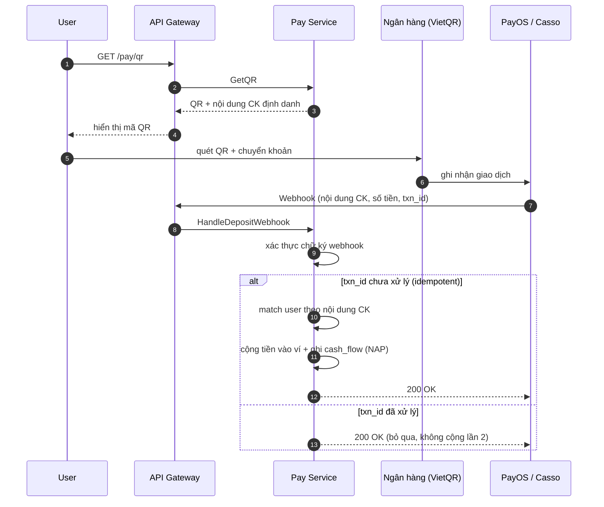
```mermaid
sequenceDiagram
    autonumber
    participant U as User
    participant GW as API Gateway
    participant Pay as Pay Service
    participant Bank as Ngân hàng (VietQR)
    participant Gate as PayOS / Casso

    U->>GW: GET /pay/qr
    GW->>Pay: GetQR
    Pay-->>GW: QR + nội dung CK định danh
    GW-->>U: hiển thị mã QR

    U->>Bank: quét QR + chuyển khoản
    Bank->>Gate: ghi nhận giao dịch
    Gate->>GW: Webhook (nội dung CK, số tiền, txn_id)
    GW->>Pay: HandleDepositWebhook

    Pay->>Pay: xác thực chữ ký webhook

    alt txn_id chưa xử lý (idempotent)
        Pay->>Pay: match user theo nội dung CK
        Pay->>Pay: cộng tiền vào ví + ghi cash_flow (NAP)
        Pay-->>Gate: 200 OK
    else txn_id đã xử lý
        Pay-->>Gate: 200 OK (bỏ qua, không cộng lần 2)
    end
```

### 14.8. Withdraw Money

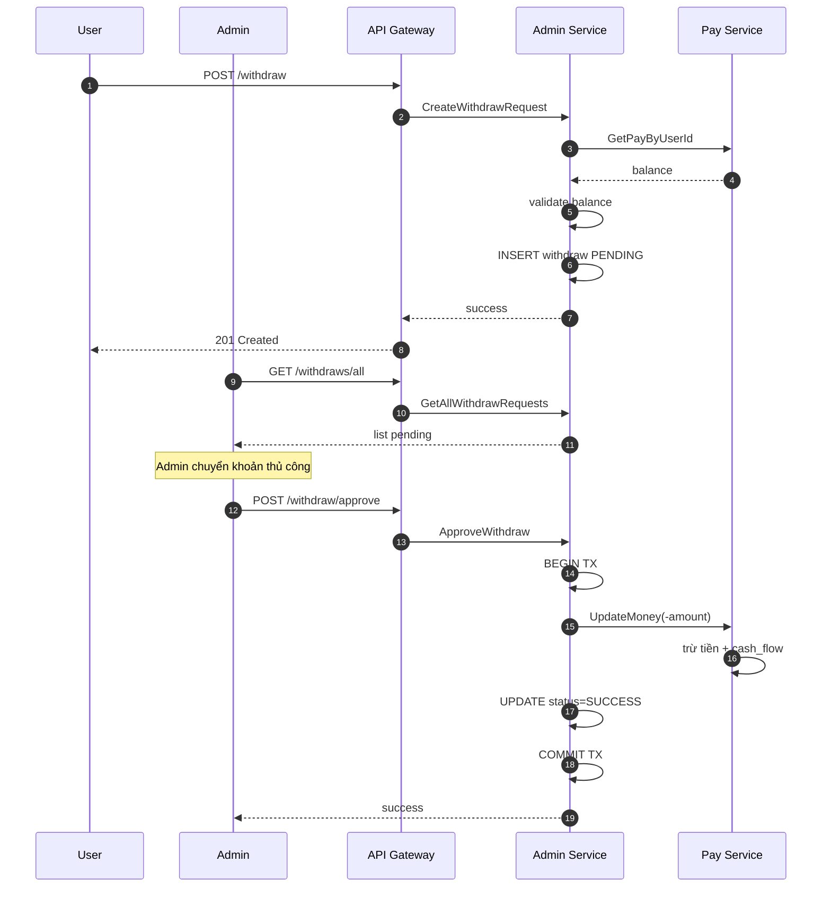
```mermaid
sequenceDiagram
    autonumber
    participant U as User
    participant A as Admin
    participant GW as API Gateway
    participant Cashier as Admin Service
    participant Pay as Pay Service

    U->>GW: POST /withdraw
    GW->>Cashier: CreateWithdrawRequest
    Cashier->>Pay: GetPayByUserId
    Pay-->>Cashier: balance
    Cashier->>Cashier: validate balance
    Cashier->>Cashier: INSERT withdraw PENDING
    Cashier-->>GW: success
    GW-->>U: 201 Created

    A->>GW: GET /withdraws/all
    GW->>Cashier: GetAllWithdrawRequests
    Cashier-->>A: list pending

    Note over A: Admin chuyển khoản thủ công

    A->>GW: POST /withdraw/approve
    GW->>Cashier: ApproveWithdraw
    Cashier->>Cashier: BEGIN TX
    Cashier->>Pay: UpdateMoney(-amount)
    Pay->>Pay: trừ tiền + cash_flow
    Cashier->>Cashier: UPDATE status=SUCCESS
    Cashier->>Cashier: COMMIT TX
    Cashier-->>A: success
```

### 14.9. Game Connect & Realtime

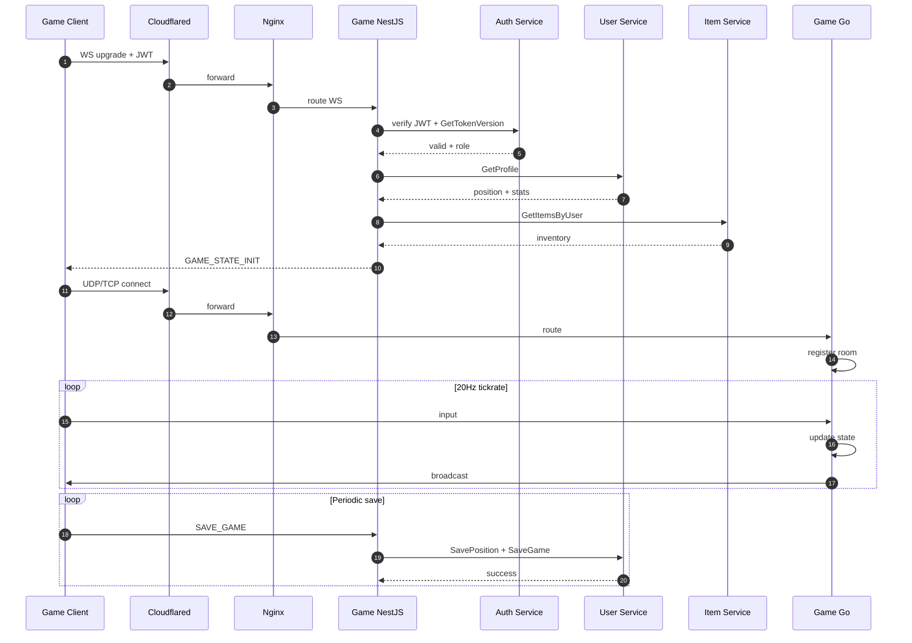
```mermaid
sequenceDiagram
    autonumber
    participant C as Game Client
    participant CF as Cloudflared
    participant Nginx as Nginx
    participant GameNest as Game NestJS
    participant Auth as Auth Service
    participant User as User Service
    participant Item as Item Service
    participant GameGo as Game Go

    C->>CF: WS upgrade + JWT
    CF->>Nginx: forward
    Nginx->>GameNest: route WS
    GameNest->>Auth: verify JWT + GetTokenVersion
    Auth-->>GameNest: valid + role
    GameNest->>User: GetProfile
    User-->>GameNest: position + stats
    GameNest->>Item: GetItemsByUser
    Item-->>GameNest: inventory
    GameNest-->>C: GAME_STATE_INIT

    C->>CF: UDP/TCP connect
    CF->>Nginx: forward
    Nginx->>GameGo: route
    GameGo->>GameGo: register room

    loop 20Hz tickrate
        C->>GameGo: input
        GameGo->>GameGo: update state
        GameGo->>C: broadcast
    end

    loop Periodic save
        C->>GameNest: SAVE_GAME
        GameNest->>User: SavePosition + SaveGame
        User-->>GameNest: success
    end
```

### 14.10. Friend & Chat

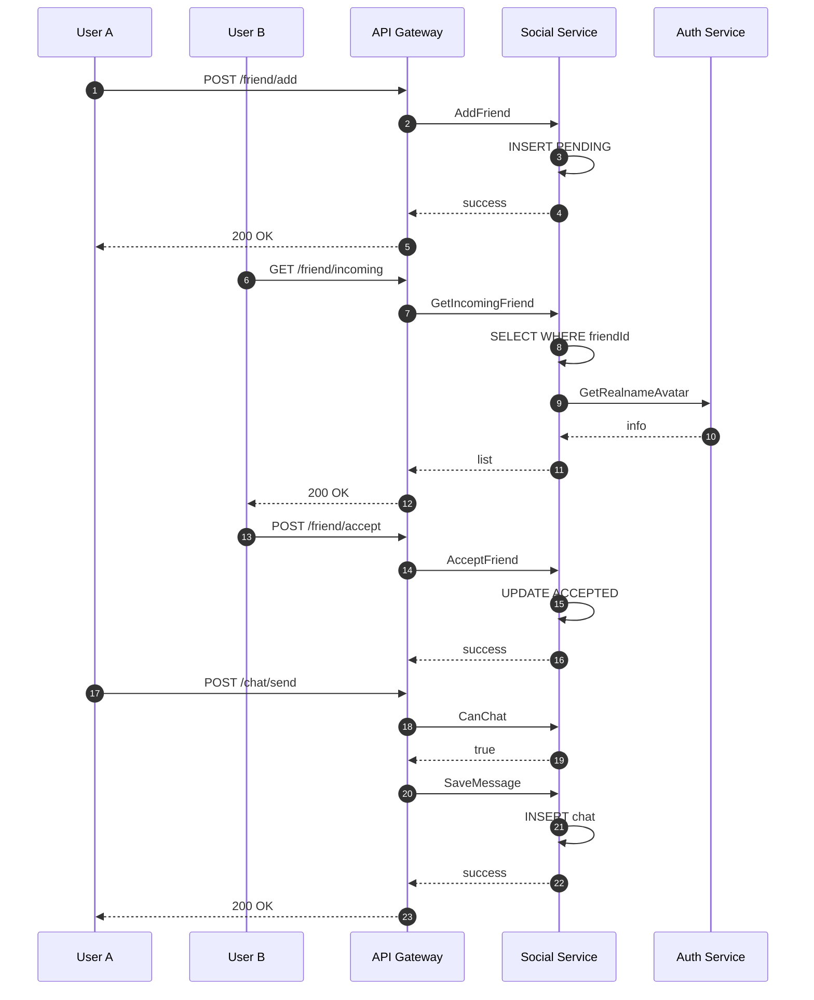
```mermaid
sequenceDiagram
    autonumber
    participant U1 as User A
    participant U2 as User B
    participant GW as API Gateway
    participant Social as Social Service
    participant Auth as Auth Service

    U1->>GW: POST /friend/add
    GW->>Social: AddFriend
    Social->>Social: INSERT PENDING
    Social-->>GW: success
    GW-->>U1: 200 OK

    U2->>GW: GET /friend/incoming
    GW->>Social: GetIncomingFriend
    Social->>Social: SELECT WHERE friendId
    Social->>Auth: GetRealnameAvatar
    Auth-->>Social: info
    Social-->>GW: list
    GW-->>U2: 200 OK

    U2->>GW: POST /friend/accept
    GW->>Social: AcceptFriend
    Social->>Social: UPDATE ACCEPTED
    Social-->>GW: success

    U1->>GW: POST /chat/send
    GW->>Social: CanChat
    Social-->>GW: true
    GW->>Social: SaveMessage
    Social->>Social: INSERT chat
    Social-->>GW: success
    GW-->>U1: 200 OK
```

### 14.11. Leaderboard

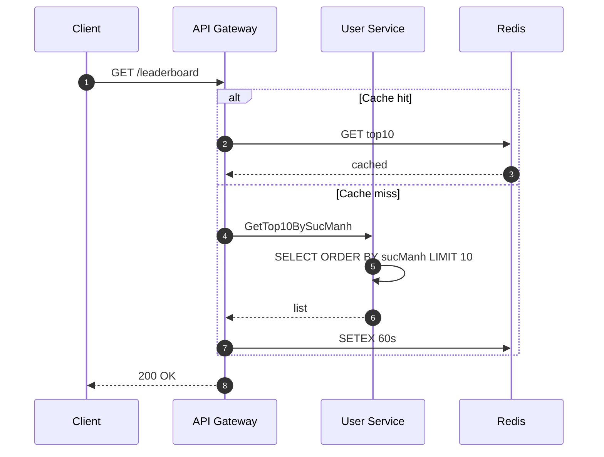
```mermaid
sequenceDiagram
    autonumber
    participant C as Client
    participant GW as API Gateway
    participant User as User Service
    participant Cache as Redis

    C->>GW: GET /leaderboard

    alt Cache hit
        GW->>Cache: GET top10
        Cache-->>GW: cached
    else Cache miss
        GW->>User: GetTop10BySucManh
        User->>User: SELECT ORDER BY sucManh LIMIT 10
        User-->>GW: list
        GW->>Cache: SETEX 60s
    end

    GW-->>C: 200 OK
```

### 14.12. Editor Post + Comment

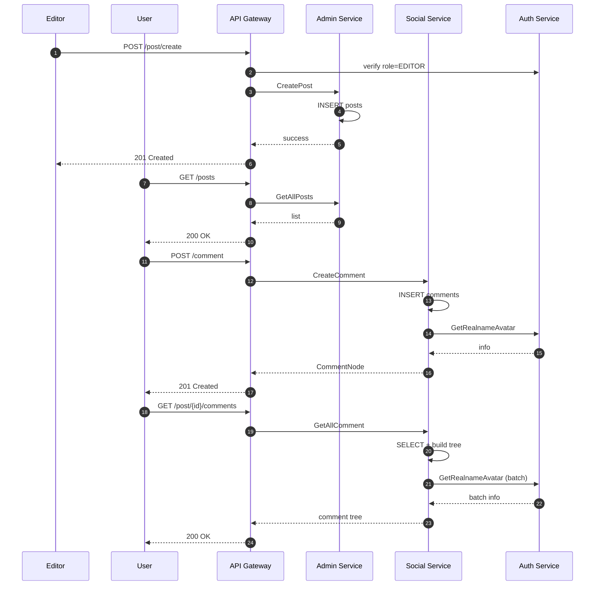
```mermaid
sequenceDiagram
    autonumber
    participant E as Editor
    participant U as User
    participant GW as API Gateway
    participant Admin as Admin Service
    participant Social as Social Service
    participant Auth as Auth Service

    E->>GW: POST /post/create
    GW->>Auth: verify role=EDITOR
    GW->>Admin: CreatePost
    Admin->>Admin: INSERT posts
    Admin-->>GW: success
    GW-->>E: 201 Created

    U->>GW: GET /posts
    GW->>Admin: GetAllPosts
    Admin-->>GW: list
    GW-->>U: 200 OK

    U->>GW: POST /comment
    GW->>Social: CreateComment
    Social->>Social: INSERT comments
    Social->>Auth: GetRealnameAvatar
    Auth-->>Social: info
    Social-->>GW: CommentNode
    GW-->>U: 201 Created

    U->>GW: GET /post/{id}/comments
    GW->>Social: GetAllComment
    Social->>Social: SELECT + build tree
    Social->>Auth: GetRealnameAvatar (batch)
    Auth-->>Social: batch info
    Social-->>GW: comment tree
    GW-->>U: 200 OK
```

### 14.13. Upload Music (Runtime Content)

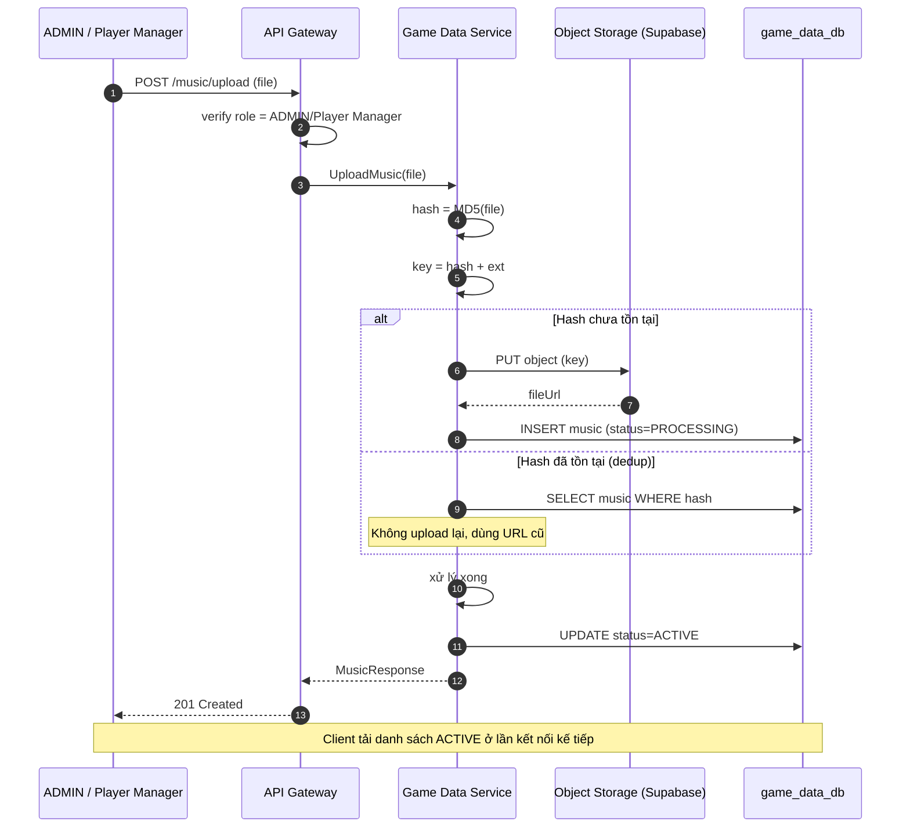
```mermaid
sequenceDiagram
    autonumber
    participant A as ADMIN / Player Manager
    participant GW as API Gateway
    participant GD as Game Data Service
    participant Storage as Object Storage (Supabase)
    participant DB as game_data_db

    A->>GW: POST /music/upload (file)
    GW->>GW: verify role = ADMIN/Player Manager
    GW->>GD: UploadMusic(file)
    GD->>GD: hash = MD5(file)
    GD->>GD: key = hash + ext

    alt Hash chưa tồn tại
        GD->>Storage: PUT object (key)
        Storage-->>GD: fileUrl
        GD->>DB: INSERT music (status=PROCESSING)
    else Hash đã tồn tại (dedup)
        GD->>DB: SELECT music WHERE hash
        Note over GD: Không upload lại, dùng URL cũ
    end

    GD->>GD: xử lý xong
    GD->>DB: UPDATE status=ACTIVE
    GD-->>GW: MusicResponse
    GW-->>A: 201 Created

    Note over A,DB: Client tải danh sách ACTIVE ở lần kết nối kế tiếp
```

### 14.14. Đăng bán tài khoản (Confirm qua Email)

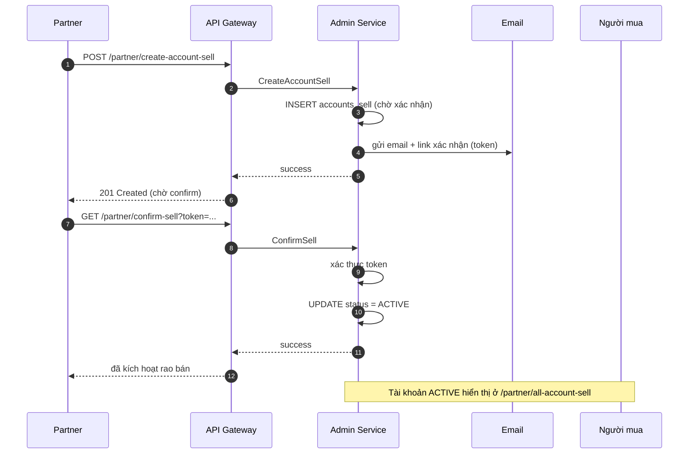
```mermaid
sequenceDiagram
    autonumber
    participant P as Partner
    participant GW as API Gateway
    participant Admin as Admin Service
    participant Mail as Email
    participant Buyer as Người mua

    P->>GW: POST /partner/create-account-sell
    GW->>Admin: CreateAccountSell
    Admin->>Admin: INSERT accounts_sell (chờ xác nhận)
    Admin->>Mail: gửi email + link xác nhận (token)
    Admin-->>GW: success
    GW-->>P: 201 Created (chờ confirm)

    P->>GW: GET /partner/confirm-sell?token=...
    GW->>Admin: ConfirmSell
    Admin->>Admin: xác thực token
    Admin->>Admin: UPDATE status = ACTIVE
    Admin-->>GW: success
    GW-->>P: đã kích hoạt rao bán

    Note over Buyer,Admin: Tài khoản ACTIVE hiển thị ở /partner/all-account-sell
```

### 14.15. RAG Chatbot (Hỏi AI về tài liệu game)

```mermaid
sequenceDiagram
    autonumber
    participant C as Player
    participant GW as API Gateway
    participant AI as AI Service
    participant Cache as Embedding Cache (local)
    participant Gemini as Gemini (embed + LLM)

    Note over AI,Cache: Chuẩn bị (một lần): đọc PDF → chunk → embed → cache

    C->>GW: POST /ai/ask (câu hỏi)
    GW->>AI: Ask
    AI->>Gemini: embed câu hỏi
    Gemini-->>AI: vector
    AI->>Cache: truy xuất đoạn liên quan (similarity)
    Cache-->>AI: top-k context

    alt Có context liên quan
        AI->>Gemini: prompt (context + câu hỏi)
        Gemini-->>AI: câu trả lời
        AI-->>GW: answer
    else Không có context
        AI-->>GW: "không có thông tin trong tài liệu"
    end
    GW-->>C: 200 OK
```

---

## 15. Phụ lục: Danh mục API

Tổng hợp endpoint theo nhóm service. Cột **Trạng thái**: ĐÃ DÙNG (đã tích hợp client) / CHƯA DÙNG (đã có backend, chờ tích hợp). Cột **Quyền** ghi role được phép gọi.

### 15.1. App & Health

| Method | Endpoint | Mô tả | Quyền |
|--------|----------|-------|-------|
| GET | `/health` | Health check cho CI/CD | PUBLIC |
| GET | `/health/circuit-breakers` | Trạng thái circuit breaker downstream | PUBLIC |
| GET | `/server/memory` | Thông tin bộ nhớ server | ADMIN |
| GET | `/server/docs` | Tài liệu server | ADMIN |

### 15.2. Auth

| Method | Endpoint | Mô tả | Trạng thái |
|--------|----------|-------|-----------|
| POST | `/auth/register` | Đăng ký tài khoản (game/web) | ĐÃ DÙNG |
| POST | `/auth/login` | Đăng nhập | ĐÃ DÙNG |
| POST | `/auth/login-google` | Đăng nhập Google | CHƯA DÙNG |
| POST | `/auth/verify-otp` | Bước 2: xác thực OTP, nhận token | ĐÃ DÙNG |
| POST | `/auth/logout` | Đăng xuất | CHƯA DÙNG |
| POST | `/auth/refresh` | Làm mới access token | CHƯA DÙNG |
| GET | `/auth/ban` | Check còn sống + còn quyền vào game | ĐÃ DÙNG |
| PATCH | `/auth/change-password` | Đổi mật khẩu | CHƯA DÙNG |
| PATCH | `/auth/change-email` | Đổi email | CHƯA DÙNG |
| PATCH | `/auth/change-avatar` | Đổi avatar | CHƯA DÙNG |
| POST | `/auth/request-reset-password` | Yêu cầu OTP reset mật khẩu | CHƯA DÙNG |
| POST | `/auth/reset-password` | Reset mật khẩu | CHƯA DÙNG |
| PATCH | `/auth/change-role-partner` | Đổi USER → PARTNER | CHƯA DÙNG |
| GET | `/auth/profile/{id}` | Xem profile của chính mình | CHƯA DÙNG |
| GET | `/auth/all-user` | Lấy user khác để kết bạn | CHƯA DÙNG |

### 15.3. User

| Method | Endpoint | Mô tả | Trạng thái |
|--------|----------|-------|-----------|
| GET | `/user/profile/{id}` | Xem profile của chính mình | ĐÃ DÙNG |
| PUT | `/user/save-game` | Tự lưu thông tin vào DB | ĐÃ DÙNG |
| GET | `/user/balance-web` | Lấy vàng/ngọc nạp từ web | ĐÃ DÙNG |
| PATCH | `/user/add-vang-web` | Thêm vàng (nạp web) | CHƯA DÙNG |
| PATCH | `/user/add-ngoc-web` | Thêm ngọc (nạp web) | CHƯA DÙNG |
| PATCH | `/user/use-vang-web` | Dùng vàng web | ĐÃ DÙNG |
| PATCH | `/user/use-ngoc-web` | Dùng ngọc web | ĐÃ DÙNG |
| POST | `/user/add-item-web` | Tự add item web | ĐÃ DÙNG |
| DELETE | `/user/use-item-web` | Tự dùng item web | ĐÃ DÙNG |
| GET | `/user/item-web` | Lấy item web của mình | ĐÃ DÙNG |
| GET | `/user/top10-suc-manh` | Top 10 sức mạnh | ĐÃ DÙNG |
| GET | `/user/top10-vang` | Top 10 vàng | ĐÃ DÙNG |

### 15.4. Social Network & Chat

| Method | Endpoint | Mô tả |
|--------|----------|-------|
| POST | `/social_network/add-friend` | Gửi lời mời kết bạn |
| GET | `/social_network/sent-friend` | Xem lời mời đã gửi (pending) |
| GET | `/social_network/incoming-friend` | Xem lời mời nhận được (pending) |
| PATCH | `/social_network/accept-friend` | Chấp nhận kết bạn |
| DELETE | `/social_network/reject-friend` | Từ chối kết bạn |
| GET | `/social_network/all-friend` | Danh sách bạn bè |
| DELETE | `/social_network/unfriend` | Hủy kết bạn |
| PATCH | `/social_network/block-user` | Chặn user |
| POST | `/social_network/create-comment` | Tạo comment bài post |
| GET | `/social_network/all-comment` | Lấy comment của post |
| PATCH | `/social_network/update-comment` | Sửa comment |
| PATCH | `/social_network/delete-comment` | Xóa comment (soft delete) |
| POST | `/social_network/like-comment` | Like comment |
| DELETE | `/social_network/unlike-comment` | Unlike comment |
| POST | `/social_network/create-notification` | Tạo thông báo |
| GET | `/social_network/notification` | Lấy thông báo theo user |
| POST | `/chat/1-1` | Tạo room chat 1-1 |
| GET | `/chat/message` | Lấy tin nhắn của room |
| POST | `/chat/create-group` | Tạo group chat |
| POST | `/chat/add-user-group` | Thêm user vào group |
| GET | `/chat/all-group` | Danh sách group của mình |

### 15.5. Item & Đệ Tử

| Method | Endpoint | Mô tả | Trạng thái |
|--------|----------|-------|-----------|
| GET | `/item/user-items` | Lấy item của mình | ĐÃ DÙNG |
| PUT | `/item/items` | Lưu item khi thoát game | ĐÃ DÙNG |
| POST | `/item/item` | Add item trong game | ĐÃ DÙNG |
| POST | `/item/itemUuids` | Fetch data item | ĐÃ DÙNG |
| PUT | `/detu/save-game` | Lưu đệ tử (ghi đè) | CHƯA DÙNG |
| POST | `/detu/create-de-tu` | Tạo đệ tử khi săn thành công | CHƯA DÙNG |
| GET | `/detu/de-tu` | Lấy đệ tử của mình | CHƯA DÙNG |

### 15.6. Pay, Cashier & Finance

| Method | Endpoint | Mô tả | Quyền | Trạng thái |
|--------|----------|-------|-------|-----------|
| GET | `/pay/pay` | Xem ví của mình | USER | ĐÃ DÙNG |
| POST | `/pay/create-pay` | Tạo ví (dev/swagger) | BACKEND | ĐÃ DÙNG |
| GET | `/pay/qr` | Lấy QR chuyển khoản (nạp tiền) | ALL | ĐÃ DÙNG |
| POST | `/cashier/create-withdraw` | Gửi yêu cầu rút tiền | USER | ĐÃ DÙNG |
| GET | `/cashier/user-withdraw` | Lịch sử rút của mình | USER | CHƯA DÙNG |
| GET | `/cashier/all-withdraw` | Xem tất cả yêu cầu rút | ADMIN/CASHIER | ĐÃ DÙNG |
| PATCH | `/cashier/approve-withdraw` | Duyệt rút tiền | ADMIN/CASHIER | ĐÃ DÙNG |
| PATCH | `/cashier/reject-withdraw` | Từ chối rút tiền | ADMIN/CASHIER | ĐÃ DÙNG |
| GET | `/finance/by-user` | Giao dịch theo user | ADMIN/FINANCE | CHƯA DÙNG |
| GET | `/finance/all-record` | Toàn bộ giao dịch | ADMIN/FINANCE | CHƯA DÙNG |
| GET | `/finance/system-cash-flow` | Thống kê tổng nạp/rút/số dư | ADMIN/FINANCE | CHƯA DÙNG |

### 15.7. Admin & Player Manager

| Method | Endpoint | Mô tả | Quyền |
|--------|----------|-------|-------|
| PATCH | `/admin/change-role` | Đổi role user | ADMIN |
| PATCH | `/admin/ban-user` | Ban user | ADMIN |
| PATCH | `/admin/unban-user` | Unban user | ADMIN |
| PATCH | `/admin/update-balance` | Cộng/trừ vàng-ngọc (gán) | ADMIN |
| POST | `/admin/add-item-web` | Add item web cho user bất kỳ | ADMIN |
| DELETE | `/admin/use-item-web` | Dùng item web của user bất kỳ | ADMIN |
| POST | `/admin/create-de-tu` | Tạo đệ tử cho user bất kỳ | ADMIN |
| PATCH | `/admin/money` | Update tiền trong ví user | ADMIN |
| PATCH | `/admin/status` | Khóa/mở ví user | ADMIN |
| GET | `/admin/all-account-buyer` | Xem acc đã mua trong hệ thống | ADMIN |
| GET | `/player_manager/profile/{id}` | Xem profile user bất kỳ | ADMIN/PLAYER_MANAGER |
| GET | `/player_manager/user-items` | Xem item user bất kỳ | ADMIN/PLAYER_MANAGER |
| GET | `/player_manager/de-tu` | Xem đệ tử user bất kỳ | ADMIN/PLAYER_MANAGER |
| GET | `/player_manager/pay` | Xem ví user bất kỳ | ADMIN/PLAYER_MANAGER |
| POST | `/player_manager/send-email` | Gửi email thông báo (1 hoặc all) | ADMIN/PLAYER_MANAGER |
| POST | `/player_manager/temporary-ban` | Ban tạm thời (≤ 3 ngày) | ADMIN/PLAYER_MANAGER |
| DELETE | `/player_manager/temporary-ban/{userId}` | Mở khóa ban tạm | ADMIN/PLAYER_MANAGER |
| GET | `/player_manager/temporary-ban-all` | Danh sách user đang bị ban tạm | ADMIN/PLAYER_MANAGER |

### 15.8. Partner (Account Trading)

| Method | Endpoint | Mô tả | Quyền |
|--------|----------|-------|-------|
| POST | `/partner/create-account-sell` | Đăng acc cần bán | ADMIN/PARTNER |
| GET | `/partner/confirm-sell` | Confirm đăng bán qua email link | (hệ thống) |
| PATCH | `/partner/update-account-sell` | Cập nhật acc rao bán | ADMIN/PARTNER |
| DELETE | `/partner/delete-account-sell` | Xóa acc rao bán | ADMIN/PARTNER |
| GET | `/partner/all-account-sell` | Xem acc đang bán (ACTIVE) | ALL |
| GET | `/partner/account-sell-by-partner` | Acc đã bán theo partner | ADMIN/PARTNER |
| GET | `/partner/account-sell/{id}` | Chi tiết 1 acc | ALL |
| POST | `/partner/buy-account-sell` | Mua acc | USER |
| GET | `/partner/all-account-buyer` | Acc mình đã mua | USER |

### 15.9. Editor (Content)

| Method | Endpoint | Mô tả | Quyền |
|--------|----------|-------|-------|
| POST | `/editor/create-post` | Tạo bài viết | ADMIN/EDITOR |
| GET | `/editor/all-posts` | Danh sách bài viết | ALL |
| GET | `/editor/post/{id}` | Chi tiết bài viết | ALL |
| PATCH | `/editor/update-post` | Cập nhật bài viết | ADMIN/EDITOR |
| DELETE | `/editor/delete-post` | Xóa bài viết | ADMIN/EDITOR |
| PATCH | `/editor/lock-post` | Khóa bài viết | ADMIN |
| PATCH | `/editor/unlock-post` | Mở khóa bài viết | ADMIN |
| GET | `/editor/by-editor` | Bài viết theo editor | ADMIN/EDITOR |

### 15.10. Game & Game Data

| Method | Endpoint | Mô tả | Quyền |
|--------|----------|-------|-------|
| POST | `/game/play` | Vào game sau verifyOTP (màn menu) | USER |
| GET | `/game-data/map` | Lấy tất cả map | ADMIN |
| GET | `/game-data/map/npcs` | NPC spawn theo map | ADMIN |
| GET | `/game-data/npc-base` | Tất cả NPC base | ADMIN |
| POST | `/game-data/npc-spawn` | Thêm NPC spawn | ADMIN |
| PATCH | `/game-data/npc-spawn` | Sửa NPC spawn | ADMIN |
| DELETE | `/game-data/npc-spawn` | Xóa NPC spawn | ADMIN |
| GET | `/game-data/npc-shop` | Item shop theo NPC | PUBLIC |
| POST | `/game-data/npc-shop` | Thêm item shop NPC | ADMIN |
| PATCH | `/game-data/npc-shop` | Sửa item shop NPC | ADMIN |
| DELETE | `/game-data/npc-shop` | Xóa item shop NPC | ADMIN |
| GET | `/game-data/item-base` | Tất cả item base | ADMIN |
| GET | `/game-data/music` | Lấy tất cả nhạc | ADMIN |
| POST | `/game-data/music` | Upload + thêm nhạc | ADMIN |
| PATCH | `/game-data/music` | Sửa metadata nhạc (tên/status) | ADMIN |
| DELETE | `/game-data/music` | Xóa nhạc (soft delete → INACTIVE) | ADMIN |

### 15.11. AI (RAG)

| Method | Endpoint | Mô tả |
|--------|----------|-------|
| POST | `/ai/ask` | Hỏi AI về tài liệu dự án (Retrieval-Augmented Generation) |

---

## 16. Cron & Scheduled Jobs

Hệ thống chạy nhiều tác vụ định kỳ. Vì backend chạy nhiều instance (scale ngang), mỗi cron được bảo vệ bằng **Redlock** (distributed lock trên Redis) để đảm bảo chỉ một instance thực thi mỗi lần — tránh gửi email trùng, log doanh thu hai lần hay kích hoạt bảo trì nhiều lần.

### 16.1. Danh sách Cron

| Lịch (cron) | Múi giờ | Tác vụ | Mô tả |
|-------------|---------|--------|-------|
| `0 20 * * *` (20h00) | Asia/Ho_Chi_Minh | Thông báo sự kiện hằng ngày | Gửi email cho **toàn bộ user** giới thiệu sự kiện "Ngọc Rồng Sao Đen" (tranh đoạt ngọc, giữ trong 30 phút) |
| `0 0 * * *` (00h00) | Asia/Ho_Chi_Minh | Báo cáo doanh thu | Tổng hợp tổng nạp / tổng rút / lợi nhuận thực trong ngày, gửi email cho **ADMIN** |
| `30 3 * * *` (03h30) | Asia/Ho_Chi_Minh | Cảnh báo & bắt đầu bảo trì | Báo cho user trong game "bảo trì sau 30 phút", rồi lên lịch bắt đầu bảo trì |

### 16.2. Cơ chế chống chạy trùng (Redlock)

Mỗi cron acquire một lock có TTL trước khi chạy:

```
acquire('lock:cron:<tên>', TTL) → chạy tác vụ → release()
```

Nếu một instance khác đang giữ lock (`ResourceLockedError` / `ExecutionError`), instance hiện tại **bỏ qua lượt chạy** thay vì chạy song song. Lock có TTL để tự giải phóng nếu instance giữ lock bị chết giữa chừng.

### 16.3. Luồng bảo trì (Maintenance)

Bảo trì không dùng hai cron riêng cho "bắt đầu" và "kết thúc" vì hai mốc này **phụ thuộc nhau** (không đảm bảo cả hai cron đều chạy đúng). Thay vào đó hệ thống dùng **BullMQ delayed job** kết hợp **Redis key có TTL**:

```mermaid
sequenceDiagram
    autonumber
    participant Cron as Cron 03:30
    participant Game as Game (WS broadcast)
    participant BullMQ as BullMQ (delayed job)
    participant Redis as Redis (maintenance key)
    participant MW as Middleware

    Cron->>Game: emit "bảo trì sau 30 phút"
    Cron->>BullMQ: schedule startMaintenance(+30 phút)

    Note over BullMQ: sau 30 phút
    BullMQ->>Redis: SET maintenance key (TTL ~1h)
    Note over Redis,MW: Trong thời gian có key → server ở chế độ bảo trì

    loop Mỗi request
        MW->>Redis: kiểm tra maintenance key
        alt Có key
            MW-->>MW: chặn / trả thông báo bảo trì
        else Hết key (TTL hết)
            MW-->>MW: phục vụ bình thường (tự hết bảo trì)
        end
    end
```

Cơ chế "key tự hết hạn" giúp server **tự động thoát chế độ bảo trì** khi TTL hết mà không cần một cron khác can thiệp — đơn giản và chịu lỗi tốt hơn.

### 16.4. Các tác vụ nền khác

| Tác vụ | Cơ chế |
|--------|--------|
| Tự động gỡ ban tạm khi hết hạn (≤ 3 ngày) | BullMQ delayed job |
| Outbox poller / saga retry | Polling theo `nextRetryAt` |
| Backup database định kỳ | Scheduled job *(chi tiết lịch & nơi lưu tùy cấu hình vận hành)* |

---

## 17. Thuật ngữ

### 17.1. Thuật ngữ nghiệp vụ (tiếng Việt)

| Thuật ngữ | Giải thích |
|-----------|------------|
| **Đệ Tử** | Pet / companion đi theo nhân vật, có chỉ số sức mạnh riêng |
| **Sức mạnh (sucManh)** | Chỉ số chiến lực của nhân vật; dùng để xếp hạng leaderboard |
| **Vàng (vang)** | Tiền tệ trong game (in-game currency) |
| **Ngọc (ngoc)** | Tiền tệ cao cấp trong game (premium currency) |
| **vangNapTuWeb / ngocNapTuWeb** | Lượng vàng/ngọc người chơi nạp từ website (qua tiền thật) |
| **biBan** | Cờ đánh dấu tài khoản bị cấm (banned) |
| **daVaoTaiKhoanLanDau** | Cờ đánh dấu người chơi đã đăng nhập vào tài khoản lần đầu chưa |
| **coDeTu** | Cờ đánh dấu nhân vật đã sở hữu đệ tử chưa |
| **maItem / maHinh** | Mã định danh vật phẩm |
| **hanhTinh** | Hành tinh (khu vực bản đồ) mà vật phẩm/nhân vật thuộc về |
| **soSaoPhaLe** | Số sao pha lê (cấp độ nâng cấp vật phẩm) |
| **loaiTien** | Loại tiền dùng để mua (vàng / ngọc) tại shop NPC |
| **nhacnen** | Nhạc nền của game |

### 17.2. Thuật ngữ kỹ thuật

| Thuật ngữ | Giải thích |
|-----------|------------|
| **Saga** | Mẫu quản lý giao dịch phân tán bằng chuỗi các bước cục bộ, có bước bù trừ khi thất bại |
| **Outbox Pattern** | Ghi sự kiện cần gửi vào một bảng trong cùng transaction nghiệp vụ; một poller đọc và gửi sau, đảm bảo không mất sự kiện |
| **Compensation** | Hành động hoàn nguyên (rollback nghiệp vụ) khi một bước trong saga thất bại |
| **Idempotency Key** | Khóa định danh một thao tác để khi gọi lặp lại không gây tác dụng phụ trùng (vd: không trừ tiền 2 lần) |
| **Tickrate** | Số lần server cập nhật/đồng bộ trạng thái mỗi giây (ở đây 20Hz) |
| **Token Version** | Số phiên bản token; tăng lên để vô hiệu hóa token cũ sau khi đổi mật khẩu |
| **Content-Addressable Storage** | Lưu trữ mà địa chỉ/tên đối tượng được suy ra từ nội dung (hash), khiến URL bất biến |
| **Deduplication** | Khử trùng lặp dữ liệu: nội dung giống nhau chỉ lưu một bản |
| **Cache Busting** | Kỹ thuật làm cache cũ vô hiệu (ở đây tự động nhờ URL đổi theo hash) |
| **CDN** | Mạng phân phối nội dung, cache file gần người dùng để giảm độ trễ |
| **gRPC** | Giao thức gọi hàm từ xa hiệu năng cao, dùng cho giao tiếp nội bộ giữa các service |
| **Cloudflared Tunnel** | Đường hầm bảo mật đưa lưu lượng từ Internet vào hạ tầng nội bộ qua Cloudflare |
| **PROCESSING / ACTIVE** | Trạng thái của bài nhạc: đang xử lý (chưa phục vụ) / sẵn sàng cho client tải |
| **Redlock** | Thuật toán khóa phân tán trên Redis, đảm bảo chỉ một instance chạy một cron tại một thời điểm khi hệ thống scale ngang |
| **RAG (Retrieval-Augmented Generation)** | Kỹ thuật cho AI trả lời dựa trên tài liệu: truy xuất đoạn liên quan rồi đưa vào prompt cho LLM, giảm bịa đặt (hallucination) |
| **Embedding** | Vector số biểu diễn ngữ nghĩa của văn bản, dùng để đo độ tương đồng khi truy xuất trong RAG |

---

*— Hết tài liệu —*